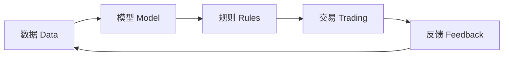

# 01 什么是量化投资

> 所属模块：Part I 认识量化研究

**量化投资不是更聪明的预测，而是更诚实的验证。**

## 本节导读

本章回答 handbook 的第一个问题：量化投资（Quantitative Investing）到底是什么。很多新人把「会 Python」「会用 XGBoost」「回测年化 30%」当成量化的入场券——这三件事可能都有用，但都不是定义本身。量化研究的核心，是用 **数据（Data）+ 模型（Model）+ 规则（Rules）** 把投资判断变成可重复执行的流程，并在每一步留下可审计的记录。

## 学习目标

1. 理解量化投资的基本定义与边界
2. 区分主观投资与量化投资
3. 掌握从观点到可验证假设的转化思路

---

## 01.1 量化投资的基本定义

量化领域有几个常被混用的英文术语，首次出现时一并给出中文对照：

| 术语 | 中文 | 核心含义 |
| --- | --- | --- |
| Quantitative Investing | 量化投资 | 用系统化方法做投资决策 |
| Quantitative Research | 量化研究 | 提出假设、构造信号、统计验证 |
| Quantitative Strategy | 量化策略 | 将信号转化为可执行的交易规则 |
| Quantitative Trading | 量化交易 | 按规则下单、控制执行与成本 |

四者的关系可以用一条链路概括：



### 数据、模型、规则与交易之间的关系

- **数据**：行情、财务、资金流、另类数据等原始输入。没有可靠数据，后面全是空中楼阁（Part II 会展开）。
- **模型**：对数据的结构化表达——可以是简单排序规则，也可以是多因子回归或机器学习。模型输出的是 **信号（Signal）**，不是直接下单指令。
- **规则**：把信号翻译成「买什么、卖什么、买多少、何时调仓」。规则必须明确到另一个人用同一套数据能复现你的持仓。
- **交易**：把目标持仓变成真实成交，并承担手续费、滑点、涨跌停等摩擦（Part V、Part IX 展开）。

**关键判断**：如果你只能展示一条回测曲线，但说不清数据口径、调仓规则、成本假设——你做的是演示，不是量化研究。

### 一个最小示例

假设你认为「小市值 + 低波动」在 A 股中长期有效。量化表达不是「我觉得小盘好」，而是：

```python
# 伪代码：展示「规则可复现」的思路，非完整策略
universe = all_a_shares(exclude_st=True, exclude_suspended=True)
signal = rank(universe, by=[-market_cap, -volatility_60d])
portfolio = top_n(signal, n=100, weight="equal")
rebalance(freq="monthly", trade_at="next_open")
```

每一行都对应一个需要写进研究文档的 **口径决策**：股票池、因子定义、权重方案、调仓频率、成交价格。这些决策比模型本身更重要。

---

## 01.2 量化投资不是什么

反炒作清单——在量化机构里，下面五条新人踩坑率极高：

| 误解 | 实际情况 |
| --- | --- |
| 量化研究 = 写交易代码 | 代码是工具；研究核心是假设、口径与验证 |
| 量化策略 = 预测明天涨跌 | 多数中低频策略预测的是 **相对排序**，不是点位 |
| 用机器学习 = 有 Alpha | ML 是建模手段；Alpha 来自经风险调整后的超额收益 |
| 回测盈利 = 实盘可交易 | 回测省略了成本、容量、执行约束（见第 08 章） |
| 复杂模型 > 简单模型 | 简单因子 + 清晰逻辑 + 稳健检验，往往比黑箱更可靠 |

举个后文会反复碰到的**教学情景**（非真实人物；同类偏差在 [08 回测与实盘](08-backtest-vs-live.md)、[21 股票池](../part-iv/21-universe.md)、[29 回测陷阱](../part-v/29-backtest-pitfalls.md)、[40 ML 定位](../part-viii/40-ml-positioning.md) 展开）：小王用 LSTM 预测个股涨跌，样本内准确率 58%，回测年化 40%。上线后三个月跑输沪深 300——归因一看，模型在小盘股上过度暴露，而回测用的是 **当前成分股** 而非历史成分，叠加了幸存者偏差。模型不是不能用，但他混淆了「预测准确率」和「可交易 Alpha」。

---

## 01.3 主观投资与量化投资

国内不少「主观私募」已配备量化风控与组合工具；「量化私募」也会在宏观拐点由 PM 人工降仓。**二分法用于理解差异，不是贴标签。**

两者不是非黑即白，而是 **信息处理与决策机制** 的差异。

| 维度 | 主观投资 Discretionary | 量化投资 Quantitative |
| --- | --- | --- |
| 信息处理 | 深度研究少数标的 | 批量处理全市场数据 |
| 决策机制 | 基金经理综合判断 | 规则驱动 + 人工监督 |
| 可重复性 | 低（同一人不同天可能不同） | 高（同规则同数据应同结果） |
| 可解释性 | 叙事逻辑清晰 | 需额外做归因与分解 |
| 可扩展性 | 覆盖标的有限 | 可覆盖数千只股票 |
| 主要风险 | 认知偏差、集中持仓 | 模型风险、过拟合、执行偏差 |

### 主要风险来源

- **主观**：过度自信、锚定效应、故事驱动、持仓集中。
- **量化**：数据质量、过拟合、因子拥挤、回测与实盘口径不一致。

### 两类方法如何结合

实务中最常见的模式不是「纯量化 vs 纯主观」，而是：

1. **量化执行主观观点**：PM 看好新能源方向，研究员用因子在全行业内筛选标的，而非 PM 手动挑三只票。
2. **主观约束量化输出**：模型给出 100 只候选，PM 基于宏观判断调整行业上限或剔除特定板块。
3. **量化监控主观组合**：对主观持仓做风险暴露分析，识别隐性 Beta 或风格漂移。

量化不是取代判断，而是 **让判断可被检验、被约束、被规模化**。

---

## 01.4 从主观观点到可验证假设

量化研究的第一步，不是打开 Jupyter，而是把模糊观点翻译成 **可证伪假设（Falsifiable Hypothesis）**。

### 转化六步


| 步骤 | 说明 | 反例 |
| --- | --- | --- |
| 市场观察 | 记录现象，不预设结论 | 「小盘永远跑赢」——太绝对 |
| 经济逻辑 | 解释为何存在风险补偿或行为偏差 | 「因为大家都喜欢小盘」——不是逻辑 |
| 数据表达 | 用可计算的变量定义概念 | 用「热门概念」但无客观定义 |
| 可证伪性 | 明确什么结果会推翻假设 | 「无效也继续用」——不可证伪 |
| 统计验证 | 分组回测、回归、t 检验等 | 只看全样本 Sharpe，不做子样本 |
| 投资实现 | 考虑成本、容量、约束后的可交易版本 | 毛回测漂亮，却未计入高换手下的成本与冲击，净超额消失 |

### 示例：从观点到假设

**主观观点**：「A 股机构持仓集中度上升后，被低配的股票会补涨。」

**可验证假设**：

- 变量：基金持仓占比相对行业均值的偏离度
- 预测：低配程度越高，未来 20 日超额收益越高
- 证伪条件：分组单调性不显著，或中性化后 IC 归零
- 口径：剔除 ST、停牌；使用公告滞后后的持仓数据（避免前视）

这一步写不好，后面的因子构造和回测都是在浪费时间。

---

## 01.5 量化研究的核心价值

在 A 股多因子研究场景中，量化研究的价值可以归结为五点：

1. **批量处理信息**：全市场 5000+ 只股票，人工无法逐一跟踪；因子框架让比较成为可能。
2. **系统化验证规律**：每个想法都走同一套检验流程，减少「我记得以前有效」的选择性记忆。
3. **约束情绪和认知偏差**：规则在极端行情下不会 panic sell——当然，规则本身可能失效，这是另一个问题。
4. **提高研究复现性**：代码、数据版本、参数、随机种子留档，同事可以复跑你的实验。
5. **支持规模化投资决策**：同一套信号可以同时服务 1 亿和 100 亿规模——前提是容量与成本算过。

### 量化研究 vs 量化开发 vs 量化交易：再划一刀

| 活动 | 核心问题 | 典型产出 |
| --- | --- | --- |
| 量化研究 | 这个规律是否真实？ | 因子、报告、检验 |
| 量化开发 | 系统能否稳定复现？ | 平台、pipeline、测试 |
| 量化交易 | 能否按目标成交？ | 订单、成交、滑点分析 |

新人常把三者混为一谈。Handbook 主线是 **研究**——但你必须知道开发与交易的约束，否则研究无法落地（第 02、08 章）。

---

## 常见错误

- 把「会写策略代码」当成「会做量化研究」，跳过假设与口径文档。
- 用回测年化收益对外讲故事，不披露 Beta 暴露和最大回撤。
- 把 ML 模型的训练准确率直接等同于因子 IC，不做样本外与中性化检验。
- 认为量化 = 全自动、不需要人工——风控限额、异常监控、假设修订都需要人。

## 要点回顾

- 量化投资 = 数据 + 模型 + 规则 + 交易，核心是 **可复现的系统** 而非预测圣杯。
- 写代码、用 ML、回测盈利都不等于 Alpha；复杂模型不一定优于简单模型。
- 主观与量化的差异在信息处理与决策机制；实务中常结合使用。
- 投资观点必须转化为 **可证伪假设**，明确数据表达与推翻条件。
- 量化研究的价值在于批量验证、约束偏差、复现与规模化——不是替代思考，而是升级思考的方式。
