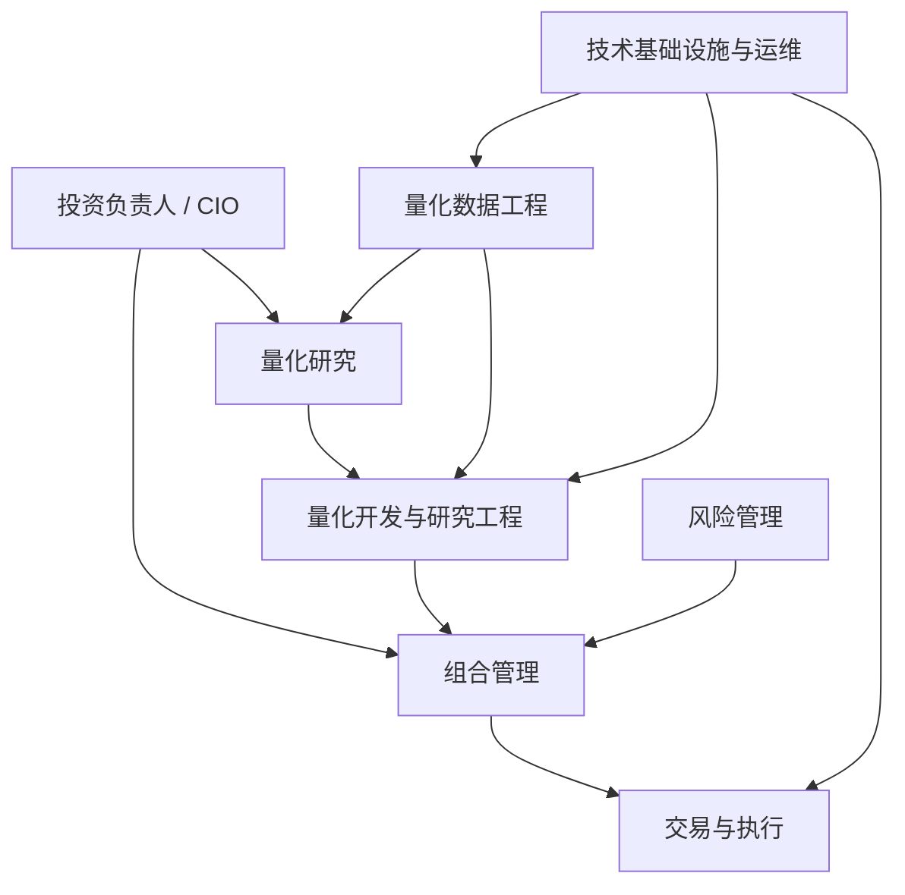
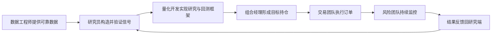

# 02 团队结构与岗位分工

> 所属模块：Part I 认识量化研究

**一条 Alpha 信号从诞生到成交，至少要经过五个角色的手——跳过任何一个，回测就只是在真空中跳舞。**

## 本节导读

新人常以为量化机构 = 研究员写因子 + 程序自动赚钱。真实情况是：数据工程师保证输入可靠，研究员构造并验证信号，量化开发搭建可复现框架，组合经理把信号变成持仓，交易员把持仓变成成交，风控全程监控。本章帮你建立 **组织地图**，避免「研究很好但没人能上线」或「实盘亏损却互相甩锅」的协作断裂。

## 学习目标

1. 理解量化机构的典型组织分工
2. 明确研究员与相邻岗位的协作边界
3. 掌握与数据、开发、PM、交易、风控对齐的「最小共同语言」

---

## 02.1 量化机构的典型组织结构

CIO（Chief Investment Officer，投资负责人）位于决策顶端，对 **投资理念、风险预算、最终业绩** 负责。研究员不直接对实盘盈亏负全责——但研究员的输出质量决定了整个链条的上限。

---

## 02.2 投资负责人 / CIO

| 职责 | 说明 |
| --- | --- |
| 制定投资理念与策略方向 | 决定做多因子、市场中性还是混合 |
| 决定风险预算 | 各策略线可承受的最大回撤与杠杆 |
| 配置研究资源 | 人力、算力、数据采购优先级 |
| 评估策略组合 | 策略相关性、容量、边际贡献 |
| 对整体投资结果负责 | 向投资人解释业绩与风险 |

CIO 不写因子代码，但会问：「这个 Alpha 是新的，还是小盘 Beta 的换皮（即已知风格暴露的重新包装）？」新人汇报时，CIO 关心的往往是 **逻辑、容量、与现有策略的相关性**，而非 IC 小数点后第三位。

---

## 02.3 量化研究员 Quant Researcher

在大型机构，研究员可能进一步分为 **Alpha 研究**（因子、信号）与 **组合研究**（优化、约束）——中小机构往往一人全覆盖。入职时确认你所在的「研究员」更偏哪一端。

研究员（Quant Researcher）是 handbook 的主要读者角色。核心职责：

- 提出投资假设，完成文献与实务调研
- 构造因子与信号，定义计算口径
- 进行统计检验：IC、分组回测、回归、样本外
- 设计回测实验，分析收益来源与风险暴露
- 完成样本内（In-Sample）与样本外（Out-of-Sample）验证
- 输出研究报告，参与评审与上线讨论

**边界**：研究员通常 **不** 直接管实盘下单，也 **不** 独自决定产品基准与风险限额——但需要理解这些约束，否则研究产物无法落地。

---

## 02.4 量化开发与研究工程 Quant Developer / Research Engineer

| 职责 | 对研究员的意义 |
| --- | --- |
| 搭建研究平台 | Jupyter / 自研 IDE、因子库、回测引擎 |
| 开发因子计算引擎 | 批量、增量、并行计算 |
| 维护回测框架 | 统一样本空间、成本、调仓逻辑 |
| 优化计算性能 | 全市场 10 年日频因子 < 可接受时延 |
| 保证实验可复现 | 版本控制、数据快照、参数日志 |
| 研究原型 → 稳定系统 | 研究代码不能「只能在我电脑上跑」 |

常见摩擦：研究员写原型很快，但缺少单元测试、边界处理、增量更新——量化开发的工作就是把 **能跑** 变成 **能上线、能审计、能回滚**。

---

## 02.5 量化数据工程师 Quant Data Engineer

数据工程师（Quant Data Engineer）是 **最容易被低估、出问题代价最高** 的角色。

- 获取行情、财务、资金流与另类数据
- 数据清洗、修复与对齐（复权、停牌、财报滞后）
- 维护历史数据库与增量更新管道
- 建立数据质量检查（DQ Check）：缺失率、异常值、交叉验证
- 设计备份与恢复机制

**一句话**：研究员的 Alpha 可能是数据工程师的 Bug。2020 年某私募因复权因子错误，整组动量因子符号反转，实盘亏损两周才发现——根因是数据管道未做前后版本 diff。

---

## 02.6 组合经理 Portfolio Manager

组合经理（Portfolio Manager，PM）把研究信号转化为 **可交付的产品**：

- 分配权重与风险预算
- 控制行业、市值与风格暴露
- 约束换手率、容量和流动性
- 对组合最终表现负责（相对基准或绝对收益）

同一因子信号，PM 可以做出三种产品：高 Beta 量化多头、严格跟踪误差的指数增强、行业中性化的市场中性—— **产品目标不同，组合构建完全不同**（见第 04 章）。

---

## 02.7 交易员与执行团队 Trader / Execution

- 将目标持仓转化为订单
- 控制滑点（Slippage）与市场冲击（Market Impact）
- 选择执行算法（VWAP、TWAP、POV 等）
- 处理 A 股特有摩擦：涨跌停、停牌、T+1、集合竞价
- 将真实成交反馈给研究与组合团队

执行团队是 **回测与实盘的第一道差距来源**。回测假设「次日开盘价全部成交」，实盘可能因涨停买不到、因流动性只能成交目标量 30%。

---

## 02.8 风险管理 Risk Management

| 类型 | 内容 |
| --- | --- |
| 事前风险 Ex-Ante | 限额设定、杠杆上限、行业偏离、集中度 |
| 事后风险 Ex-Post | 回撤监控、暴露漂移、异常 PnL 归因 |

- 设置风险限额，区分硬限与软限
- 监控杠杆、回撤和集中度
- 检查行业与风格暴露是否超出产品契约
- 识别异常仓位和策略失效（Regime Change）
- 在极端行情下触发减仓或熔断

风控不是「阻止交易」，而是 **在已知约束内最大化研究价值**。

---

## 02.9 技术基础设施与运维

- 服务器与计算资源（研究集群、生产服务器）
- 数据库与权限管理
- 任务调度（Airflow、Cron、自研 Scheduler）
- 日志与监控（Prometheus、Grafana、告警）
- 灾备与故障恢复
- 生产环境稳定性（SLA、值班、Incident Review）

研究员日常感知不强，直到 **回测任务排队 6 小时** 或 **生产因子更新失败无人知晓**——那时才体会到 INF 的价值。

---

## 02.10 各岗位如何协作

### 一次典型的因子上线流程

1. **研究员** 提交因子研究报告（IC、分组收益、中性化结果、样本外）
2. **数据工程** 确认因子依赖的数据字段已在生产库更新
3. **量化开发** 将因子接入生产 pipeline，跑通历史回填
4. **PM** 将因子纳入组合优化，设定暴露约束
5. **风控** 审核组合暴露与限额
6. **交易** 模拟盘 / 小资金试运行
7. **全员** 复盘：回测 vs 模拟 vs 实盘的差异归因

任何一步跳过，都可能造成「研究很好、产品很差」的断层。

---

## 02.11 跨岗位沟通的「最小共同语言」

与数据工程：字段名、更新 cron、lag 规则  
与量化开发：API、版本号、单元测试、SLA  
与 PM：基准、TE、换手、容量  
与交易：成交假设、涨跌停处理、冲击  
与风控：暴露限额、回撤、Kill Switch  

这五组词汇对齐了，协作摩擦会小很多。

---

## 常见错误

- 研究员闭门造车，不提前了解 PM 的基准约束和换手限制。
- 把数据问题当模型问题，反复调参却不去查底层数据管道。
- 认为上线 = 研究结束；忽略持续监控与因子衰减。
- 忽视文档与口径记录，人员流动后研究无法复现。

## 要点回顾

- 量化机构是分工协作系统：数据 → 研究 → 开发 → 组合 → 交易 → 风控 → 反馈。
- 研究员的核心产出是可验证的信号与报告，不是实盘下单。
- 数据工程师和量化开发决定研究能否 **复现、上线、扩展**。
- PM 和交易决定信号能否 **变成可交付产品**。
- 岗位名称因机构而异；对齐职责与接口比纠结 Title 更重要。
