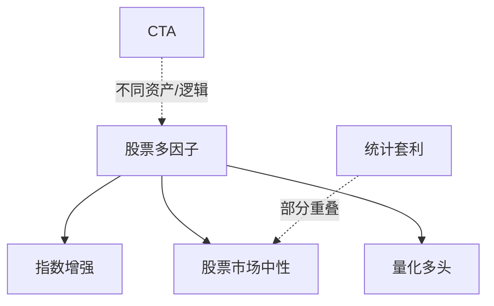

# 03 量化策略的基本地图

> 所属模块：Part I 认识量化研究

**策略地图不是目录装饰——它决定你用什么数据、什么频率、什么基准来评价自己的工作。**

## 本节导读

「量化策略」四个字底下，藏着从毫秒级做市到年度换手的宏观配置。新人若不分清资产类别、研究逻辑、持有周期和收益来源，很容易在错误的维度上比较策略：用高频的 Sharpe 标准要求中低频因子，或用 CTA 的逻辑评价股票多因子。本章建立 **四维分类框架**，并明确本手册的研究边界。

## 学习目标

1. 建立量化策略的分类框架
2. 明确本手册的研究边界

---

## 03.1 按资产类别划分

量化机构按资产类别划分团队并不罕见：股票 QR、期货 CTA、期权 vol 各守一块。你作为 **A 股股票多因子** 新人，多数协作仍在同一资产线内——但仍需知道其他类别存在，避免读研报时 **张冠李戴**。

| 资产类别 | 典型策略 | A 股语境下的特点 |
| --- | --- | --- |
| 股票 Equities | 多因子、指数增强、市场中性 | 本手册核心；T+1、涨跌停、停牌多 |
| 期货 Futures | CTA 趋势跟踪、期限结构套利 | 保证金、杠杆、夜盘 |
| 期权 Options | 波动率套利、备兑开仓（Covered Call） | 非线性收益、Greeks 管理 |
| 债券 Fixed Income | 收益率曲线骑乘（Riding）、信用利差 | 机构主导、流动性分层 |
| 外汇 FX | Carry Trade（套息交易）、宏观 | A 股量化团队较少涉及 |
| 商品 Commodities | 趋势跟踪、跨期/跨品种套利 | 与宏观周期关联强 |
| 数字资产 Crypto | 跨所套利、链上信号 | 监管与合规不确定；本手册仅概念介绍 |

---

## 03.2 按研究逻辑划分

| 策略类型 | 核心逻辑 | 与本手册关系 |
| --- | --- | --- |
| 股票多因子 Multi-Factor | 横截面排序，因子暴露获取超额 | **核心** |
| 指数增强 Index Enhancement | 跟踪基准 + 主动 Alpha | **重点** |
| 股票市场中性 Equity Market Neutral | 对冲 Beta，提取纯 Alpha | **重点** |
| CTA 趋势跟踪 Trend Following | 时间序列动量，截断亏损 | 简介 |
| 统计套利 Statistical Arbitrage | 配对、协整、均值回复 | 简介 |
| 事件驱动 Event Driven | 并购、定增、财报 | 非核心 |
| 做市与高频 Market Making / HFT | 订单流、延迟竞争 | 弱化 |
| 波动率与期权策略 Volatility | Vega、Gamma 管理 | 非核心 |

---

## 03.3 按持有周期划分

| 周期 | 典型持仓时间 | 数据需求 | 成本敏感度 |
| --- | --- | --- | --- |
| 高频 HFT | 毫秒～秒 | Tick、Level 2 | 极高 |
| 日内 Intraday | 分钟～小时 | 分钟 bar | 高 |
| 短周期 Short-Term | 1～5 日 | 日频 + 部分 intraday | 中高 |
| 中低频 Medium-Low Freq | 1～4 周 | 日频 | 中 |
| 长周期 Long-Term | 月～季 | 日频 + 基本面 | 较低 |

**本手册聚焦中低频**：调仓频率通常为 **周度或月度**，数据以日频为主。这意味着：

- 不需要 tick 级数据做核心研究
- 但必须认真建模 **交易成本与冲击**（不是「可以忽略」）
- 因子 decay 以「周～月」尺度衡量，而非「秒」

### 周期与数据、成本的三角关系

| 持有周期 | 典型数据粒度 | 成本占 gross **alpha** 比例（示意） | 研究重点 |
| --- | --- | --- | --- |
| 高频 | Tick / L2 | 常 >50% | 延迟、队列、撮合 |
| 日内 | 1～5 分钟 | 10%～30% | 开盘收盘效应 |
| 中低频 | 日频 | 5%～20% | 因子 IC、中性化 |
| 长周期 | 日频 + 季报 | <5% | 基本面修订、事件 |

A 股 T+1 制度意味着 **纯日频以内换仓** 在现货端受限——许多自称「日内」的策略实际依赖期货对冲或 T+0 ETF，与 handbook 主线无关，但需知晓存在。

### 如何判断一个策略属于哪一格？

三个问题：

1. **持仓平均几天？** → 定周期
2. **主要交易什么资产？** → 定类别
3. **赚钱靠方向、排序还是价差？** → 定逻辑与收益来源

答不清这三问，就不要开始写回测。

---

## 03.4 按收益来源划分

理解收益来源，是区分 **真 Alpha** 与 **隐性 Beta** 的前提（第 06 章展开）。

| 收益来源 | 含义 | 示例 |
| --- | --- | --- |
| 市场 Beta | 整体市场方向 | 2024 年 beta 暴露带来的上涨 |
| 风格因子收益 Style | 市值、价值、动量等系统性暴露 | 小盘风格年的超额 |
| 选股 Alpha Stock Selection | 个股层面经风险调整的超额 | 中性化后的 IC 收益 |
| 套利收益 Arbitrage | 定价偏差收敛 | 配对价差回复 |
| 流动性补偿 Liquidity Premium | 承担流动性风险的回报 | 小市值、低换手标的 |
| 波动率风险溢价 Vol Risk Premium | 卖出/买入波动率的系统性回报 | 期权策略 |

**诚实的问题**：你的策略赚钱，是因为 **你比市场聪明**，还是因为 **你承担了某种已知风险**？后者不一定是坏事——但必须被识别、计量、定价。

### 收益来源与 A 股 Regime

A 股近年显著 Regime 包括：2019 核心资产、2021 小盘占优、2024 微盘与量化限仓争议。同一条 **Size 因子**，在不同 Regime 下 **因子收益（Factor Return）** 可正可负——暴露不变，贡献变。地图上的「收益来源」因此是 **动态** 的，不是贴一次标签就永久有效。

---

## 03.5 本手册的研究边界

| 范围 | 内容 |
| --- | --- |
| **核心** | A 股中低频股票多因子策略 |
| **重点** | 指数增强、股票市场中性 |
| **简介** | CTA、统计套利（建立直觉，不深入实现） |
| **弱化** | 高频、做市、数字资产 |
| **扩展阅读** | LLM Agent 自动交易、多智能体交易（概念性） |

### 从地图到后续 Part

| 地图位置 | Handbook 展开 |
| --- | --- |
| 股票 + 多因子 + 中低频 | Part III 因子研究 |
| 指数增强 / 市场中性 | Part IV 组合构建 |
| 收益来源 / Alpha | Part V 回测、Part VI 风险 |
| 回测 vs 实盘 | Part V、Part IX |

Part I 的地图是 **索引**，不是 **终点**——知道自己在哪，才知道下一步读什么。

---

## 常见错误

- 不做分类就比较策略：「我的因子 Sharpe 2，比某某 CTA 厉害」——维度不同，比较无意义。
- 把本手册当成高频入门，纠结 tick 数据而忽视日频口径。
- 看到「AI 量化」「Agent 交易」就跳过基础——生产系统仍需要数据、回测、风控。
- 忽视 A 股特有约束（T+1、涨跌停、ST），照搬美股文献的假设。

## 要点回顾

- 策略可按 **资产、逻辑、周期、收益来源** 四维分类；比较策略须同维度。
- 本手册核心：A 股中低频股票多因子；重点：指数增强与市场中性。
- 中低频研究须认真建模成本，不是「频率低就可以忽略摩擦」。
- 收益来源分解是识别真假 Alpha 的基础。
- 高频、做市、数字资产、LLM Agent 等不在核心范围，但可扩展阅读。
