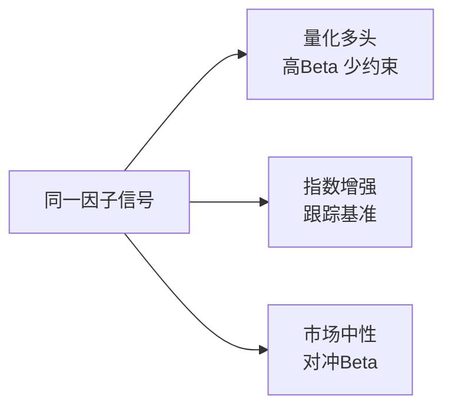

# 04 多头、增强与市场中性

> 所属模块：Part I 认识量化研究

**同一个因子，可以做出三种完全不同的产品——差别不在信号，在约束。**

## 本节导读

A 股量化私募最常见的产品形态有三类：量化多头、指数增强、股票市场中性。它们共享相似的研究底座（多因子选股），但 **产品目标、风险暴露、评价基准** 截然不同。新人若混淆三者，可能做出「回测超额惊人、产品形态不匹配」的研究——PM 无法采用，风控无法通过。

## 学习目标

1. 区分三类主流股票量化产品形态
2. 理解同一因子如何服务不同产品目标

---

## 04.1 量化多头 Quant Long-Only

国内私募语境里「量化多头」有时指 **高仓位选股型** 产品，与「指数增强」的边界并非一刀切——关键看 **是否有明确基准约束** 以及 **TE 是否受控**。无严格基准、高 Beta 暴露的，通常归入量化多头。

量化多头（Quant Long-Only）在 A 股语境下通常指 **高仓位、偏主动** 的股票多头策略，常见特征：

| 维度 | 典型设定 |
| --- | --- |
| 市场暴露 | 高 Beta，仓位 80%～95% |
| 收益构成 | 市场收益 + 选股超额 |
| 风格暴露 | 可能有意识暴露小盘、价值等 |
| 主要风险 | 市场系统性回撤 |
| 评价方式 | 绝对收益 + 相对基准超额 |

### 收益分解直觉

$$
R_{p} \approx \underbrace{\beta \cdot R_{m}}_{\text{Beta}} + \underbrace{\sum w_i \alpha_i}_{\text{Stock Alpha}} + \underbrace{\text{Style}}_{\text{intentional or not}}
$$

2022 年 A 股整体下跌，许多量化多头产品回撤 25%～35%——其中大部分是 **市场 Beta**，不是因子失效。评价这类产品，必须同时看 **绝对回撤** 和 **相对基准超额**。

### 回撤与仓位管理

- 量化多头通常 **不做股指对冲**，市场跌时组合跟跌。
- PM 可能通过 **降仓、行业轮动、防御因子** 控制回撤，但这是产品层面的决策，不是因子本身的属性。
- 研究员需明确：你的因子是 **进攻型**（高 IC、高换手）还是 **防御型**（低波、质量）——两者服务的产品不同。

---

## 04.2 指数增强 Index Enhancement

指数增强（Index Enhancement）的目标是：**跟踪基准指数（Benchmark），同时获取稳定超额收益（Active Return）**。

| 概念 | 说明 |
| --- | --- |
| 基准指数 | 常见：沪深 300、中证 500、中证 1000 |
| 主动收益 Active Return | 组合收益 − 基准收益 |
| 跟踪误差 Tracking Error | 主动收益的标准差 |
| 信息比率 IR | 主动收益均值 / 跟踪误差 |

$$
\mathrm{IR} = \frac{\mathbb{E}[R_p - R_b]}{\sigma(R_p - R_b)}
$$

### 风险约束

指数增强不是「跑得比指数越远越好」。产品契约通常限制：

- 跟踪误差上限（如 TE < 4%～6% 年化）
- 行业偏离限额（如单行业 ±3%）
- 风格暴露限额（市值、Beta 接近 1）
- 成分股内外比例（如 80% 权重在指数成分内）

**增强收益来源**：在约束允许的空间内，通过因子选股获取 **经风险调整后的超额**——通常是行业内选股、微调权重，而非大幅偏离指数。

### A 股实务

- **沪深 300 增强**：大盘蓝筹池，流动性好，容量大，Alpha 空间相对小。
- **中证 1000 增强**：小中盘暴露，Alpha 空间较大，但流动性、冲击成本更敏感。
- 选错基准是常见错误：用 1000 增强的方法做 300 产品，风格漂移严重。

---

## 04.3 股票市场中性 Equity Market Neutral

股票市场中性（Equity Market Neutral，EMN）追求 **剥离市场方向，提取纯 Alpha**。

| 组件 | 说明 |
| --- | --- |
| 多头组合 Long Book | 因子选出的高分股票 |
| 空头/对冲 Short / Hedge | 融券做空或股指期货对冲 |
| Beta 中性 | 组合对市场涨跌不敏感 |
| 风格/行业中性 | 进一步剥离系统性暴露 |
| 对冲成本 | 融券费率、期货基差、保证金 |

### 收益特征

- 理想状态：市场涨 10% 或跌 10%，组合收益接近 **纯 Alpha**。
- 现实状态：完美中性很难；基差波动、融券稀缺、对冲滞后都会带来 **隐性 Beta 和成本**。

### A 股特殊摩擦

| 问题 | 影响 |
| --- | --- |
| 融券稀缺 | 空头端难以完全复制多头，常用股指期货替代 |
| 股指期货基差 | 对冲成本随市场变化，2024 年曾出现深度贴水 |
| T+1 | 日内无法灵活调整对冲比例 |
| 涨跌停 | 多头涨停买不到、空头跌停平不了，破坏中性 |

市场中性产品的评价基准通常是 **绝对收益** 或 **0% 无风险利率超额**，而非某个股票指数。

---

## 04.4 三类策略对比

| 维度 | 量化多头 | 指数增强 | 股票市场中性 |
| --- | --- | --- | --- |
| 主要收益来源 | 市场 + 选股 | 指数 + 超额 | 选股 Alpha |
| 市场暴露 | 较高（Beta ≈ 0.8～1.0） | 接近基准（Beta ≈ 1） | 较低（Beta ≈ 0） |
| 约束强度 | 中等 | 较高 | 高 |
| 典型风险 | 市场回撤 | 跟踪误差、风格漂移 | 对冲成本、基差、拥挤 |
| 评价指标 | 绝对收益、超额、最大回撤 | IR、TE、超额 | 绝对收益、Sharpe、回撤 |
| 容量 | 较大 | 中～大 | 中（受融券/对冲工具限制） |
| A 股工具 | 纯多头 | 纯多头 | 多头 + 股指期货 / 融券 |



---

## 04.5 从因子信号到不同产品形态

### 同一个因子，三种用法

假设你有一个 **质量因子（Quality Factor）**，IC 稳定、逻辑清晰：

| 产品 | 用法 | 差异 |
| --- | --- | --- |
| 量化多头 | 质量加权 Top 100，全市场选股 | 可能超配小盘高质量股 |
| 300 增强 | 在沪深 300 成分内按质量超配 | 行业偏离 ±2%，TE 控制 |
| 市场中性 | 多头高质量 / 空头低质量，行业中性 | 需对冲 Beta，扣减对冲成本 |

### 风险约束如何改变组合

```python
# 伪代码：同一 signal，不同优化目标
# 量化多头：最大化预期收益
w_long = optimize(max_return, signal, constraints=[weight_sum=1, long_only=True])

# 指数增强：最大化超额，约束 TE 和行业偏离
w_ie = optimize(max_active_return, signal,
                constraints=[te_limit=0.04, industry_dev=0.03, beta=1.0])

# 市场中性：最大化 Alpha，Beta 和行业中性
w_emn = optimize(max_alpha, signal,
                 constraints=[beta=0, industry_neutral=True, dollar_neutral=True])
```

### 产品目标如何影响研究方式

| 产品 | 研究员应额外关注 |
| --- | --- |
| 量化多头 | 因子在不同市场环境下的表现；与 PM 的仓位策略配合 |
| 指数增强 | 因子在 **基准成分内** 的 IC；行业内选股能力 |
| 市场中性 | 因子 **中性化后** 的 IC；多空 spread；对冲成本敏感性 |

**上线前必问 PM**：「这个因子服务哪条产品线？」——答案决定你的检验口径。

### 产品契约中的「隐藏约束」

除 TE 与行业偏离外，实务中还有：

| 约束 | 典型值 | 影响研究 |
| --- | --- | --- |
| 最大单票权重 | 1%～3% | 限制在小票上的 Alpha 集中度 |
| 最小成交额过滤 | 5000 万/日 | 缩小可交易 universe |
| 换手上限 | 300%/年 | 高 IC 低换手因子更受欢迎 |
| ESG / 禁投名单 | 因机构而异 | 部分股票信号强制为零 |

研究员若不知这些约束，可能优化一个在数学上最优、在产品上 **不可行** 的组合。

### 三条产品线的客户预期

| 产品 | 客户通常问 | 研究员应准备的答案 |
| --- | --- | --- |
| 量化多头 | 「熊市能少跌吗？」 | 回撤分解、Beta、防御因子 |
| 指数增强 | 「每年稳定跑赢几个点？」 | IR、TE、超额稳定性 |
| 市场中性 | 「跟大盘有关系吗？」 | Beta 中性度、对冲成本、绝对 Sharpe |

### 对冲工具速览（A 股）

| 工具 | 用途 | 局限 |
| --- | --- | --- |
| 股指期货 | Beta 对冲 | 基差、合约展期 |
| 融券 | 个股/行业对冲 | 券源、费率 |
| ETF | 简易 Beta 管理 | 跟踪误差 |

市场中性须在研究阶段选定主对冲工具，并在回测中建模成本——不能「先假设完美对冲」。

---

## 常见错误

- 用全市场 IC 汇报指数增强因子，未检验成分内有效性。
- 忽略对冲成本，市场中性回测按「完美对冲、零成本」假设。
- 把量化多头的绝对收益全部归功于因子，不分解 Beta 贡献。
- 研究时不设产品约束，上线时才发现 TE 超标或行业偏离过大。

## 要点回顾

- 量化多头、指数增强、市场中性共享因子研究，但 **产品目标与约束** 不同。
- 指数增强用 IR 和 TE 评价；核心是 **在约束内获取稳定超额**。
- 市场中性追求 Beta 中性，A 股需面对融券、基差、T+1 等摩擦。
- 同一因子须按产品线做不同的组合构建与检验口径。
- 研究前先问清服务哪条产品线——这比 IC 小数点更重要。
