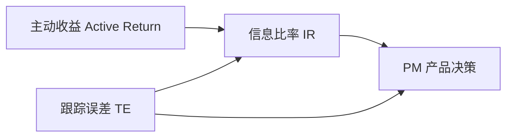

# 05 收益、风险与基准

> 所属模块：Part I 认识量化研究

**收益数字本身不会说谎——但口径会。**

## 本节导读

两个研究员汇报「年化 15%」，可能一个在算简单收益、另一个在用对数收益；一个含交易成本、另一个不含；一个相对沪深 300，另一个相对中证 1000。本章统一 **收益、风险、基准** 的基本口径，避免后续 Part 的讨论建立在不可比的数字上。

## 学习目标

1. 统一收益与风险的基本口径
2. 理解 Benchmark、Active Return 与 Tracking Error

---

## 05.1 收益率的基本口径

收益口径混乱是实习生汇报被 PM 打断的头号原因。下面从 **定义** 到 **汇报习惯** 逐层对齐——建议抄到你的笔记首页。

### 简单收益率 vs 对数收益率

**简单收益率（Simple Return）**：

$$
R_t = \frac{P_t - P_{t-1}}{P_{t-1}}
$$

**对数收益率（Log Return）**：

$$
r_t = \ln\left(\frac{P_t}{P_{t-1}}\right)
$$

| 类型 | 优点 | 常用场景 |
| --- | --- | --- |
| 简单收益 | 直观，可跨资产加权 | 组合收益、超额收益汇报 |
| 对数收益 | 时间可加性，统计性质好 | 回归分析、波动率估计 |

近似关系：当 $|R_t|$ 较小时，$r_t \approx R_t$。日频 A 股研究中两者差异通常不大，但 **跨期累乘时必须统一**。

### 累计与年化

$$
R_{\text{cum}} = \prod_{t=1}^{T}(1 + R_t) - 1
$$

$$
R_{\mathrm{annual}} = (1 + R_{\mathrm{cum}})^{252/N} - 1 \quad (\text{daily, 252 trading days})
$$

**注意**：年化方式有多种（算术平均 × 252、几何平均等），团队内须统一。实习报告中应注明「年化方法：几何，基于 252 交易日」。

### 绝对、相对与超额

| 类型 | 定义 | 示例 |
| --- | --- | --- |
| 绝对收益 Absolute Return | 组合自身涨跌 | 今年 +12% |
| 相对收益 Relative Return | 相对某基准 | 跑赢沪深 300 共 5% |
| 超额收益 Excess Return | 组合 − 无风险利率 $R_p-R_f$ | Sharpe 等绝对收益评价 |
| 主动收益 Active Return | 组合 − 基准 $R_p-R_b$（中文常简称「超额」时须注明相对基准） | 指增 / 相对评价的核心 |

```python
import numpy as np

# 伪代码：相对基准的主动收益（Active Return）
portfolio_ret = 0.0012  # 日简单收益
benchmark_ret = 0.0008
active_ret = portfolio_ret - benchmark_ret  # 日主动收益 R_p - R_b
# 累计主动收益 ≠ 累计组合 − 累计基准（需逐日相减后复利，或统一口径）
```

**常见陷阱**：把「累计组合收益 − 累计基准收益」直接当累计主动收益——仅在单期成立；多期须逐期计算。

### 口径对齐实例

同一组合 2023 年数据，不同口径可得出「不同答案」：

| 口径选择 | 组合年化 | 备注 |
| --- | --- | --- |
| 简单收益，不含成本 | +18.2% | 最常见的新手汇报 |
| 简单收益，含双边 0.3% 成本 | +14.5% | 更贴近机构 |
| 相对沪深 300 超额 | +9.1% | 需逐日减基准 |
| 相对中证 1000 超额 | +2.3% | 换基准结论大变 |

**结论**：汇报时写全「绝对/相对、含费/不含费、基准名、年化方法」四要素，避免争议。

### 无风险利率与超额

有时「超额」指 $R_p - R_f$（相对国债或 Shibor），有时指 $R_p - R_b$（相对指数）。本手册约定：**Excess = 相对无风险；Active / 相对基准超额 = $R_p-R_b$**。对外汇报首次出现「超额」时写清所指。

- **相对无风险**：回答「是否值得承担股票风险」
- **相对基准**：回答「PM 是否值得付管理费」

指数增强几乎总是后者；市场中性可能两者都看。

---

## 05.2 风险的多维含义

「风险」不是波动率一个词能概括的。量化研究中至少区分以下维度：

| 风险类型 | 含义 | 度量示例 |
| --- | --- | --- |
| 波动率 Volatility | 收益离散程度 | 年化标准差 |
| 最大回撤 Max Drawdown | 峰值到谷底的最大跌幅 | MDD = −35% |
| 下行风险 Downside Risk | 负收益部分的波动 | Sortino 分母 |
| 尾部风险 Tail Risk | 极端损失 | VaR、CVaR、极端日收益 |
| 流动性风险 Liquidity | 无法以合理价格成交 | 成交额占比、冲击成本 |
| 模型风险 Model Risk | 假设错误、过拟合 | 样本外衰减 |
| 拥挤交易 Crowding | 同类策略同步调仓 | 因子相关性上升 |
| 操作风险 Operational | 系统故障、人为失误 | 下单错误、数据延迟 |

### 波动率与回撤

$$
\sigma_{\text{annual}} = \sigma_{\text{daily}} \times \sqrt{252}
$$

最大回撤（Maximum Drawdown）对 **客户体验** 和 **风控限额** 往往比波动率更敏感——2022 年许多量化产品「波动率不高但回撤深」，正是因为 Beta 暴露与市场共振。

### 风险汇报的最小集合

对内风控日报、对外投资人月报，建议至少包含：年化波动与最大回撤、相对基准超额与 TE、Beta 与主要风格暴露、流动性指标（成交额占比、单票权重）、模型风险（OOS IC 滚动、策略相关性）。少报一项，就少一个 **提前预警** 的机会。

### 风险不是越少越好

- 指数增强需要 **适度跟踪误差** 才有超额空间；TE 压到零 = 复制指数，没有 Alpha。
- 市场中性降低 Beta 风险，但引入 **对冲成本与基差风险**。
- 研究员应汇报 **多维风险**，而非只给一个 Sharpe。

---

## 05.3 Benchmark 的作用

基准（Benchmark）是评价策略的 **参照系**。没有基准，「跑赢 10%」无从谈起。

| 基准 | 特点 | 适用产品 |
| --- | --- | --- |
| 沪深 300 CSI 300 | 大盘蓝筹，流动性好 | 300 增强、大盘多头 |
| 中证 500 CSI 500 | 中盘 | 500 增强 |
| 中证 1000 CSI 1000 | 小中盘 | 1000 增强、小盘策略 |
| 自定义基准 Custom | 复合指数或规则组合 | 全市场量化多头 |

### 为什么必须选合理基准？

1. **分解收益**：超额多少是 Alpha，多少是「基准本身涨得好」？
2. **风格对齐**：小盘因子策略用沪深 300 做基准，会系统性「看起来超额很高」——因为风格暴露，不是选股能力。
3. **产品契约**：指数增强产品的基准写在合同里，偏离基准 = 偏离产品定义。
4. **同业比较**：同一基准下才可比较不同管理人的 IR。

**反例**：某策略全市场选小盘股，却用沪深 300 做基准，2021 年小盘年超额 30%——其中大部分是小盘 **风格 Beta**，不是经调整的 Alpha。

---

## 05.4 Active Return 与 Tracking Error

### 定义

- **主动收益 Active Return**（相对基准超额）：$R_p - R_b$
- **跟踪误差 Tracking Error（TE）**：主动收益的标准差（通常年化）

$$
\mathrm{TE} = \sigma(R_p - R_b) \times \sqrt{252}
$$

### 信息比率 Information Ratio

$$
\mathrm{IR} = \frac{\mathbb{E}[R_p - R_b]}{\sigma(R_p - R_b)} = \frac{\text{Ann. Active Return}}{\text{Ann. TE}}
$$

日频实务中：分子常用 $\bar r_a\times 252$，分母用 $\sigma(r_a)\times\sqrt{252}$（算术年化）；**勿**把几何年化超额直接除以年化 TE 却不声明口径。

IR 是指数增强的 **核心评价指标**：在相同 TE 下，IR 越高越好；在相同 IR 下，TE 越高意味着更大偏离与潜在更大超额（也更大风险）。

### 指数增强中的收益—风险权衡

| TE 水平 | 含义 | 典型 IR 期望 |
| --- | --- | --- |
| 低（< 3%） | 接近指数，超额空间有限 | IR > 1 已不错 |
| 中（3%～6%） | 主流增强区间 | IR > 1.5 较优秀 |
| 高（> 6%） | 偏离大，可能风格化 | 需额外解释风格暴露 |



**实务**：PM 通常设定 TE 上限；研究员在 TE 预算内优化 Alpha，而非无限追求超额。

### Sharpe 与 Sortino：何时用哪个？

| 指标 | 公式直觉 | 适用 |
| --- | --- | --- |
| Sharpe | 超额 / 总波动 | 通用，但对上行波动也惩罚 |
| Sortino | 超额 / 下行波动 | 更关注「亏的时候有多惨」 |

$$
\mathrm{Sharpe} = \frac{\mathbb{E}[R_p - R_f]}{\sigma(R_p)}
$$

多因子选股策略常呈 **正偏**：小赚多、大亏少——Sortino 可能高于 Sharpe。但团队内须统一汇报哪一个，避免 selective reporting。

### TE 预算分配直觉

假设 PM 给 TE 预算 5%，研究员可在 **行业偏离、风格偏离、个股选择** 之间分配：

- 行业 bet 用掉 2% TE → 剩余 3% 给纯选股
- 全部 TE 用于行业轮动 → 产品更像「增强型行业 ETF」，而非纯多因子

这与第 04 章「同一因子、不同产品」一脉相承—— **TE 是稀缺资源**。

### 与 Wind / 同业的口径差异

实务中常见：Wind 年化与自研框架差 0.5%～1%，原因可能是交易日历、复权方式、加权方式不同。**团队内对齐 > 追求与外部完全一致**；对外报告注明数据源与口径即可。

向非量化同事解释业绩时，用「分解表」而非单一数字——透明度建立信任，也减少「为什么和 App 上不一样」的追问。

---

## 常见错误

- 汇报收益不注明：简单/对数、含/不含成本、年化方法。
- 用错误基准评价策略，把风格暴露当成 Alpha。
- 只报 Sharpe，不报最大回撤和 TE。
- 多期累计主动收益用「终值相减」而非逐期主动收益复利。

## 要点回顾

- 简单收益与对数收益各有用途；累计与年化须统一方法。
- 风险是多维的：波动、回撤、流动性、模型、拥挤、操作等。
- 基准是评价超额的前提；选错基准会系统性误判 Alpha。
- 指数增强核心指标：主动收益、TE、IR；TE 与超额存在权衡。
- 数字不会说谎，但口径会——先对齐口径，再比较结论。
