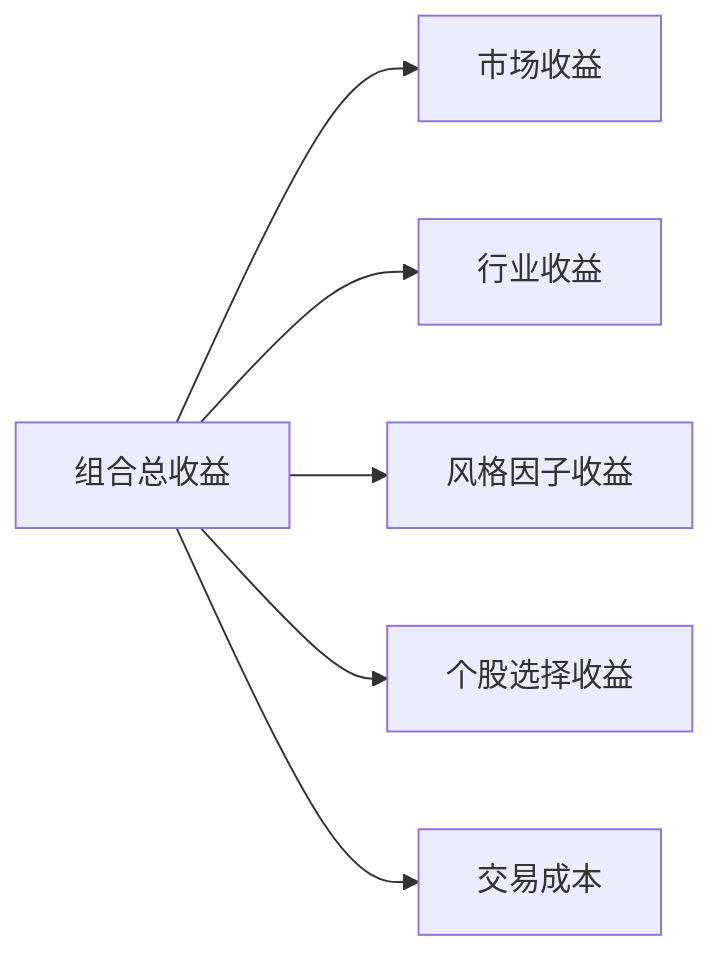

# 06 Alpha、Beta 与风险暴露

> 所属模块：Part I 认识量化研究

**绝对收益是结果，Alpha 是解释——不会解释，就不会改进。**

## 本节导读

「今年赚了 20%」不等于「有 Alpha」。可能是市场涨了 25%，你 Beta 0.8 跟涨；可能是小盘风格年，你无意中暴露小市值；也可能是数据泄漏下的回测幻觉。本章建立 **Alpha / Beta / 风险暴露** 的基本框架，帮你学会分解收益、识别假 Alpha——这是多因子研究员的核心功。

## 学习目标

1. 区分 Alpha 与 Beta
2. 理解风格暴露与收益归因的基本思想

---

## 06.1 Beta 是什么

Beta 是归因的起点，不是终点。许多新人第一次做风险模型暴露报告时，才发现组合「偷偷」在小盘上暴露了 +0.5 标准差——牛市这是礼物，熊市这是账单。

**Beta（β）** 衡量组合对 **系统性风险因子** 的暴露程度，即「市场动一下，你动多少」。

| Beta 类型 | 含义 | 示例 |
| --- | --- | --- |
| 市场 Beta Market Beta | 对整体市场指数的敏感度 | β = 1.0 跟涨跟跌同幅 |
| 行业 Beta Industry Beta | 对某行业指数的暴露 | 超配电子 10% |
| 风格 Beta Style Beta | 对市值、价值、动量等因子的暴露 | 小盘 β 高 |

### 系统性风险暴露

系统性风险（Systematic Risk）无法通过分散化消除——市场跌时大多数股票跌。Beta 是这种 **不可分散风险** 的度量。

CAPM 框架下的直觉（非 handbook 重点推导，但需知道）：

$$
R_p - R_f = \alpha + \beta (R_m - R_f) + \epsilon
$$

- $\beta (R_m - R_f)$：市场带来的收益部分
- $\alpha$：经 Beta 调整后的超额
- $\epsilon$：残差

**A 股语境**：除市场 Beta 外，行业与风格 Beta 同样重要——A 股行业轮动快，风格切换剧烈（大小盘、价值成长）。

### Beta 估计的实务注意

- **滚动窗口**：Beta 非恒定，常用 60 日或 252 日滚动回归。
- **基准选择**：全市场策略用沪深 300 或中证全指；1000 增强用中证 1000。
- **杠杆**：市场中性可能 Beta 名义为 0，但 **基差与对冲比例误差** 会引入动态 Beta。

Beta 估错 → Alpha 归因全错。上线前与风控对齐 **Beta 计算口径**（回归方法、窗口、基准）。

---

## 06.2 Alpha 是什么

**Alpha（α）** 指 **经系统性风险暴露调整后** 的超额收益，即「市场、行业、风格都解释完之后，你还多赚（或少赚）的部分」。

| 误解 | 正解 |
| --- | --- |
| 绝对收益高 = Alpha 高 | 需扣除 Beta 与风格贡献 |
| 跑赢基准 = 纯 Alpha | 基准可能风格不同，需归因 |
| 回测 IC 高 = Alpha 确定 | IC 是预测力，Alpha 是实现的超额 |

### 因子 Alpha vs 个股 Alpha

- **因子 Alpha**：某因子组合相对基准的超额（如 Top 组 − Bottom 组，中性化后）。
- **个股 Alpha**：单只股票相对其风险模型预期收益的超额。

多因子研究中，我们更关心 **因子 Alpha 是否稳健、可规模化**。

### Alpha 的时间维度

| 持有期 Horizon | 含义 | 研究用途 |
| --- | --- | --- |
| 1 日 | 短期 mispricing | 高换手，成本敏感 |
| 5～20 日 | 主流因子 horizon | IC 检验常用 |
| 60 日+ | 慢变量、基本面 | 与财报滞后相关 |

同一因子在不同 horizon 上可能「有 Alpha」或「无 Alpha」——汇报时必须写明 **holding period**，否则不可比。

---

## 06.3 风格因子暴露 Style Factor Exposure

Barra 等风险模型常用风格因子（本 handbook 后续 Part VI 展开）：

| 风格因子 | 含义 | A 股特点 |
| --- | --- | --- |
| 市值 Size | 大/小盘倾向 | 大小盘轮动显著 |
| 价值 Value | 低估值倾向 | BP、EP 等 |
| 成长 Growth | 高成长倾向 | 与价值常对立 |
| 动量 Momentum | 过去赢家倾向 | 反转与动量共存 |
| 波动率 Volatility | 高/低波倾向 | 低波异象存在 |
| 流动性 Liquidity | 换手、成交额 | 小票流动性溢价 |

### 暴露 vs 收益

- **暴露 Exposure**：组合在某因子上的权重偏离（如相对基准小盘 +0.3 标准差）。
- **因子收益 Factor Return**：该因子在全市场的平均回报（如本月小盘因子 +2%）。
- **贡献 Contribution**：暴露 × 因子收益 ≈ 组合从该因子获得的收益。

**假 Alpha 预警**：若你的「Alpha」与小盘暴露高度相关，且中性化后消失——你赚的是 **风格 Beta**，不是选股 Alpha。

---

## 06.4 收益归因的基本思想

收益归因（Performance Attribution）把组合总收益分解为可解释的组成部分：



| 组成部分 | 含义 |
| --- | --- |
| 市场收益 | Beta × 市场回报 |
| 行业收益 | 行业配置与行业指数回报 |
| 风格因子收益 | 风格暴露 × 因子回报 |
| 个股选择 Stock Selection | 行业内选股带来的超额 |
| 交易成本 | 手续费、滑点、冲击 |

### 简化数值示例

假设某月组合收益 +3%，分解如下：

| 来源 | 贡献 |
| --- | --- |
| 市场（Beta=0.95） | +1.8% |
| 行业配置 | +0.3% |
| 小盘风格暴露 | +0.7% |
| 个股选择（Alpha） | +0.4% |
| 交易成本 | −0.2% |
| **合计** | **+3.0%** |

对外汇报「Alpha +0.4%」比「本月 +3%」诚实得多——也更能指导改进方向。

---

## 06.5 假 Alpha 的常见来源

| 来源 | 机制 | 如何识别 |
| --- | --- | --- |
| 小盘暴露 Size | 小市值溢价或风格年 | 市值中性化后 IC 归零 |
| 行业集中 Industry | 押中热门行业 | 行业中性化后失效 |
| 市场上涨 Beta | 高仓位牛市 | 熊市超额转负 |
| 流动性溢价 Liquidity | 持有低流动性小票 | 扣冲击成本后消失 |
| 数据泄漏 Look-Ahead | 用了未来信息 | 改滞后口径后失效 |
| 幸存者偏差 Survivorship | 只用现存股票 | 换历史成分股后衰减 |

### 检验清单

1. **中性化**：对行业、市值中性化后，因子 IC 是否仍显著？
2. **子样本**：2018 熊市、2021 小盘年、2024 微盘年分别检验。
3. **成本**：加入贴近实盘的交易成本后，分组 spread 是否仍为正？
4. **样本外**：Walk-forward 或 hold-out 区间是否衰减可控？

```python
# 伪代码：中性化后检验 IC
raw_ic = cross_sectional_ic(factor, forward_return)
neutral_ic = cross_sectional_ic(
    neutralize(factor, by=["industry", "market_cap"]),
    forward_return
)
# 若 raw_ic >> neutral_ic，警惕风格假 Alpha
```

### A 股假 Alpha 案例速览

| 场景 | 表面现象 | 归因后真相 |
| --- | --- | --- |
| 2021 小盘年 | 全市场因子 IR 2+ | 市值中性后 IR < 0.8 |
| 2024 微盘拥挤 | 反转因子爆发 | 流动性溢价 + 执行不可复制 |
| 单行业爆款 | 新能源赛道超额 | 行业配置 Beta，非行业内选股 |
| 财报季策略 | 事件后漂移 | 未滞后财报公告日 → 前视 |

每个案例的教训相同：**分解先于庆祝**。

### 暴露管理 vs Alpha 研究

| 角色 | 关注点 |
| --- | --- |
| 研究员 | 构造经中性化仍有效的信号 |
| PM | 在 TE 预算内决定是否 **有意** 保留某风格暴露 |
| 风控 | 监控暴露是否超出产品契约 |

有时 PM **故意** 保留小盘暴露——那是产品定位，不是研究失误。但必须是 **透明、可计量、可解释** 的选择，不是无意识漂移。

### Fama-French 直觉（扩展）

三因子 / 五因子是学术界的归因语言；A 股实务多用 Barra 或自研模型，但思想一致：**先把已知风险因子解释掉，再看 residual**。不必死记公式，但要理解 Alpha 是 residual，不是 headline return。

定期做 **归因复盘**：月度 PnL 会议前先写好分解表，避免现场即兴解释——专业研究员与「会讲故事的人」的分野往往在这里。

---

## 常见错误

- 把牛市绝对收益包装成 Alpha，不做事后归因。
- 只报告 raw IC，不做行业和市值中性化。
- 忽视流动性：回测按收盘价全额成交，实盘冲击巨大。
- 发现假 Alpha 后仍坚持上线，「反正客户看的是总收益」——短期可能，长期伤害信任。

## 要点回顾

- Beta 是系统性风险暴露；Alpha 是经 Beta 与风格调整后的超额。
- 绝对收益、跑赢基准 ≠ Alpha；必须做收益归因。
- 风格因子暴露（市值、价值、动量等）是 A 股假 Alpha 的主要来源。
- 收益归因分解：市场、行业、风格、选股、成本。
- 识别假 Alpha：中性化、子样本、成本、样本外四件套。
