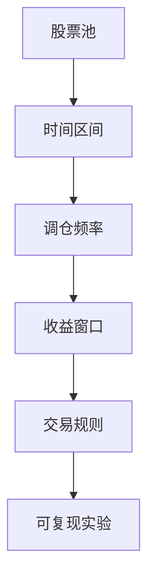
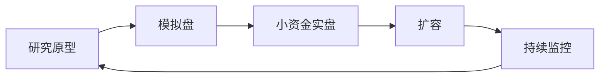
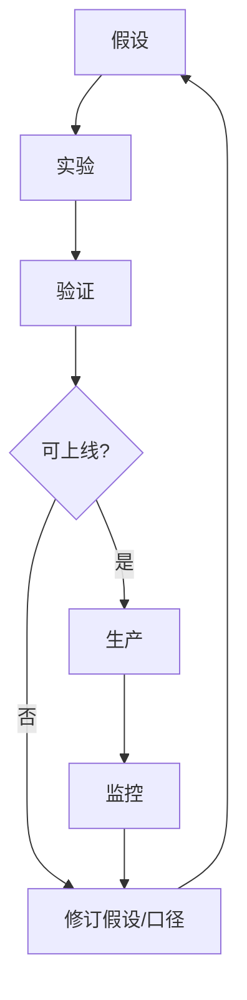

# 07 策略研究生命周期

> 所属模块：Part I 认识量化研究

**量化研究不是从回测开始、到回测结束的直线——而是一条不断被数据、成本与实盘结果证伪并修正的循环。**

## 本节导读

新人常见 workflow：想到一个因子 → 跑回测 → 曲线好看 → 写报告。缺少的是：现象从哪来、假设能否证伪、口径是否写清、样本外是否做过、上线谁负责。本章描述 **从观察到生产** 的完整生命周期，并强调研究是 **迭代循环** 而非一次性交付。

## 学习目标

1. 掌握从现象到生产的完整研究闭环
2. 理解研究是迭代而非线性过程

---

## 07.1 观察市场现象

现象观察阶段 **禁止** 直接打开代码。先用文字描述：谁在什么情况下、做了什么、价格如何反应。若描述无法量化，说明还没想清楚。

研究的起点是 **现象（Phenomenon）**，不是 **结论（Conclusion）**。

| 好的起点 | 差的起点 |
| --- | --- |
| 「ST 摘帽后 20 日平均超额 X%」 | 「我要做一个 ML 策略」 |
| 「北向资金连续流入日的次日收益分布」 | 「师兄说动量有效，我也做一个」 |
| 「财报预告超预期后的漂移持续多久」 | 「回测年化要超过 30% 才行」 |

### 从现象到问题

- 现象描述要 **可量化**：时间、标的、变量、方向。
- **避免结果导向**：先定「要正 IC」再倒推数据，是典型的 p-hacking 温床。
- **明确时间尺度**：日频、周频、月频——现象在哪个尺度成立？

---

## 07.2 提出经济假设

每一个因子背后应有一句 **经济逻辑（Economic Rationale）**，常见四类：

| 逻辑类型 | 含义 | 示例 |
| --- | --- | --- |
| 风险补偿 Risk Premium | 承担某风险获得回报 | 小盘流动性溢价 |
| 行为偏差 Behavioral Bias | 投资者系统性错误定价 | 过度反应、锚定 |
| 市场摩擦 Market Friction | 交易限制、信息传播慢 | 财报滞后、限售解禁 |
| 信息扩散 Information Diffusion | 信息逐步纳入价格 | 分析师覆盖滞后 |

**可证伪性**：若逻辑是「因为大家都喜欢小盘」，无法证伪；若逻辑是「小盘流动性溢价在控制规模后仍存在」，可通过中性化检验推翻。

---

## 07.3 定义数据与研究口径

口径（Specification）是研究 **可复现** 的骨架。以下每一项必须在实验前写清：

| 口径项 | 典型选择 | 不明确的后果 |
| --- | --- | --- |
| 股票池 Universe | 全 A 剔除 ST / 停牌 / 次新 | 结果不可比 |
| 时间区间 | 2015～2024，样本内/外切分 | 过拟合无法识别 |
| 调仓频率 Rebalance | 周度 / 月度 | 成本与 IC 不可比 |
| 收益窗口 Horizon | 5 日 / 20 日 forward return | IC 量级不同 |
| 交易规则 | 信号日收盘，次日开盘成交 | 误用 T 日收盘价成交 → **前视偏差** |



**Part II 起会逐项展开**；此处只强调：**口径不一致的研究，连讨论的资格都没有。**

### 口径文档示例（片段）

| 字段 | 本团队示例值 | 备注 |
| --- | --- | --- |
| universe | 全 A，剔除 ST、*ST | 与 Wind 全 A 差 ~2% |
| 成交价格 | T+1 开盘价 | 非收盘价 |
| 成本 | 佣金万 2 + 印花税 0.05%（卖） | 2024 费率 |
| 财务滞后 | 公告日 + 1 交易日 | 防前视 |

新人最常犯的错误：复制论文口径直接跑——论文用 CRSP、NYSE，你用 A 股， **默认对齐等于没有对齐**。

---

## 07.4 构造信号

从原始变量到可交易信号，典型流水线：

| 步骤 | 说明 |
| --- | --- |
| 原始变量 Raw Variable | ROE、换手率、北向净流入等 |
| 因子表达 Factor Expression | 公式、滞后、 winsorize |
| 标准化 Standardization | 截面 z-score、rank |
| 中性化 Neutralization | 对行业、市值回归取残差 |
| 合成 Combination | 多因子加权、ML 组合 |

```python
# 伪代码：典型因子构造流水线
raw = get_fundamental("roe")
winsorized = winsorize(raw, limits=(0.01, 0.99))
standardized = cross_sectional_zscore(winsorized)
neutralized = neutralize(standardized, by=["industry", "log_market_cap"])
signal = neutralized  # 或与其他因子合成
```

**原则**：每一步可单独审查；黑箱一步到位的因子，难以 debug 也难以过合规。

---

## 07.5 验证策略

验证（Validation）不是「跑一次回测」，而是 **多层证据**：

| 方法 | 回答的问题 |
| --- | --- |
| 统计检验 Statistical Test | IC t 值、显著性是否稳健 |
| 分组回测 Group Backtest | Top−Bottom 是否单调 |
| 横截面回归 Cross-Sectional Regression | 因子溢价是否显著 |
| 样本外 OOS | 新时间段是否衰减 |
| 稳健性 Robustness | 换口径、换池、换参数是否仍成立 |

### 样本内 vs 样本外

- **样本内 In-Sample（IS）**：用于构造和初筛，允许探索。
- **样本外 Out-of-Sample（OOS）**：未参与调参的时间段，模拟「未来」。
- **Walk-Forward**：滚动 IS/OOS，更接近实盘节奏。

**纪律**：OOS 区间 **只验不收**——不在 OOS 上继续调参，否则 OOS 变成 IS。

---

## 07.6 从研究到生产

研究验证通过后，进入 **生产化（Productionization）** 链条：

| 阶段 | 目的 | 关键活动 |
| --- | --- | --- |
| 研究原型 Research Prototype | 验证想法 | Jupyter、单次回测 |
| 模拟盘 Paper Trading | 检验执行与延迟 | 实时信号、模拟成交 |
| 小资金实盘 Pilot | 检验成本与容量 | 真实资金、小规模 |
| 扩容 Scale-Up | 扩大 AUM | 冲击成本、市场影响 |
| 持续监控 Monitoring | 检测衰减 | IC 滚动、归因、告警 |



**常见断层**：研究在 Jupyter 里完美，生产 pipeline 未接入——因子值更新延迟一天，实盘用的是「昨天的信号」。

---

## 07.7 研究是循环而非直线

研究生命周期不是「完成就归档」，而是持续 **反馈—修订**：

| 反馈来源 | 可能动作 |
| --- | --- |
| 样本外 IC 衰减 | 修订假设或降权 |
| 数据口径变更 | 重跑历史、修正因子 |
| 市场结构变化 | 调整中性化、换股票池 |
| 实盘成本超预期 | 降换手、改执行 |
| 风控限额收紧 | 改组合约束 |
| 因子拥挤 | 寻找 orthogonal 替代 |



**心态**：因子失效不是失败，是信息—— **快速识别、快速归因、快速决策** 是成熟研究员的标志。

### Research Spec 最小模板

```markdown
# 项目：XXX 因子
## 假设
- 经济逻辑：（一句话）
- 证伪条件：（IC<OOS 阈值 / 中性化后无效）

## 口径
- Universe：全 A 剔除 ST，上市 >60 日
- 区间：IS 2015-2020，OOS 2021-2024
- 调仓：月度，信号 T 日 close，成交 T+1 open
- 成本：双边 0.3% + 滑点 10bp

## 交付
- 单因子报告 + 生产字段清单 + 评审日期
```

团队可在此基础上扩展，但 **不可删减证伪条件与交易规则**。

### 评审会上的五个常问问题

1. 经济逻辑是什么？若无效，最可能原因？
2. OOS 表现相对 IS 衰减多少？
3. 中性化后 IC 是否仍显著？
4. 目标产品线是什么？约束下是否仍有效？
5. 生产依赖哪些数据？延迟多少？

提前准备好这五问的答案，比 PPT 动画更能建立信任。

### 时间与精力分配建议

| 阶段 | 建议占比 |
| --- | --- |
| 假设与口径 | 20% |
| 构造与单因子检验 | 30% |
| 样本外与稳健性 | 25% |
| 文档与对齐 | 15% |
| 生产准备 | 10% |

新人常把 80% 时间花在调参—— **口径与 OOS 才是护城河**。区分「项目失败」与「假设被证伪」：后者是正常科学过程，应写进 changelog。

---

## 常见错误

- 跳过现象与假设，直接从「找个因子公式」开始。
- 口径口头约定，不写 Research Spec，后人无法复现。
- 在 OOS 上反复调参，把样本外当样本内用。
- 研究通过评审即视为结束，不做生产监控与衰减跟踪。
- 实盘表现差时只怪「市场不行」，不做归因与假设修订。

## 要点回顾

- 研究从 **可量化现象** 开始，经经济假设、口径定义、信号构造、多层验证。
- 口径（股票池、区间、频率、收益窗口、交易规则）是复现的前提。
- 验证须含 IS/OOS、稳健性检验；OOS 纪律不可破。
- 生产链条：原型 → 模拟盘 → 小资金 → 扩容 → 监控。
- 研究是循环：监控反馈驱动假设修订，而非一次性交付。
