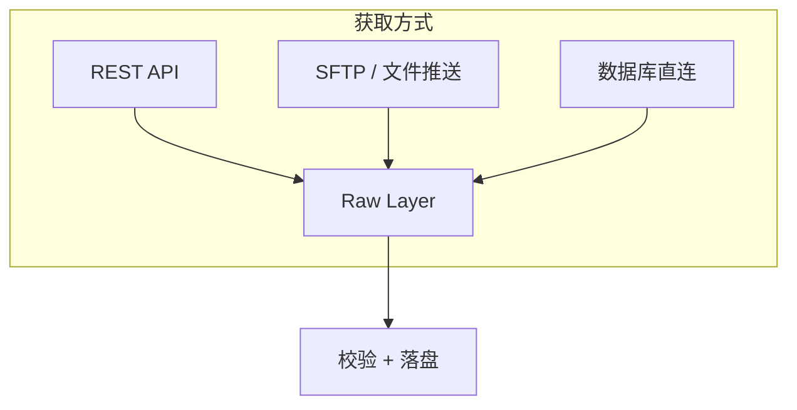
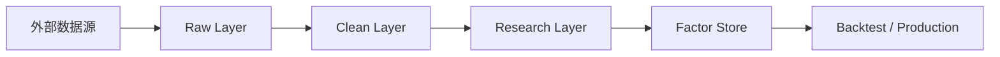
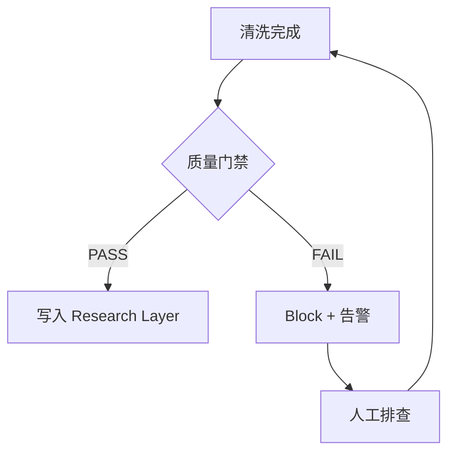
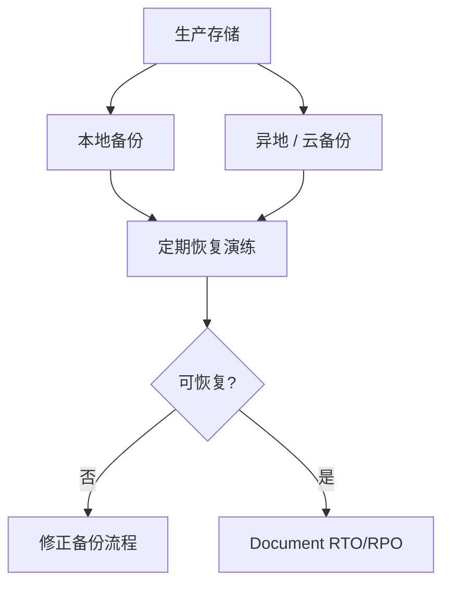

# 10 数据获取与数据 Pipeline

> 所属模块：Part II 数据是量化研究的起点

**Pipeline 不是 ETL 脚本堆砌——它是一条不可篡改、全程可追溯、过门禁才放行的高质量数据生产线。**

## 本节导读

情景：周一早上 9:00，研究员打开 Notebook 发现「昨日因子全是 NaN」。追查发现：供应商 API 凌晨超时、清洗脚本 silently drop 了 30% 行、Research Layer 被研究员手工改了一列——三重故障，零告警。

本章讲如何把「从 Wind 拉数据」升级为 **工程化的数据 Pipeline**：分层存储、增量更新、版本管理，以及三条铁律——**不可变（Immutable）、可追溯（Traceable）、质量门禁（Quality Gate）**。

## 学习目标

1. 了解 A 股量化研究的主要数据来源与获取方式
2. 理解 Raw / Clean / Research 三层架构及职责边界
3. 设计全量与增量更新、幂等与重跑机制
4. 建立数据版本管理与策略版本的绑定关系
5. 落实不可变、可追溯、质量门禁三大原则

---

## 10.1 数据来源

### 主要来源类型

| 来源 | 英文 | 典型内容 | A 股场景 |
| --- | --- | --- | --- |
| 交易所 | Exchange | 官方行情、公告 | 上交所、深交所、北交所 |
| 数据供应商 | Data Vendor | 清洗后的结构化数据 | Wind、Choice、CSMAR、聚源 |
| 券商接口 | Broker API | 实时行情、交易 | QMT、Ptrade、自建 |
| 公司公告 | Company Filing | 财报、重大事项 | 巨潮资讯、交易所网站 |
| 开源数据 | Open Source | 免费/社区维护 | AKShare、Tushare（Pro） |
| API / 文件 | API & File | 批量下载、FTP | 供应商定制推送 |

### 选择考量

| 维度 | 问题 | 建议 |
| --- | --- | --- |
| 覆盖度 | 是否覆盖全 A、历史深度够不够 | 供应商 > 开源（历史完整性） |
| 口径一致性 | 复权、财报字段定义是否稳定 | 读 Data Dictionary，做交叉验证 |
| 延迟 | T 日数据何时可用 | 生产 Pipeline 需 SLA |
| 成本 | 年费、增量计费 | 小团队可开源 + 关键字段采购 |
| 合规 | 数据使用授权范围 | 另类数据尤其注意 |

### API vs 文件



- **API**：灵活、适合增量；注意限流、超时、重试
- **文件**：批量稳定、适合全量；注意编码、分隔符、日期格式
- **不要**：研究员 Notebook 里直接 `wind.wsd()` 然后 `to_csv` 当正式数据源

---

## 10.2 原始数据层、清洗层与研究层

### 三层架构



| 层级 | 职责 | 谁写入 | 谁读取 | 可否修改 |
| --- | --- | --- | --- | --- |
| **Raw Layer** | 原始落地，与供应商一致 | 数据工程 | 清洗任务 | **不可变** |
| **Clean Layer** | 清洗、标准化、质检通过 | 数据工程 | 研究员、Factor Store | 版本化覆盖 |
| **Research Layer** | 研究专用宽表/长表 | 数据工程 / 研究员 | 研究员、回测 | 派生可重建 |
| **Factor Store** | 因子值存储 | 因子引擎 | 回测、组合、生产 | 版本化 |

### 不可变（Immutable）

**Raw Layer 一旦写入，永不修改、永不覆盖。**

- 供应商送错了？保留错误版本，另写 `raw/v20240315_fix/` 或等供应商重推
- 清洗逻辑改了？从 Raw 重跑 Clean，生成 **新版本**，不 patch 旧文件
- 好处：任何历史研究都能用「当时看到的 Raw 数据」复现

```text
data/
  raw/
    daily_price/
      ingest_date=20240315/
        part-000.parquet    # 只追加，不覆盖
      ingest_date=20240316/
        part-000.parquet
  clean/
    daily_price/
      version=v3/             # 清洗逻辑 v3
        trade_date=2024-03-15.parquet
```

### 可追溯（Traceable）

每一行 Clean / Research 数据都能回答：

1. **从哪来**：Raw 的 ingest_date、供应商 batch_id
2. **怎么变**：清洗脚本 git commit、配置 hash
3. **何时产**：pipeline run_id、timestamp
4. **谁批准**：质量门禁 pass 记录

```python
# 元数据示例：每次 pipeline run 写入 manifest
manifest = {
    "run_id": "20240315_060032",
    "git_commit": "a1b2c3d",
    "config_hash": "e4f5g6h",
    "raw_ingest_dates": ["20240315"],
    "quality_gate": "PASS",
    "row_count": 5123456,
    "output_path": "clean/daily_price/version=v3/trade_date=2024-03-15.parquet",
}
```

研究员问「这个 ROE 怎么来的」——一条 lineage 链指向 Raw 文件 + 清洗 commit。

### 质量门禁（Quality Gate）

**Clean → Research 的晋级不是自动的，必须通过门禁。**

| 门禁项 | 检查内容 | 失败动作 |
| --- | --- | --- |
| 完整性 | 行数 vs 历史均值 ±阈值 | Block + 告警 |
| 唯一性 | (trade_date, symbol) 无重复 | Block |
| 合法性 | 价格 > 0、日期在范围内 | Block 或 quarantine |
| 一致性 | 与另一数据源交叉验证 | Warn 或 Block |
| 及时性 | 数据延迟 < SLA | Warn |



**铁律**：门禁 FAIL 时，Research Layer **不更新**。研究员宁可多用一天旧数据，也不用脏数据做决策。

### 层间隔离

- 研究员 **不应** 直接改 Clean Layer 文件
- 临时实验在 `sandbox/` 或 Notebook 缓存，不入 Research Layer
- Factor Store 只从 Research Layer **版本化快照** 读取

---

## 10.3 全量更新与增量更新

### 首次建库（Bootstrap）

- 从供应商拉全历史（如 2005～今）
- 按日期或股票分区写入 Raw
- 全量跑清洗 → 生成 Clean v1
- 耗时可能数小时～数天，需断点续传

### 每日增量（Daily Incremental）

| 步骤 | 说明 |
| --- | --- |
| 1. 拉取 | T 日收盘后拉 T 日数据（或 T+1 凌晨） |
| 2. 落 Raw | 新 ingest_date 分区，append-only |
| 3. 清洗 | 仅处理新日期（或 rolling window 需重算时扩大范围） |
| 4. 门禁 | 通过后 append 到 Clean / Research |
| 5. 通知 | 研究员收到「数据就绪」 |

### 断点续传

- 每阶段持久化 checkpoint（已完成的 trade_date 列表）
- 失败后从最后 checkpoint 重跑，不从头开始
- API 分页拉取时记录 offset / cursor

### 幂等更新（Idempotent）

**同一输入跑两次，输出完全一致。**

```python
def ingest_daily(trade_date: str, force: bool = False) -> None:
    raw_path = f"raw/daily_price/ingest_date={trade_date}/"
    if path_exists(raw_path) and not force:
        log.info("Raw already exists, skip ingest")  # 幂等
        return
    data = fetch_from_vendor(trade_date)
    write_parquet(raw_path, data)  # 只写一次，不 append 重复
```

- 清洗任务：输出按 `(version, trade_date)` 分区，重跑覆盖同分区
- **禁止**：向同一文件 append 两次相同日期

### 重跑机制（Backfill / Reprocess）

| 场景 | 动作 |
| --- | --- |
| 供应商修正历史 | 新 Raw ingest → 重跑受影响日期 Clean |
| 清洗逻辑升级 | 新 Clean version → 全量或增量重跑 → 新 Research snapshot |
| 单日复核 | `force=True` 重拉 Raw → 重跑该日 |

重跑必须 **留痕**：changelog 记录原因、影响范围、新旧 version 对比。

---

## 10.4 数据版本管理

### 为什么需要版本

- 供应商 **修订历史**（财报重述、复权因子调整）
- 团队 **升级清洗逻辑**（新的 ST 识别规则）
- 研究 **可复现**：「2023 年那篇报告用的到底是哪版数据？」

### 版本维度

| 维度 | 示例 | 绑定对象 |
| --- | --- | --- |
| Raw ingest | ingest_date=20240315 | 原始批次 |
| Clean version | clean/v3 | 清洗逻辑 |
| Research snapshot | research/20240315 | 研究员使用的冻结快照 |
| Factor version | factor/mom_20d/v2 | 因子计算逻辑 + 数据 snapshot |

### 数据版本与策略版本绑定

```text
Strategy Report 2024Q1
  ├── code: git tag strategy-v1.2.0
  ├── factor: mom_20d/v2, value_ep/v1
  ├── data: research_snapshot/20240301
  └── backtest_config: config/backtest_2024q1.yaml
```

回测报告 footer 应注明 **data snapshot id**。六个月后复现，拉同一 snapshot，结果应一致。

### 历史快照

- Research Layer 定期（如每周）打 **snapshot** 标签
- 重大清洗升级前，冻结当前 snapshot 供在途研究使用
- 新研究默认用 latest；发表/上线时锁定 snapshot

---

## 10.5 数据备份与恢复

### 备份策略

| 类型 | 频率 | 保留 | 用途 |
| --- | --- | --- | --- |
| 全量备份 | 周 / 月 | 6～12 月 | 灾难恢复 |
| 增量备份 | 日 | 30～90 天 | 误删恢复 |
| Raw 永久归档 | 每次 ingest | 永久 | 审计、复现 |

### 校验

- 备份后做 **checksum**（MD5 / SHA256）对比
- 定期 **恢复演练**：从备份恢复到隔离环境，跑一条 pipeline 验证
- 不要「有备份但从没试过恢复」——那不算有备份

### 灾备思维



- **RTO**（Recovery Time Objective）：能接受停机多久
- **RPO**（Recovery Point Objective）：能接受丢多少天数据
- A 股日频研究：RPO 通常 ≤ 1 交易日

---

## Python 示例：Pipeline 骨架

```python
from dataclasses import dataclass
from enum import Enum

class GateResult(Enum):
    PASS = "pass"
    FAIL = "fail"

@dataclass
class QualityReport:
    completeness: float
    duplicate_count: int
    invalid_price_count: int

    def run_gate(self) -> GateResult:
        if self.completeness < 0.98:
            return GateResult.FAIL
        if self.duplicate_count > 0:
            return GateResult.FAIL
        if self.invalid_price_count > 0:
            return GateResult.FAIL
        return GateResult.PASS

def daily_pipeline(trade_date: str) -> None:
    # 1. Ingest (immutable raw)
    ingest_raw(trade_date)

    # 2. Clean
    df = clean_daily_price(trade_date)
    report = QualityReport.from_dataframe(df)

    # 3. Quality gate
    if report.run_gate() == GateResult.FAIL:
        alert(f"Quality gate FAIL for {trade_date}: {report}")
        return  # Block — do NOT write to research layer

    # 4. Write clean + research
    write_clean(df, trade_date, version=CLEAN_VERSION)
    write_research(df, trade_date)
    write_manifest(trade_date, report)
```

---

## 常见错误

- Raw 层被清洗脚本直接覆盖——无法追溯「供应商原始送了什么」
- 无质量门禁，脏数据静默进入 Research Layer
- 增量 append 无幂等设计，重跑产生重复行
- 数据版本与代码版本脱节，半年后无法复现回测
- 备份存在但从未演练恢复
- 研究员 Notebook 直连供应商 API 当生产数据源

## 要点回顾

- 三层架构：Raw（不可变）→ Clean（版本化）→ Research（快照）
- 三大铁律：**不可变、可追溯、质量门禁**——门禁 FAIL 则 Block
- 增量更新需 **幂等 + 断点续传**；逻辑变更通过 **新版本** 重跑，不 patch 旧数据
- 数据 snapshot 与策略 / 因子 version **绑定**，是可复现研究的凭证
- 备份必须 **定期恢复演练**，否则只是心理安慰
