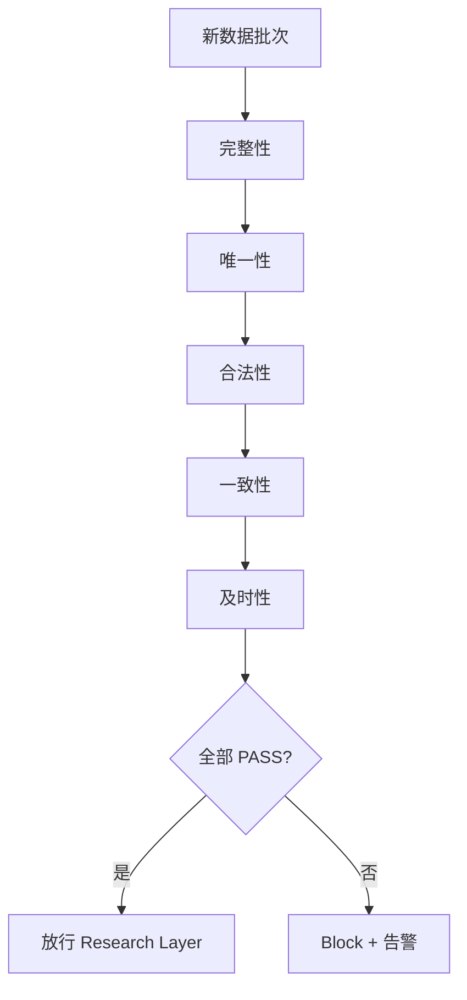

# 11 数据清洗与质量控制

> 所属模块：Part II 数据是量化研究的起点

**脏数据不会自己喊救命——你必须用规则把它拦在 Research Layer 之外。**

## 本节导读

情景：价值因子 IC 在某月突然从 0.05 跳到 0.12。研究员狂喜，准备写报告——数据团队排查发现：供应商把一批 ST 股的 PE 从缺失改成了 -999，而你的 winsorize 没处理负数，Rank 时被排到了「最便宜」端。

清洗（Cleaning）不是「fillna 走天下」，而是 **区分真缺失与业务缺失、识别错误与极端、在多源冲突时留审计痕迹**。本章建立 A 股多因子研究的数据质量控制框架，与第 10 章 Pipeline 门禁、第 13 章时间对齐形成闭环。

## 学习目标

1. 区分缺失类型并选择合适的处理策略
2. 设计主键与去重规则，消除重复记录
3. 区分数据错误与真实极端值，应用 Winsorization 等方法
4. 处理多数据源冲突并保留审计记录
5. 建立六维质量检查框架与自动化报告

---

## 11.1 缺失值

### 真缺失 vs 业务缺失

| 类型 | 含义 | 示例 | 处理方式 |
| --- | --- | --- | --- |
| 真缺失 True Missing | 数据未采集或丢失 | API 超时、字段为空 | 标记 NaN，不随意填充 |
| 业务缺失 Business Missing | 语义上「不适用」 | 银行股市净率、亏损股 PE | 保留 NaN 或单独编码 |
| 状态缺失 Status Missing | 因交易状态导致 | 停牌日无成交 | **不是价格 = 0** |
| 哨兵缺失 Sentinel Missing | 供应商用特殊值表示缺失 | PE = -999、999999 | 映射为 NaN + 告警 |

### 停牌 ≠ 价格为零

A 股常见致命错误：停牌日价格填 0，然后算收益率出现 -100%。

```python
import numpy as np
import pandas as pd

# 错误
df.loc[df["is_suspended"], "close"] = 0

# 正确：保留 NaN 或 forward-fill 最后有效价（仅用于估值展示，不用于收益）
df.loc[df["is_suspended"], "ret"] = np.nan

# 哨兵值清洗（应在 Raw → Clean 层统一做）
SENTINEL_MAP = {"pe_ttm": [-999, 999999], "pb": [-999]}
for col, bad_vals in SENTINEL_MAP.items():
    df.loc[df[col].isin(bad_vals), col] = np.nan
```

### 处理策略

| 策略 | 英文 | 适用场景 | 风险 |
| --- | --- | --- | --- |
| 保留缺失 | Keep NaN | 默认首选；下游因子剔除 | 覆盖率下降 |
| 剔除 | Drop | 缺失比例过高的一整列/行 | 样本选择偏差 |
| 填充 | Imputation | 需全截面覆盖时 | 引入虚假信息 |
| 缺失指示 | Missing Indicator | 缺失本身有信号 | 增加维度 |

### 不同字段的处理差异

| 字段类型 | 建议 | 原因 |
| --- | --- | --- |
| 价格 / 成交量 | 不填充，标记状态 | 填充捏造收益 |
| 财务指标 | 不跨期随意 fill；可用同行业 median | 财报有离散更新节奏 |
| 因子暴露 | 截面 median / 行业 median | 常见做法，需在 Spec 写明 |
| 分类变量（行业） | 不填充，必须有效 | 中性化依赖行业标签 |
| 北向持股 | 不 fill 为 0 | 0 与「未披露/无持股」语义不同 |

### 情景：财务因子缺失填充

某 ROE 因子在截面回归前需覆盖 80% 以上股票。团队规则：**同行业、同市值分位 median 填充**，且填充比例 > 30% 的交易日触发 WARN。填充本身写入 `roe_imputed_flag`，便于后续稳健性检验。

```python
def industry_median_impute(df: pd.DataFrame, col: str, group_cols=("trade_date", "industry")) -> pd.DataFrame:
    out = df.copy()
    med = out.groupby(list(group_cols))[col].transform("median")
    out[f"{col}_imputed"] = out[col].isna()
    out[col] = out[col].fillna(med)
    return out
```

---

## 11.2 重复记录

### 主键设计

A 股日频面板的标准主键：

$$\text{Primary Key} = (\text{trade\_date}, \text{symbol})$$

- `symbol`：统一用 Wind 代码（如 `000001.SZ`）或内部编码，全库一致
- `trade_date`：`datetime64[ns]` 或 `YYYYMMDD` int，禁止混用
- 财务 PIT 表另加 `available_date` / `report_period`，见第 14 章

### 重复来源

| 来源 | 场景 | 预防 |
| --- | --- | --- |
| 增量 append 两次 | Pipeline 重跑无幂等 | 第 10 章幂等设计 |
| 多源 merge 笛卡尔积 | join key 不唯一 | merge 前 validate |
| 供应商重复推送 | 同一日两条记录 | Raw 层去重 + 告警 |
| 除权除息日双记录 | 罕见供应商 bug | 规则去重 |
| 复权与未复权混存 | 同一日两条不同 close | 分表存储，禁止混 join |

### 去重规则

```python
# 去重：保留最后一条（或第一条，团队统一即可）
df = df.sort_values(["symbol", "trade_date", "update_time"])
df = df.drop_duplicates(subset=["trade_date", "symbol"], keep="last")

# merge 前验证
assert df.duplicated(subset=["trade_date", "symbol"]).sum() == 0

# pandas merge 内置检查
merged = left.merge(right, on=["trade_date", "symbol"], validate="one_to_one")
```

**审计**：去重前后行数差异写入 DQR（Data Quality Report），字段 `dedup_dropped_rows`。

### 情景：笛卡尔积灾难

研究员把 `daily_price`（5000 行/日）与 `fundamental`（500 行/季）按 `symbol` 直接 merge，未带日期键——得到 5000×N 倍膨胀行数，IC 虚高。预防：**merge 前 `validate=` + 行数 sanity check**。

---

## 11.3 异常值

### 数据错误 vs 极端市场事件

| 类型 | 特征 | 示例 | 处理 |
| --- | --- | --- | --- |
| 数据错误 | 违背物理约束 | 价格 < 0、PE = -999 | 置 NaN + 告警 |
| 录入错误 | 数量级错误 | 市值多一个零 | 交叉验证后修正 |
| 真实极端 | 业务合理但尾部 | 重组股涨 10 倍 | Winsorize，不删除 |
| 制度性极端 | 涨跌停、新股 | 首日无涨跌幅限制 | 单独规则 |
| 会计极端 | 一次性损益 | 商誉减值导致 ROE 暴跌 | 业务判断 + 稳健性 |

### Winsorization（缩尾）

将超出分位数的值拉到边界：

$$\tilde{x}_i = \begin{cases} Q_{p} & \text{if } x_i < Q_{p} \\ x_i & \text{if } Q_{p} \leq x_i \leq Q_{1-p} \\ Q_{1-p} & \text{if } x_i > Q_{1-p} \end{cases}$$

A 股惯例：截面因子 **1% / 99%** 或 **5% / 95%** 缩尾；须在 Research Spec 固定，**按交易日截面** 执行。

```python
def winsorize_cross_section(df: pd.DataFrame, col: str, date_col="trade_date",
                            limits=(0.01, 0.99)) -> pd.DataFrame:
    def _clip(s: pd.Series) -> pd.Series:
        lo, hi = s.quantile(limits[0]), s.quantile(limits[1])
        return s.clip(lo, hi)
    out = df.copy()
    out[col] = out.groupby(date_col)[col].transform(_clip)
    return out
```

### MAD（Median Absolute Deviation）

对偏离中位数超过 $k \times MAD$ 的值进行处理：

$$\text{MAD} = \text{median}(|x_i - \text{median}(x)|), \quad \tilde{x}_i = \text{clip}(x_i,\; m - k \cdot 1.4826 \cdot \text{MAD},\; m + k \cdot 1.4826 \cdot \text{MAD})$$

更稳健，适合 heavy-tail 分布；$k$ 常取 3～5。与分位数缩尾相比，MAD 对样本量较小的截面更稳定。

### 分位数处理

- **缩尾 Winsorize**：保留样本量，压缩极端
- **截断 Truncate / Drop**：直接剔除极端——减少样本，慎用
- **Rank**：天然抗极端，但丢失幅度信息

**原则**：清洗层的异常处理与因子层的 winsorize **分工明确**——清洗层处理明显错误；因子层处理合理解释的极端。

### 逻辑校验规则（A 股常用）

| 规则 | 表达式 | 失败动作 |
| --- | --- | --- |
| 价格正数 | close > 0 | 置 NaN |
| OHLC 关系 | low ≤ open, close ≤ high | 告警 + 人工 |
| 涨跌幅边界 | \|ret\| ≤ 0.30（非 ST 非新股） | 标记制度例外 |
| 市值一致性 | \|mkt_cap - close × shares\| / mkt_cap < 1% | WARN |
| 换手率边界 | 0 ≤ turnover ≤ 1（或合理上界） | 置 NaN |

---

## 11.4 多数据源冲突

### 场景

同一字段（如收盘价、总股本）Wind 与 Choice 不一致——听谁的？

### 来源优先级

| 步骤 | 动作 |
| --- | --- |
| 1. 定优先级 | 团队 Data Spec 写明：行情以 Wind 为准，财报以 CSMAR 为准 |
| 2. 交叉验证 | 差异 > 阈值（如 0.1%）触发告警 |
| 3. 人工仲裁 | 重大差异开 ticket，留 resolution 记录 |
| 4. 审计记录 | 存 `source`, `conflict_flag`, `resolution` 字段 |

```python
def reconcile_primary_backup(primary: pd.DataFrame, backup: pd.DataFrame,
                             key=("trade_date", "symbol"), val="close",
                             tol=0.001) -> pd.DataFrame:
    merged = primary.merge(backup, on=list(key), suffixes=("", "_alt"), how="left")
    rel_diff = (merged[val] - merged[f"{val}_alt"]).abs() / merged[val]
    merged["conflict_flag"] = rel_diff > tol
    merged["source"] = np.where(merged["conflict_flag"], "primary_review", "primary")
    return merged
```

### 一致性校验

- 市值 ≈ 价格 × 总股本（允许小幅误差）
- OHLC 逻辑：Low ≤ Open, Close ≤ High
- 涨跌幅与 limit_up/limit_down 一致
- 复权因子单调性：除权除息日复权因子跳变，其余日连续
- 总股本：除送转外不应剧烈跳变

### 情景：股本口径不一致

Wind「总股本」与 CSMAR「流通 A 股」混用，导致 EP 因子市值分母错误。解决：**Data Dictionary 强制字段级口径**，清洗层统一映射为 `total_shares` / `float_shares`。

---

## 11.5 数据质量检查框架

### 六维框架

| 维度 | 英文 | 检查内容 | 示例规则 |
| --- | --- | --- | --- |
| 完整性 | Completeness | 应有尽有的行/字段 | 全 A 日行数 > 4800 |
| 唯一性 | Uniqueness | 主键不重复 | PK duplicate = 0 |
| 合法性 | Validity | 值域合理 | close > 0 |
| 一致性 | Consistency | 跨表/跨源一致 | 市值公式校验 |
| 及时性 | Timeliness | 延迟在 SLA 内 | T 日数据 T+1 08:00 前就绪 |
| 可追溯性 | Traceability | 有 lineage | manifest 含 run_id |



与第 10 章 **质量门禁** 一一对应；本章定义 **查什么**，第 10 章定义 **何时拦**。

### 完整性：A 股日频基准

| 指标 | 计算 | 参考 |
| --- | --- | --- |
| 标的数 | distinct symbol / 日 | 与昨日 ±50 内 |
| 交易日覆盖 | 是否漏日 | 对照 exchange calendar |
| 字段填充率 | non-null / total | 核心字段 > 99% |
| 新上市 | list_date 在窗口内 | 记录增量 |

### 唯一性与合法性

```python
def run_pk_check(df: pd.DataFrame, pk=("trade_date", "symbol")) -> dict:
    dup = df.duplicated(subset=list(pk)).sum()
    invalid_price = (df["close"] <= 0).sum() if "close" in df.columns else 0
    return {"duplicate_pk": int(dup), "invalid_price": int(invalid_price),
            "pass": dup == 0 and invalid_price == 0}
```

---

## 11.6 自动化质量报告

### DQR 每日内容

| 指标 | 计算 | 告警阈值（示例） |
| --- | --- | --- |
| 行数变化 | today vs 7d avg | ±5% |
| 缺失率 | NaN count / total | 某字段 > 10% |
| 重复率 | duplicate PK / total | > 0 |
| 异常分布 | 价格 < 0 计数 | > 0 |
| 更新延迟 | now - data_timestamp | > 2h |
| 新上市 / 退市 | 标的数变化 | 记录，极端告警 |
| 冲突率 | conflict_flag sum / total | > 0.1% |

### 报告形态

```text
=== Daily Data Quality Report 2024-03-15 ===
Status: PASS (with 1 WARN)

[daily_price]
  rows: 5,123 (+0.3% vs avg) ✓
  missing close: 0.02% ✓
  duplicate PK: 0 ✓
  invalid price: 0 ✓

[fundamental_roe]
  rows: 4,890 (-2.1% vs avg) ⚠ WARN
  missing roe: 8.5% ✓

Pipeline: run_id=20240315_060032, gate=PASS
```

### 报警机制

| 级别 | 动作 |
| --- | --- |
| INFO | 记录日志 |
| WARN | 群通知，不 Block |
| ERROR | Block Research 更新 + 电话/on-call |
| CRITICAL | 停止下游 Factor 计算 |

### DQR 与因子研究的衔接

研究员打开 DQR 应能回答三个问题：**今天数据能不能用？哪张表有问题？问题影响哪些因子？** 因此 DQR 最好附带 `downstream_factors: [EP, BP, MOM_20]` 的依赖映射——在第 10 章 lineage 中维护。

---

## 常见错误

- 停牌日填 0 或 forward-fill 价格后算收益——捏造 -100% 或虚假平稳
- 对所有缺失统一 `fillna(0)`——亏损股 PE、无财报 ROE 被扭曲
- 去重无规则 `drop_duplicates()` 不指定 keep——结果不确定
- 清洗层做 1%/99% winsorize，因子层再做一遍——双重压缩
- 多源冲突无优先级，「谁后 merge 谁赢」
- 质量检查只做一次建库，日常增量无 DQR
- 哨兵值（-999）未映射，Rank 因子时排到错误分位

## 要点回顾

- 缺失分真缺失、业务缺失、状态缺失、哨兵缺失；**停牌不是价格为零**
- 主键 `(trade_date, symbol)` 唯一；去重规则团队统一并审计
- 区分数据错误（置 NaN）与真实极端（Winsorize / Rank）
- 多源冲突靠 **优先级 + 交叉验证 + 审计记录**
- 六维质检（完整、唯一、合法、一致、及时、可追溯）+ 每日 DQR + 分级告警
- 清洗是 Research Layer 的防火墙，与 Pipeline 门禁、时间对齐同等重要

## 下一章

[12 复权、停牌与交易状态](12-adjustment-trading-status.md)
