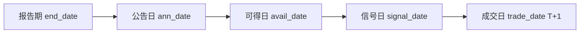
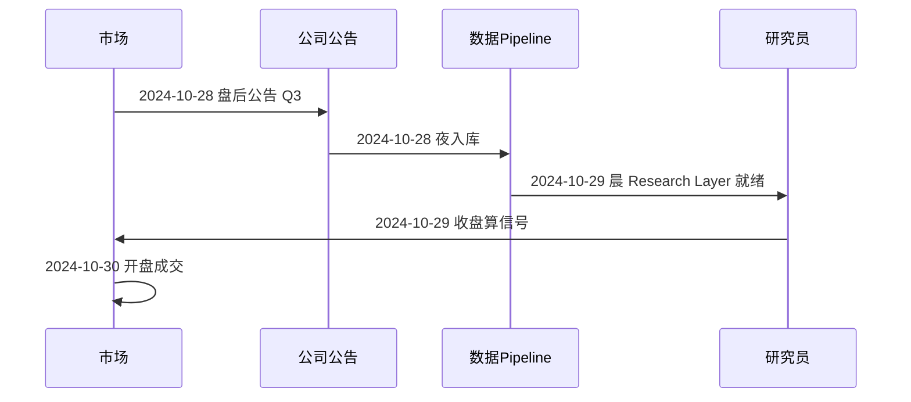

# 13 时间对齐与避免未来函数

> 所属模块：Part II 数据是量化研究的起点

**未来函数（Look-ahead Bias）是量化研究最安静的杀手——代码能跑、曲线好看、样本外才现形。**

## 本节导读

情景：你用 `merge` 把 2020 年的股价和「报告期为 2020Q3、end_date = 2020-09-30」的 ROE 拼在一起，跑出了 IC = 0.08 的价值因子。组长问：2020 年 10 月 1 日，你知道这家公司的 Q3 ROE 吗？——你不知道。财报 10 月底才公告。

**Point-in-Time（PIT）** 原则：任意时刻 $t$，策略只能使用 **在 $t$ 当时已公开可得** 的信息。本章是 Part II 的 **核心章**，也是 Part V「回测偏差」中 Look-ahead Bias 的数据层解法。

## 学习目标

1. 掌握交易日与自然日、月末/季末对齐规则
2. 理解报告期、公告日、可得日、修订日的区别
3. 建立 PIT 数据库意识，处理财报重述与指数成分历史
4. 识别 Look-ahead Bias 的典型场景与错误 Merge 模式
5. 实现 As-of Join 与正确的滞后规则

---

## 13.1 交易日对齐

### 自然日 vs 交易日

| 概念 | 英文 | 说明 |
| --- | --- | --- |
| 自然日 | Calendar Day | 含周末、节假日 |
| 交易日 | Trading Day | 交易所开市日 |

A 股因子研究 **默认在交易日网格上** 运算。周末、春节长假不产生截面。

```python
import pandas as pd

# 获取 A 股交易日历（来自 exchange 或 数据供应商）
trade_dates = pd.DatetimeIndex(get_trading_calendar("SSE", "2015-01-01", "2024-12-31"))

# 禁止：用 pd.date_range(freq="D") 然后 forward-fill —— 含非交易日
```

### 月末与季度末

许多因子 **调仓频率** 为月度或季度：

| 调仓 | 信号日 | 注意 |
| --- | --- | --- |
| 月末 | 每月 **最后一个交易日** | 不是自然月 30/31 日 |
| 季末 | 3/6/9/12 月最后交易日 | 与财报季不对齐 |
| 周频 | 每周最后交易日 | 避开周一效应需 Spec 说明 |

```python
def month_end_trading_days(trade_dates: pd.DatetimeIndex) -> pd.DatetimeIndex:
    s = pd.Series(trade_dates, index=trade_dates)
    return s.groupby(s.dt.to_period("M")).max().values
```

**错误**：用 `resample("M").last()` 对含 NaN 的价格序列——非交易日被错误纳入。

### 跨市场日历

- A 股 vs 港股 vs 美股 **交易日不同**
- 北向资金：港股通休市 vs A 股休市
- 研究 A 股因子：以 **SSE/SZSE 交易日历** 为主轴

---

## 13.2 行情与财务数据对齐

### 四个关键日期

| 日期 | 英文 | 含义 | 示例 |
| --- | --- | --- | --- |
| 报告期 | Report Period / end_date | 财报覆盖的会计期间 | 2024Q3 → 2024-09-30 |
| 公告日 | Announcement Date | 公司首次公开该报告 | 2024-10-28 |
| 实际可得日 | Available Date | 数据入库、研究员能拿到 | 2024-10-28 18:00 或 T+1 |
| 修订日 | Restatement Date | 财报更正后的新版本 | 2025-02-01 |



### 为什么不能按报告期 Merge

| 做法 | 后果 |
| --- | --- |
| `merge on end_date` | 10 月 1 日就用上 9 月 30 日报告期的 Q3 数据——**未来函数** |
| `merge on end_date + lag(1)` | 固定滞后 1 期不够——公告有早有晚 |
| 按 **公告日** merge | 仍可能早几小时——需 **可得日 + 滞后** |

### 正确逻辑

滞后只写入 `available_date`（见 §13.5），join 时固定：

$$
\text{available\_date} \leq t
$$

即在交易日 $t$ 只用「已生效」的财报版本。**不要**在 join 条件再写 $t-\delta$，否则会与 `available_date` 内建滞后叠加成双重延迟。

---

## 13.3 Point-in-Time Data

### 定义

**Point-in-Time（PIT）数据库**：存储每个数据点的 **多版本历史**——不仅存「最终正确值」，还存「当时公布的是什么」。

| 非 PIT（危险） | PIT（正确） |
| --- | --- |
| ROE 只有一列，2025 年修正后覆盖 2020 年 | 2020 年存 ann_date=2021-04-30 时的 ROE_v1 |
| 指数成分只有当前名单 | 每个 rebalance 日存快照 |
| 分析师一致预期随时修订 | 存 forecast as-of 每个 cut-off 日 |

### 财报重述（Restatement）

公司可能因会计差错 **修正历史财报**：

- 非 PIT 库：你今天回测用的「2020 ROE」可能已是日后重述版本——**混入了未来信息**，且不同时点重跑结果不一致
- PIT 库：回测到历史日 $t$（例如 2020-10-30）时，只能使用 `available_date ≤ t` 的 ROE 版本；2021 年之后的重述**不得**回填到 $t$ 的信号。另用数据版本号保证两次回测可复现（版本冻结 ≠ PIT）

### 指数成分历史快照

第 09 章强调：沪深 300 **每年多次调整**，必须用历史成分。

PIT 要求：

```text
index_constituents/
  index=000300.SH
  rebalance_date=2024-06-14  →  [symbol, weight, ...]
  rebalance_date=2024-12-13  →  [...]
```

回测到 2024-03-01，只能 join rebalance_date ≤ 2024-03-01 的 **最新一次** 快照。

### 供应商 PIT 支持

| 供应商 | PIT 能力 | 备注 |
| --- | --- | --- |
| Compustat（美股） | 标准 PIT | A 股需替代 |
| CSMAR | 部分表有 ann_date | 需确认是否 backfill |
| Wind | 公告日字段 | 自行构建 as-of 逻辑 |
| 自建 | 完全可控 | 工作量大 |

**无 PIT 时**：至少用 **公告日 + 1 交易日滞后**，并知晓重述风险。

---

## 13.4 Look-ahead Bias

### 定义

**Look-ahead Bias（前视偏差 / 未来函数）**：在时刻 $t$ 使用了 $t$ 之后才能获得的信息，导致回测结果系统性偏乐观。

### 典型案例

| 案例 | 错误做法 | 后果 |
| --- | --- | --- |
| 财务 merge | `on=end_date` | IC 虚高 30～50% 不罕见 |
| 指数成分 | 当前 HS300 过滤 2015 | 幸存者 + 前视 |
| 全市场股票池 | 剔除「后来退市」的股 | Survivorship Bias |
| 标准化 | 用全样本 mean/std 做 z-score | 含未来数据于统计量 |
| 行业分类 | 用当前行业标签填历史 | 行业轮动后错位 |
| 参数优化 | 在全区间调参 | Data Snooping |
| 幸存者基金 | 只回测存活到现在的基金持仓 | Selection Bias |

### 错误 Merge 模式

```python
# ❌ 未来函数：按报告期对齐
pd.merge(prices, fundamentals, left_on="trade_date", right_on="end_date")

# ❌ 未来函数：merge 后 ffill 到所有交易日（含公告前）
merged = pd.merge(prices, fund, on=["symbol", "end_date"])
merged.groupby("symbol").ffill()  # 把未来财报填到了过去

# ❌ 未来函数：用 shift(-1) 收益当标签又当特征
df["feature"] = df["ret"].shift(-1)
```

### 使用未来成分股

```python
# ❌ 2024 年的沪深300名单过滤 2018 年数据
today_hs300 = get_constituents("000300.SH", date="2024-12-31")
prices_2018 = prices_2018[prices_2018["symbol"].isin(today_hs300)]
```

### 使用修订后财务数据

Wind 导出的「2020 ROE」若是 **2024 年修正版**，你等于告诉 2020 年的自己：「别买，2024 年会重述」。

**检测方法**：对同一 symbol、同一 end_date，比较 ann_date 不同版本的值是否一致；若 2024 年跑 2020 数据与 2021 年跑不同 → 非 PIT。

---

## 13.5 正确的数据对齐方法

### As-of Join（截至对齐）

**语义**：对每个 `(symbol, trade_date)`，取 **available_date ≤ trade_date** 的 **最新一条** 财报。

```python
import pandas as pd

def asof_join_fundamentals(
    prices: pd.DataFrame,
    fundamentals: pd.DataFrame,
) -> pd.DataFrame:
    """prices: trade_date, symbol
    fundamentals: available_date, symbol, roe, ...
    """
    prices = prices.sort_values(["symbol", "trade_date"])
    fundamentals = fundamentals.sort_values(["symbol", "available_date"])
    return pd.merge_asof(
        prices,
        fundamentals,
        left_on="trade_date",
        right_on="available_date",
        by="symbol",
        direction="backward",  # 只往过去看
    )
```

### 公告日生效 + 滞后

保守 Pipeline：

$$
\text{available\_date} =
\begin{cases}
\text{ann\_date} & \text{激进：假定公告日收盘后即可用} \\
\text{next\_trading\_day}(\text{ann\_date}) + \delta & \text{默认/保守}
\end{cases}
$$

```python
def compute_available_date(ann_date: pd.Series, calendar, delta: int = 0) -> pd.Series:
    """默认：公告日的下一交易日；delta 为额外交易日缓冲"""
    next_td = ann_date.map(lambda d: calendar.next_trading_day(d))
    if delta <= 0:
        return next_td
    out = next_td
    for _ in range(delta):
        out = out.map(lambda d: calendar.next_trading_day(d))
    return out
```

| 设定 | 场景 |
| --- | --- |
| `available_date = ann_date` | 激进：假定公告日收盘后即可用（需时间戳支撑） |
| 下一交易日（$\delta=0$） | **推荐默认**：避开公告日当日边界与入库延迟 |
| 下一交易日 + 额外 $\delta$ | 模拟数据团队 T+1/T+2 才清洗完 |

### 滞后一期

部分团队对所有基本面因子统一：

$$\text{signal\_date} = \text{trade\_date},\quad \text{factor}(t) = \text{fundamental}(\text{available} \leq t-1)$$

简单、保守；可能损失 1 日信息，但 **宁漏勿偷**。

### 可用时间戳（Available Timestamp）

最佳实践：存储 **精确时间戳**（如 2024-10-28 18:32:00），而不只是日期。日内策略或公告日当日调仓需要。

```text
fundamentals_pit/
  symbol, end_date, ann_timestamp, field, value, version
```

As-of join 用 `trade_timestamp >= ann_timestamp` 的 backward 逻辑。

### 截面标准化的时间安全

```python
# ❌ 用全样本统计量
z = (df["roe"] - df["roe"].mean()) / df["roe"].std()

# ✓ 每个 trade_date 截面内计算（只用当日可见股票）
df["roe_z"] = df.groupby("trade_date")["roe"].transform(
    lambda x: (x - x.mean()) / x.std()
)
```

### SQL As-of Join 示例

```sql
-- DuckDB / PostgreSQL 风格示意
SELECT p.trade_date, p.symbol, f.roe
FROM prices p
ASOF JOIN fundamentals f
  ON p.symbol = f.symbol
 AND p.trade_date >= f.available_date;
```

---

## 完整时间线示例

某股 2024Q3 财报：

| 日期 | 事件 | 研究员能否使用 Q3 ROE |
| --- | --- | --- |
| 2024-09-30 | 报告期结束 | **否** |
| 2024-10-28 18:00 | 公告发布 | 当日收盘后？看 Spec |
| 2024-10-29 | 下一交易日 | **是**（avail + 0 lag） |
| 2024-10-30 | 再滞后 1 日 | **是**（avail + 1 lag，保守） |
| 2024-10-29 09:30 | 开盘调仓 | 需 ann_timestamp < 开盘 |



---

## 自检清单（Look-ahead Audit）

在提交因子报告前，逐项回答：

| # | 问题 | 期望答案 |
| --- | --- | --- |
| 1 | 财务数据按什么日期对齐？ | available_date，非 end_date |
| 2 | 是否有统一滞后？ | Spec 写明：相对公告日至少 T+1（写入 available_date），join 用 ≤ trade_date |
| 3 | 指数成分是否历史快照？ | 是 |
| 4 | 退市股是否保留？ | 是，至退市日 |
| 5 | 标准化是否截面按日？ | 是 |
| 6 | 行业标签是否 PIT？ | 是，或接受近似 |
| 7 | 数据源是否 PIT 库？ | 知晓限制 |
| 8 | 信号日与成交日关系？ | T 信号 → T+1 成交 |

---

## 常见错误

- 按 `end_date` merge 财务与行情——**头号未来函数**
- `merge` 后 `groupby().ffill()` 把未来财报填到过去每一天
- 用当前指数成分、当前 ST 名单过滤历史
- 全区间 mean/std 做标准化——统计量含未来
- 公告日当日算因子、当日收盘成交——忽略入库延迟
- 忽视财报重述，用「最新修正版」回测历史

## 要点回顾

- 研究在 **交易日网格** 上；月末 = 最后交易日，非自然日
- 财务对齐看 **公告日/可得日**，永远不是报告期 end_date
- **PIT 数据库** 是根除重述与前视的终极方案；无 PIT 则公告日 + 滞后
- Look-ahead 典型坑：错误 merge、未来成分股、修订财报、全样本标准化
- **As-of Join + 保守滞后 + T+1 成交** 是 A 股多因子研究的默认安全组合
