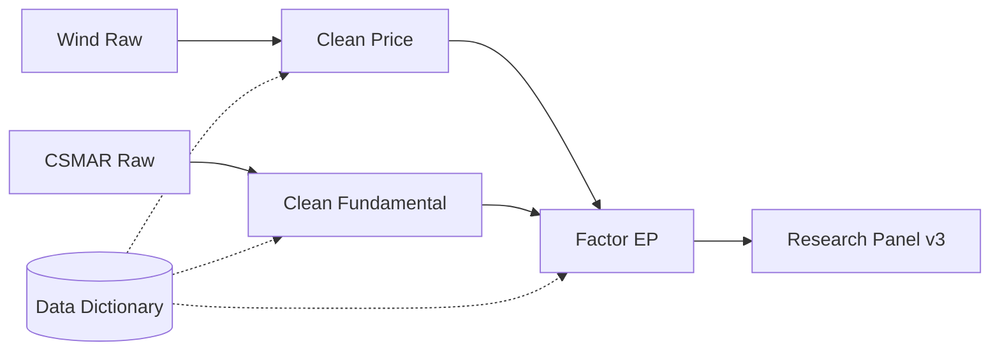

# 14 数据存储与研究数据集

> 所属模块：Part II 数据是量化研究的起点

**存储选型服务于查询模式；主键与数据字典服务于可复现。**

## 本节导读

情景：团队新人把全 A 十年日频行情塞进一个 80 GB 的 CSV，Git 提交失败，Pandas 读入内存爆掉，merge 一次半小时。老研究员的 Parquet 分区库同样数据 8 GB，按日期过滤单秒返回——差距不在硬盘，而在 **是否按访问模式设计存储**。

CSV 适合交换，Parquet 适合分析，数据库适合共享与权限。本章说明行式/列式、长表/宽表、主键与元数据——让 A 股中低频多因子研究数据集 **可协作、可版本化、可复现**。

## 学习目标

1. 按场景选择 CSV / Parquet / 数据库
2. 理解面板长表与因子宽表的权衡
3. 设计含版本号的主键并维护数据字典
4. 规划分区策略与 Research Layer 数据集形态

---

## 14.1 CSV、Parquet 与数据库

### 三种形态对比

| 形态 | 优点 | 缺点 | A 股研究典型用途 |
| --- | --- | --- | --- |
| CSV | 人类可读、交换方便 | 慢、无类型、压缩差、难增量 | 与外部方交换、临时导出 |
| Parquet | 列式压缩、schema 强、与 Pandas/DuckDB 友好 | 需工具链；小文件过多有开销 | **Clean / Research 层主力** |
| 关系型 DB | 权限、并发、SQL、索引 | 运维成本；超大宽表不友好 | 元数据、权限、点查 |
| 对象存储 S3/OSS | 廉价、版本化 | 非结构化；需上层格式 | Raw 层原始文件归档 |

### 推荐分层（与第 10 章 Pipeline 呼应）

```text
Raw/          → 供应商原始 CSV/JSON/XML，按 ingest_date 归档
Clean/        → Parquet，按 trade_date 分区，主键唯一
Research/     → 因子长表 / 宽表 Parquet，带 data_version
Meta/         → DB 或 JSON：字典、manifest、lineage
```

### 情景：从 CSV 迁移到 Parquet

某团队日频行情 5000 股 × 2500 日 × 30 字段 ≈ 3.75 亿单元格。CSV 约 12 GB；Snappy 压缩 Parquet 约 1.2 GB。查询「2023 年 EP 因子所需字段」：CSV 全表扫描 ~90s；Parquet 列裁剪 + 分区 ~2s。

```python
import pandas as pd

# 写入分区 Parquet
df.to_parquet(
    "clean/daily_price",
    partition_cols=["trade_date"],
    engine="pyarrow",
    compression="snappy",
    index=False,
)

# 按日期读取
part = pd.read_parquet(
    "clean/daily_price",
    filters=[("trade_date", ">=", "2023-01-01")],
)
```

### 何时仍用数据库

- 多研究员 **并发点查** 单只股票全历史
- 需要 **行级权限**（如内部评级）
- 元数据、因子注册表、冲突审计表——行数小、更新频、关系多

OLAP 引擎（ClickHouse、Doris、DuckDB）在大规模截面聚合场景可替代「巨型 PostgreSQL 宽表」。

### 文件格式选型决策树

```text
数据量 < 100MB 且仅交换一次？ → CSV
分析型扫描、列裁剪、分区？   → Parquet
需要约束/权限/并发点查？     → DB + 必要时导出 Parquet 快照
原始供应商文件归档？         → 对象存储 + checksum，不改内容
```

---

## 14.2 行式存储与列式存储

### 访问模式决定选型

| 访问模式 | 特征 | 更适合 |
| --- | --- | --- |
| 行式 Row-oriented | 读整行 | OLTP、逐笔成交明细点查 |
| 列式 Column-oriented | 读少列、扫多行 | 因子研究、截面 IC |

因子研究典型查询：「取 2020–2024 全部交易日的 `close_adj`, `float_cap`, `industry`」——列式 **只解压需要的列**，IO 与内存成倍下降。

### 压缩与编码

Parquet 对重复度高的列（行业代码、trade_date）压缩率极高；浮点因子列用 Snappy（速度）或 Zstd（压缩比）按团队偏好选择。**禁止** 对已经 gzip 的 CSV 再 gzip 一次当「优化」。

### 情景：宽表 500 因子

若把 500 个因子存成「一行一股一日 500 列」的 mega 宽表：新增因子需改 schema，Git diff 不可读。更优：**因子长表** `factor_id` 或 **按因子族分目录**，见 14.3。

### DuckDB 直接查 Parquet

```python
import duckdb

con = duckdb.connect()
df = con.execute("""
    SELECT trade_date, symbol, close_adj, float_cap
    FROM read_parquet('clean/daily_price/**/*.parquet')
    WHERE trade_date BETWEEN '2023-01-01' AND '2023-12-31'
""").df()
```

Notebook 探查阶段极快，无需先把全库 load 进内存。

---

## 14.3 长表与宽表

### 定义

| 形态 | Schema 示例 | 适合 |
| --- | --- | --- |
| 长表 Long / Tidy | trade_date, symbol, field, value | 存储、清洗、append 新因子 |
| 面板长表 | trade_date, symbol, open, close, pe_ttm, ... | 常用字段的日频面板 |
| 宽表 Wide | trade_date × symbol → 多列因子 | 截面 IC、优化器、ML 特征矩阵 |

### Tidy Data 原则

1. 每列一个变量
2. 每行一个观测
3. 每个单元格一个值

A 股面板天然适合长表治理：`symbol` + `trade_date` 定位观测，不同 `field` 可来自不同 Pipeline。

### 转换示例

```python
# 长表 → 宽表（单日截面）
long_df = pd.read_parquet("research/factor_long")
wide_day = long_df[long_df["trade_date"] == "2024-06-28"].pivot(
    index="symbol", columns="factor_id", values="factor_value"
)

# 宽表 → 长表（入库）
wide_df = pd.read_parquet("temp/factor_wide")
long_df = wide_df.reset_index().melt(
    id_vars=["trade_date", "symbol"],
    var_name="factor_id",
    value_name="factor_value",
)
```

### 权衡

| 维度 | 长表 | 宽表 |
| --- | --- | --- |
| 新增因子 | append 行，不改 schema | 加列，历史需 backfill |
| 存储冗余 | factor_id 重复 | 列名即因子名 |
| IC 计算 | 需 pivot 或 groupby | 直接矩阵运算 |
| 版本管理 | 易按 factor_id 版本 | 列爆炸难追踪 |

**实践**：Clean 层长表；Research 层按任务 materialize 宽表快照（带 `snapshot_id`），不反向当主存储。

### 稀疏因子与 EAV

另类数据常极度稀疏（仅部分股票有值）。EAV（Entity-Attribute-Value）长表 + `field` 列比强行宽表更省空间；消费时 `pivot` 即可。

---

## 14.4 主键设计

### 常见主键

| 数据集 | 主键 | 说明 |
| --- | --- | --- |
| 日频行情 | (trade_date, symbol) | 标准面板 |
| 财务 PIT | (symbol, available_date, report_period, field) | available_date = 公告后可得日 |
| 指数成分 | (trade_date, index_code, symbol) | 历史权重 |
| 因子值 | (trade_date, symbol, factor_id, data_version) | **版本不可缺** |
| 因子元数据 | (factor_id, spec_version) | 与因子值分离 |

### 版本号为何是复现杀手

同一 `factor_id` 在不改名的前提下可能因 **winsor 参数调整、中性化模型变更、数据源切换** 而数值变化。若无 `data_version`：

- 2023 年论文与 2024 年回测对不上
- 无法回答「这次 IC 变化是因子失效还是数据重跑」

```python
# manifest 示例（JSON / DB 一行）
manifest = {
    "data_version": "20240628_v3",
    "factor_id": "EP_neutral_z",
    "git_commit": "a1b2c3d",
    "input_tables": {
        "fundamental": "clean/fundamental_v2",
        "price": "clean/daily_price",
    },
    "spec_hash": "sha256:...",
    "created_at": "2024-06-28T18:00:00+08:00",
}
```

### 幂等与 Upsert

增量 Pipeline 写入时按主键 **Upsert**（存在则更新，不存在则插入），避免重复行。第 10 章 Pipeline 与第 11 章唯一性检查共同保证。

### 实验快照

关键实验（论文、监管报送）应 **冻结** 输入表路径：

```yaml
experiment_id: exp_2024q1_value
data_version: 20240331_frozen
inputs:
  price: research/snapshots/20240331/daily_price
  fundamental: research/snapshots/20240331/fundamental_pit
factors: [EP_neutral_z, BP_neutral_z]
```

---

## 14.5 数据字典与元数据

### 数据字典最低字段

每个字段记录：

| 属性 | 示例 |
| --- | --- |
| field_name | roe_ttm |
| 中文名 / 定义 | 净资产收益率 TTM |
| 单位 | 小数（0.15 = 15%） |
| 更新频率 | 季频，随财报 |
| 来源表 / 供应商 | Wind ASHAREFINANCIALINDICATOR |
| **可用时间 PIT** | available_date ≥ 公告日 |
| 缺失策略 | Keep NaN |
| 已知缺陷 | 2019 年前口径变更 |
| owner | data_team |

没有字典的仓库，三个月后只有作者能用——**字典是团队协议，不是文档装饰。**

### 元数据与 Lineage



Lineage 回答：**这张表从哪来、经过哪些变换、哪版代码、依赖谁**。与 DQR、manifest 联动。

### 因子注册表（Factor Registry）

| 字段 | 用途 |
| --- | --- |
| factor_id | 唯一标识 |
| direction | 高好 / 低好 |
| universe | 全 A / 沪深 300 增强池 |
| neutralization | 行业+ln_cap |
| owner | 研究员 |
| status | draft / validated / production |

Research Layer 只消费 `status >= validated` 的因子，避免 notebook 实验污染生产。

### 命名规范（建议）

```text
{family}_{variant}_{proc}
例：EP_raw, EP_winsor_mad, EP_neutral_z, MOM_20d_adj, LIQ_turn_20d
```

统一命名降低 merge 错误与重复造轮子。

### 分区策略（A 股日频）

| 分区键 | 适用 | 注意 |
| --- | --- | --- |
| trade_date | 日频行情、因子 | **推荐**；便于增量与按年清理 |
| factor_id | 因子长表 | 单因子历史回测 |
| symbol | 单股时序 | 5000 分区过多，慎用 |

单分区目录建议 **128MB–1GB** Parquet 文件；过小文件过多会拖慢 listing。

---

## 常见错误

- 全公司共用一个巨型 CSV 且无分区——无法增量、无法协作
- 宽表直接当主存储——新因子改 schema、无法追溯版本
- 字段口口相传不写字典——人员流动即知识流失
- 主键不含 data_version——复现时对不上号
- Parquet 按 symbol 分区（5000 小文件）——应用 trade_date 分区
- Git 跟踪大二进制——应用 DVC / 对象存储 + manifest
- 实验结果不冻结 snapshot——供应商修订后无法复现论文

## 要点回顾

- 按访问模式选型：Raw 归档、Clean/Research 用 Parquet、Meta 用 DB/JSON
- 列式存储服务「少列多行」的因子计算模式
- **长表治理 + 宽表消费**；宽表是快照不是源头
- 主键含 **factor_id + data_version**；manifest 记录 lineage
- 数据字典与因子注册表是团队协作与复现的硬基础设施

## 下一章

进入 [Part III 因子研究](../part-iii/index.md)。
