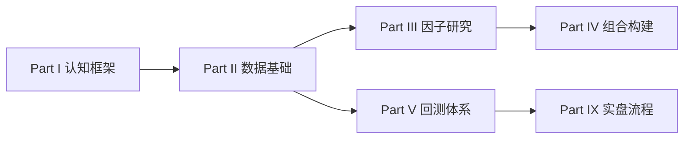

# Part II 数据是量化研究的起点

> **没有可靠的数据，再漂亮的因子公式也只是过拟合的装饰品。**

## 本节导读

Part I 建立了量化研究的认知框架：什么是 Alpha、研究如何循环、回测与实盘为何有距离。进入 Part II，我们把镜头对准 **一切研究的物理基础——数据**。

在 A 股多因子研究中，数据问题往往比模型问题更早、更致命：复权口径不一致导致动量因子「幽灵收益」、财务数据按报告期 merge 产生未来函数（Look-ahead Bias）、指数成分用「当前名单」回测历史产生幸存者偏差（Survivorship Bias）。这些问题不会在回测报告里自动标红，只会在样本外或实盘中以 IC 衰减、超额回撤的形式显现。

本 Part 覆盖从 **数据类型认知** 到 **Pipeline 工程**、**清洗质控**、**复权与交易状态**、**时间对齐（PIT）** 再到 **存储设计** 的完整链条。读完 Part II，你应能在动手写第一个因子前，先把数据口径、可得时间与质量门禁写进 Research Spec。

## 学习目标

1. 识别 A 股多因子研究常用的数据类型及其适用场景
2. 设计分层、可追溯、带质量门禁的数据 Pipeline
3. 正确处理缺失、异常、复权、停牌、涨跌停与上市状态
4. 掌握 Point-in-Time（PIT）对齐，系统性防范 Look-ahead Bias
5. 为研究数据集选择合理的存储形态与主键设计

## Part II 在手册中的位置

Part II 的产出是 **Research Layer 数据集**——Part III 因子构造、Part V 回测引擎、Part IX 生产 Pipeline 都依赖这一层。数据口径在这里定死，下游不应再「临时修正」。

## 本章目录

| 章节 | 主题 | 核心问题 |
| --- | --- | --- |
| [09 量化数据的基本类型](09-data-types.md) | 行情、基本面、资金面、指数、另类 | 我需要哪些数据？各字段含义是什么？ |
| [10 数据获取与 Pipeline](10-data-pipeline.md) | Raw / Clean / Research 分层 | 数据如何从供应商到研究员手中？ |
| [11 数据清洗与质量控制](11-data-cleaning.md) | 缺失、重复、异常、质检框架 | 脏数据如何识别与处理？ |
| [12 复权、停牌与交易状态](12-adjustment-trading-status.md) | 除权除息、涨跌停、ST/退市 | 价格与可交易性如何正确建模？ |
| [13 时间对齐与避免未来函数](13-time-alignment.md) | PIT、As-of Join、Look-ahead | 我用的信息在当时真的可获得吗？ |
| [14 数据存储与研究数据集](14-storage-datasets.md) | Parquet、长宽表、主键、元数据 | 数据如何存才便于复现与查询？ |

## 与其他 Part 的衔接

| Part II 章节 | 下游衔接 |
| --- | --- |
| 09 数据类型 | Part III 因子构造的数据字段来源 |
| 10 Pipeline | Part VII 研究工程化、Part IX 生产调度 |
| 11 清洗质控 | Part III 因子预处理（去极值、缺失） |
| 12 复权/交易状态 | Part IV 股票池、Part V 成交约束 |
| 13 时间对齐 | Part V 回测偏差（Look-ahead）、Part III 财务因子 |
| 14 存储设计 | Part VII SQL 查询、Part IX Factor Store |

## 常见错误

- 跳过 Part II 直接做因子——在错误数据上优化，只会得到更精致的错误
- 把「Wind 能拉到」等同于「口径已对齐」——供应商字段定义与团队 Research Spec 往往有 gap
- 只关注行情、忽视财务 PIT——A 股价值/质量因子大量依赖基本面，未来函数重灾区
- Pipeline 与研究代码混在同一层——改清洗逻辑时无法追溯历史因子值

## 要点回顾

- Part II 回答「数据从哪来、是否可靠、何时可得、如何存储」四个问题
- 数据分层（Raw → Clean → Research）是工程化与可复现的前提
- A 股研究的三大数据陷阱：复权口径、交易状态、未来函数——分别在 12、13 章展开
- 读完本 Part，应能在 Research Spec 中写清数据来源、清洗规则、PIT 对齐方式与版本号
