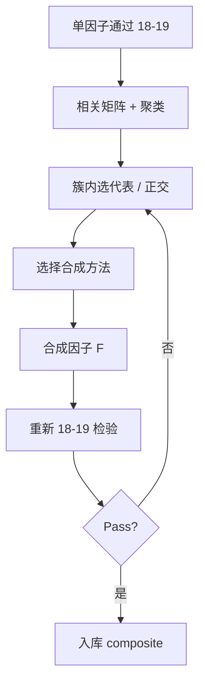

# 20 因子相关性、冗余与组合

> 所属模块：Part III 股票多因子研究

**相关 0.9 的两个因子，加在一起通常不是 2 倍 Alpha，而是 1 倍风险预算浪费。**

## 本节导读

情景：团队入库 20 个因子，等权合成「超级 Alpha」，回测 Sharpe 1.8——细看相关矩阵，15 个因子与 EP/MOM 相关 > 0.7，有效独立因子不到 5 个；2022 年风格切换，20 个因子 **同步失效**，组合最大回撤 -35%。**多因子不是因子越多越好**，而是 **增量信息 + 低冗余 + 稳健合成**。

多因子组合前，必须诊断冗余：截面相关、因子收益相关、行业内相关。然后才是等权、IC 加权、优化合成或正交化。本章强调 **增量贡献**，而不是因子个数。

## 学习目标

1. 计算并解读因子相关性的三个层次
2. 识别冗余簇并做正交化或代表因子选取
3. 理解等权、IC 加权、优化、机器学习合成的适用边界
4. 明确合成因子必须重新走检验流程

---

## 20.1 为什么相关很重要

### 三个层次的相关

| 层次 | 度量 | 回答的问题 |
| --- | --- | --- |
| 截面因子值相关 | corr($f_{i,t}^{(1)}, f_{i,t}^{(2)}$) 按日平均 | 排序是否同类？ |
| 因子收益相关 | corr($r_{LS,t}^{(1)}, r_{LS,t}^{(2)}$) | 盈亏是否同步？ |
| 增量回归 | $f^{(2)}$ 对 $f^{(1)}$ 回归残差 IC | 有没有新信息？ |

高度相关意味着：

1. **同时失效**：2022 价值+动量双杀
2. **暴露叠加**：以为分散，实际 triple Size bet
3. **回撤同步**：「多因子」名不副实
4. **有效自由度虚高**：20 因子可能 ≈ 5 因子

### 情景：EP、BP、SP 三因子等权

三者截面相关常 > 0.8，等权合成 ≈ **单一价值因子**，却占用 3 份 risk budget。应 **簇内选代表**（如 EP），或簇内 PCA 第一主成分。

```python
import pandas as pd
import numpy as np

def average_cross_sectional_corr(factor_wide: pd.DataFrame) -> pd.DataFrame:
    """
    factor_wide: index=(trade_date, stock_id), columns=factor names
    """
    dates = factor_wide.index.get_level_values("trade_date").unique()
    corrs = []
    for dt in dates:
        sub = factor_wide.xs(dt, level="trade_date").dropna(how="all")
        if sub.shape[1] >= 2 and len(sub) > 30:
            corrs.append(sub.corr())
    return pd.concat(corrs).groupby(level=0).mean()
```

---

## 20.2 冗余诊断

### 诊断工具箱

| 方法 | 用途 | 输出 |
| --- | --- | --- |
| 相关矩阵热力图 | 全局冗余一览 | avg \|corr\| |
| 层次聚类 | 形成因子簇 | dendrogram |
| VIF | 多重共线性 | VIF > 5 警惕 |
| 增量 IC / $t$ | 簇内第二个因子有无增量 | 正交后 IC |
| 因子收益 PCA | 有效维度 | 前 k 个 PC 解释 90% |

### 聚类 + 代表因子

```python
from scipy.cluster.hierarchy import linkage, fcluster
from scipy.spatial.distance import squareform

def cluster_factors(corr: pd.DataFrame, threshold=0.7) -> pd.Series:
    dist = 1 - corr.abs()
    link = linkage(squareform(dist.values), method="average")
    labels = fcluster(link, t=1 - threshold, criterion="distance")
    return pd.Series(labels, index=corr.columns, name="cluster")
```

**规则**：每簇保留 **ICIR 最高** 或 **经济含义最清晰** 的一个代表入库。

### 增量回归检验

对候选因子 $f^{(new)}$，在控制已有因子集 $\mathcal{F}$ 后：

$$f^{(new)}_{i,t} = \alpha + \sum_{g \in \mathcal{F}} \gamma_g f^{(g)}_{i,t} + u_{i,t}$$

检验 **$u$ 的 IC** 与 **Fama-MacBeth $\lambda_u$**——$t$ 不显著则 **无增量**，不入库。

### 情景：「原创」因子增量为零

新因子对 EP+MOM+Size+Industry 正交后 Rank IC 从 0.05 降至 0.008，NW $t$=0.9——**拒绝入库**，尽管 raw IC 看起来不错。

---

## 20.3 正交化

### 思路

对已有因子（或风格）回归取残差，得到 **增量因子**：

$$f^{(\perp)} = f^{(new)} - \hat{f}^{(new)}$$

其中 $\hat{f}^{(new)}$ 为对基准因子集的拟合值。

### 截面 OLS 正交（示意）

```python
import statsmodels.api as sm

def orthogonalize_factor(
    target: pd.Series,
    bases: pd.DataFrame,
) -> pd.Series:
    """target: 待正交因子; bases: 基准因子列"""
    d = pd.concat([target.rename("y"), bases], axis=1).dropna()
    X = sm.add_constant(d[bases.columns])
    resid = sm.OLS(d["y"], X).fit().resid
    out = pd.Series(np.nan, index=target.index)
    out.loc[d.index] = resid.values
    return out

def orthogonalize_panel(df: pd.DataFrame, target_col: str, base_cols: list,
                        date_col="trade_date") -> pd.DataFrame:
    parts = []
    for dt, g in df.groupby(date_col):
        resid = orthogonalize_factor(g[target_col], g[base_cols])
        parts.append(pd.DataFrame({
            date_col: dt, "stock_id": g["stock_id"], f"{target_col}_orth": resid.values
        }))
    return pd.concat(parts, ignore_index=True)
```

### 正交化的代价

- IC **下降是正常的**——剥离的是共享部分
- 若降为 0：**没有新信息**，不是正交化「搞坏了」
- 顺序依赖：先对 EP 正交再对 MOM 正交 vs 反过来，结果不同——**Gram-Schmidt 顺序需在 Spec 固定**

### 与 17 章中性化的区别

| | 17 章中性化 | 20 章正交化 |
| --- | --- | --- |
| 目的 | 去行业/市值 bet | 去已有 Alpha 重复 |
| 基准 | 行业 dummy + ln_cap | 其他因子值 |
| 时机 | 单因子构造 | 组合前增量诊断 |

---

## 20.4 合成方法

### 方法对比

| 方法 | 公式/逻辑 | 优点 | 风险 |
| --- | --- | --- | --- |
| 等权 | $F = \frac{1}{K}\sum_k z_k$ | 稳健、少过拟合 | 未反映强弱 |
| IC 加权 | $w_k \propto \overline{IC}_k$ | 跟近期表现 | 追逐噪声、换手升 |
| ICIR 加权 | $w_k \propto ICIR_k$ | 惩罚不稳定因子 | 估计误差 |
| 风险平价 | $w_k \propto 1/\sigma_k$ | 平衡波动贡献 | 需协方差估计 |
| 优化合成 | $\max w'\mu - \lambda w'\Sigma w$ | 可加约束 | 过拟合 $\Sigma$ |
| 机器学习 | GBDT/NN 非线性组合 | 捕捉交互 | 泄漏、黑盒 |

### 等权（推荐起点）

```python
def equal_weight_combine(factor_wide: pd.DataFrame) -> pd.Series:
    """factor_wide: columns=已 z-score 的因子"""
    return factor_wide.mean(axis=1)
```

新人路径：**冗余剔除 → 簇内代表 → 等权 → 检验**。

### IC 加权（注意泄漏）

权重只能用 **训练期 IC**，且 **expanding window** 或 **rolling**，禁止用全样本 IC（未来泄漏）：

```python
def ic_weights(ic_history: pd.DataFrame, lookback=36, min_periods=12) -> pd.DataFrame:
    """
    ic_history: index=date, columns=factor_id, values=daily IC
    返回每个 rebal 日的权重
    """
    # clip(lower=0)：负 IC 因子本期权重置 0（降权/剔除）；若逻辑上应反转符号，应先翻转向再加权，而非依赖 clip
    return ic_history.rolling(lookback, min_periods=min_periods).mean().clip(lower=0)
```

### 优化合成

$$\max_w \; w'\bar{\mu} - \lambda w'\Sigma w \quad \text{s.t. } \|w\|_1=1, w \geq 0$$

$\Sigma$ 为因子收益协方差——样本短、因子多时 **严重过拟合**。缓解：Ledoit-Wolf 收缩、约束 $w_k \leq w_{max}$、因子数 < 10。

### 机器学习

非线性合成需 **严格时间切分** train/valid/test；特征为各因子 z-score；标签为 forward return。**禁止** random shuffle。A 股建议仅在有充足 OOS 与解释性要求低时使用。

---

## 20.5 组合后再检验

### 合成不是免检

合成因子 $\ F_t$ 必须 **重新走第 18–19 章**：

| 检验项 | 为何必要 |
| --- | --- |
| IC / Rank IC | 合成可能相互抵消 |
| 五分组单调性 | 非线性合成破坏单调 |
| 行业/市值暴露 | 等权不等于中性 |
| 换手与成本 | IC 加权常升换手 |
| 子样本稳健 | 合成放大 IS 过拟合 |
| OOS | 最终门槛 |

```python
def combine_and_validate(
    factor_panel: pd.DataFrame,
    weights: pd.Series,
    forward_ret: pd.Series,
) -> dict:
    """示意：合成后按日截面 Rank IC（与第 18 章 daily_ic 同口径）"""
    combined = (factor_panel * weights).sum(axis=1)
    df = pd.concat({"f": combined, "r": forward_ret}, axis=1).dropna()

    def _ic(g):
        return g["f"].corr(g["r"], method="spearman")

    ic = df.groupby(level="trade_date").apply(_ic, include_groups=False)
    return {"mean_ic": float(ic.mean()), "icir": float(ic.mean() / ic.std())}
```

### 版本化

合成权重变更 → 新 `composite_id` + `spec_version`；与第 14 章 data_version 对齐。

---

## 合成流程总览



---

## 常见错误

- 把 20 个高相关因子等权当「多元化」——有效维度 ≈ 3
- 用 **未来 IC** 做加权——泄漏
- 合成后不再做风险归因——暴露漂移未发现
- 正交化顺序随意变——结果不可复现
- 优化合成因子数 > 样本长度——协方差矩阵奇异
- 忽视 **因子方向**（高好/低好）未统一就相加

## 要点回顾

- 相关分截面、因子收益、增量三层；高相关 = 同步失效 + 浪费预算
- **先降冗余**（聚类、代表、正交），再谈加权
- 等权往往最稳健；IC/优化加权需防泄漏与过拟合
- 增量贡献（正交后 IC）是入库硬标准
- **合成因子必须重新检验**；合成版本可审计

## 下一章

进入 [Part IV 从因子到投资组合](../part-iv/index.md)。
