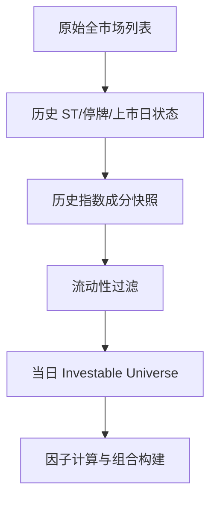

# 21 股票池构建

> 所属模块：Part IV 从因子到投资组合

> **股票池不是「能算因子的股票列表」，而是「策略声称要交易、且历史上当时能交易的股票集合」。** 池子定义错了，后面所有 IC、分组回测和组合优化都是在错误问题上做精确计算。

## 本节导读

因子再漂亮，若股票池含 ST、停牌股、未来才纳入指数的成分股，或遗漏已退市样本，结论都会系统性偏乐观。本章讲清 A 股语境下 **基础池、可交易性过滤、历史动态成分** 与 **策略目标对齐** 四件事。

## 学习目标

1. 区分「全市场」「宽基指数成分」与「自定义池」的适用场景
2. 建立可交易性过滤清单，并理解每条规则对收益与容量的影响
3. 用 Point-in-Time 成分股避免幸存者偏差与 Universe Leakage
4. 根据指数增强、量化多头、市场中性、小盘策略调整池子口径

## 核心概念

| 概念 | 含义 | 常见误用 |
|------|------|----------|
| **Universe** | 策略研究与应用的股票集合 | 与基准成分混为一谈 |
| **Investable Universe** | 扣除不可交易后的可投资集合 | 回测用收盘价能买、实盘买不到 |
| **Point-in-Time Universe** | 每个历史时点当时有效的池子 | 用「当前成分股」回测历史 |
| **Benchmark Universe** | 指数增强等产品对标的基准范围 | 中性策略误用宽基做多头池 |

---

## 21.1 基础股票池

基础池决定策略的 **市场覆盖、风格倾向与容量上限**。A 股多因子研究中最常见的起点如下。

### 全市场（A 股流通域）

- **范围**：沪深主板、创业板、科创板（按产品合规与数据覆盖选择）
- **优点**：样本量大，因子检验统计功效高；小盘、流动性因子有发挥空间
- **缺点**：ST、微盘股、流动性差标的多；实盘容量与冲击成本敏感
- **典型用途**：学术式因子检验、全市场选股后再做约束；小盘增强（需额外流动性过滤）

### 沪深 300

- **特征**：大盘蓝筹为主，流动性好，机构持仓集中
- **优点**：可交易性强，容量大，与「大盘增强」产品自然对齐
- **缺点**：行业集中（金融、消费权重高）；小盘 Alpha 难以表达
- **典型用途**：沪深 300 指数增强、大盘量化多头

### 中证 500

- **特征**：中盘成长风格明显，与 300 互补
- **优点**：增强空间通常大于 300；流动性尚可
- **缺点**：成分调整较频；极端行情下中盘波动大
- **典型用途**：中证 500 指数增强、指增 + 中性产品的多头 leg

### 中证 1000

- **特征**：小盘股占比高，因子溢价 historically 更明显
- **优点**：Alpha 潜力大；与 300/500 低相关
- **缺点**：容量瓶颈来得更早；涨跌停、流动性约束更硬
- **典型用途**：1000 指增、小盘多因子（必须叠加成交额过滤）

### 基础池选择对照

| 池子 | 大致股票数 | 流动性 | 典型容量 | 与 Barra 风格 |
|------|-----------|--------|----------|---------------|
| 全市场 | 4000+ | 分化极大 | 视过滤而定 | 暴露完整 |
| 沪深 300 | ~300 | 高 | 数十亿级+ | 偏大盘价值 |
| 中证 500 | ~500 | 中高 | 十亿—数十亿 | 中盘成长 |
| 中证 1000 | ~1000 | 中 | 数亿—十亿级 | 小盘 |

**诚实结论**：没有「最好」的池子，只有与 **产品目标、风险预算、交易能力** 匹配的池子。研究员常犯的错误是用全市场做出漂亮 IC，却从不说明实盘只会做 300 指增。

---

## 21.2 可交易性过滤

可交易性过滤把「存在行情的股票」变成「你真的能下单的股票」。在 A 股，以下规则应默认进入研究配置。

### 停牌

- **规则**：信号日或计划成交日停牌 → 不可买卖（或仅允许已有持仓的卖出来源另行定义）
- **回测**：不能假设停牌日按收盘价成交；常见做法是跳过调仓或延迟至复牌
- **影响**：高频调仓策略受影响大；复牌首日常伴随 gap，滑点模型要单独考虑

### ST / *ST

- **规则**：绝大多数 institutional 产品直接剔除 ST 族
- **原因**：涨跌幅 5%、退市风险、合规限制
- **研究**：若因子在 ST 上有效，需单独论证且一般不能进实盘池

### 上市时间

- **常见阈值**：上市满 **60 / 120 / 252 个交易日** 后纳入
- **原因**：新股定价波动大、无足够历史、限售与炒作结构特殊
- **敏感性**：阈值改变会移动 Size 暴露，要做参数稳健性检验

### 成交额 / 流动性

- **常见规则**：
  - 过去 20 日日均成交额 > 3000 万 / 5000 万 / 1 亿（按策略规模定）
  - 剔除成交额为 0 或极低的分位数尾部
- **与容量**：组合规模上升时，成交额门槛应 **随 AUM 同步上调**（见 24.5）
- **Amihud、换手率** 也可作辅助过滤，但要避免与因子定义重复计量

### 涨跌停

- **买入**：一字涨停 → 实务上通常无法买入
- **卖出**：一字跌停 → 无法卖出，被动超配或欠配
- **回测**：至少做「涨跌停日禁止成交」的硬约束；更精细的模型见 Part V 第 27 章

### 退市风险

- **规则**：剔除公告退市整理期、重大违法强制退市标的
- **与 ST 区别**：ST 仍可能交易；退市整理期流动性与规则不同
- **数据**：必须用 **历史状态** 而非当前标签

### 可交易性检查表示例

| 检查项 | 建议默认（中低频指增） | 失败处理 |
|--------|------------------------|----------|
| 停牌 | 调仓日不可交易则排除 | 延迟调仓或保留旧权重 |
| ST | 剔除 | 从池中移除 |
| 上市 < 120 日 | 剔除 | 不入池 |
| 20 日日均成交额 | > 5000 万 | 剔除 |
| 涨停（买入） | 不可买入 | 权重分配给次优标的或现金 |
| 跌停（卖出） | 不可卖出 | 记录执行缺口 |

---

## 21.3 历史股票池

这是 A 股多因子研究 **最容易造假、也最容易被忽视** 的一环。

### 动态成分股

- 指数成分 **定期调整**（如沪深 300 每半年）；调入调出会影响：
  - 可投资集合
  - 基准权重
  - 增强组合的主动边界
- **正确做法**：维护 `index_membership(symbol, index, effective_date)` 历史表，调仓日只使用 **当时已生效** 的成分

### 避免幸存者偏差

- **错误**：用「当前仍在市的股票」回测 2010—2025
- **后果**：遗漏退市股，收益虚高、波动虚低
- **正确**：包含已退市证券的历史行情与状态；退市前按规则可交易则保留在池中

### 基准调整

- 指数编制规则变更（如纳入科创板）会改变可比性
- 研究报告应注明 **基准版本** 与 **成分历史数据源**
- 增强策略的「主动收益」必须相对 **同一套历史基准权重** 计算

### Point-in-Time 流程



---

## 21.4 股票池与策略目标

同一因子，池子不同，产品形态不同。

### 指数增强

- **池子**：通常 **≥ 基准成分**（或基准成分 + 有限扩展）
- **约束**：行业、风格相对基准偏离有上限；跟踪误差预算
- **关键**：池子与基准不对齐，「增强」无从谈起

### 量化多头

- **池子**：可宽于单一指数，但需声明 Beta 与风格暴露
- **约束**：较指增松，但仍需流动性与个股权重上限
- **关键**：全市场选股 + 高 Beta ≠ Alpha，归因要拆市场与风格

### 股票市场中性

- **多头池**：常与 500/1000 或流动性过滤后的中大盘池对齐
- **空头**：融券、股指期货或 ETF 对冲；池子需考虑 **券源与对冲工具**
- **关键**：多头 leg 的池子与空头 leg 的可对冲性必须 joint 设计

### 小盘策略

- **池子**：1000 或全市场 + 严格成交额过滤
- **约束**：单票权重更低、换手更贵、容量更小
- **关键**：回测收益必须做 **容量与成本压力测试**（Part V 第 30 章）

---

## 数学定义

设 $U_t$ 为 $t$ 日基础池，$F_t$ 为可交易性过滤算子，则可投资集合：

$$
\mathcal{I}_t = F_t(U_t) = \{ i \in U_t : \text{tradable}_t(i) = 1 \}
$$

指数增强常用 **基准成分约束**：

$$
w_i \geq 0, \quad \sum_{i \in \mathcal{I}_t \cap B_t} w_i = 1, \quad \|w - w^b\|_{\infty} \leq \delta
$$

（上式用 **∞-范数** 限制单票主动偏离；亦可用 L1/L2 限制总主动偏离，并与 TE 预算联立，见第 24–25 章。）

其中 $B_t$ 为 $t$ 日 Point-in-Time 基准成分，$w^b$ 为基准权重。

---

## Python 示例

```python
import pandas as pd

def build_investable_universe(
    panel: pd.DataFrame,
    min_list_days: int = 120,
    min_avg_amount: float = 5e7,
    exclude_st: bool = True,
) -> pd.Series:
    """
    panel 列示例: trade_date, symbol, is_st, list_days,
                 avg_amount_20d, is_suspended, limit_up, limit_down
    返回: MultiIndex (trade_date, symbol) 的 bool 序列
    """
    mask = panel["list_days"] >= min_list_days
    mask &= panel["avg_amount_20d"] >= min_avg_amount
    mask &= ~panel["is_suspended"]
    if exclude_st:
        mask &= ~panel["is_st"]
    return mask.rename("investable")
```

---

## 常见错误

1. **用当前指数成分回测历史** → Universe Leakage，增强收益虚高
2. **不纳入退市股** → 幸存者偏差，小盘与质量因子尤其严重
3. **池子与基准不一致却报 Tracking Error** → 指标无意义
4. **流动性过滤与因子共用同一字段却不中性化** → 双重计量
5. **回测允许涨跌停成交** → 可交易性被系统性高估

## 要点回顾

- 股票池是策略的「研究边界」，定义错误则全流程结论失效
- A 股必须显式处理 ST、停牌、涨跌停、上市时间与流动性
- 历史池必须 Point-in-Time，含退市样本，与基准成分历史对齐
- 池子选择由产品形态（指增 / 多头 / 中性 / 小盘）驱动，而非反过来

下一章：[22 从因子分数到预期收益](22-expected-return.md)
