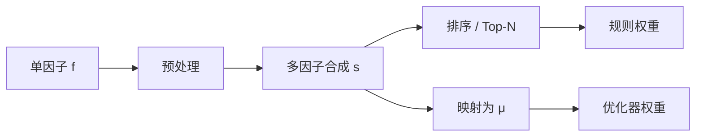

# 22 从因子分数到预期收益

> 所属模块：Part IV 从因子到投资组合

> **Rank 高不等于「明天涨 2%」。** 因子分数描述的是横截面上的相对排序；预期收益模型是一道有噪声的映射——映射越复杂，过拟合越快。

## 本节导读

单因子检验给出 IC 与分组收益；组合构建需要 **连续的综合分数**，乃至 **μ（预期收益）向量** 供优化器使用。本章讲排序、合成、预期收益估计与信号稳定性，并强调：**在 A 股，简单 Rank 组合往往比花哨的 μ 模型更稳健。**

## 学习目标

1. 掌握 Rank、分位数与分组在组合构建中的用法
2. 理解多因子合成的几种权重方案及其过拟合风险
3. 区分「排序信号」与「预期收益点估计」的适用场景
4. 设计信号平滑、滞后与衰减检验流程

## 核心概念

因子研究输出的是 **截面特征 $f_{i,t}$**；组合构建需要的是 **可排序、可加权、可进优化器的分数 $s_{i,t}$**，可选地再映射为 **$\hat{\mu}_{i,t}$**。



---

## 22.1 因子排序

### Rank

- 对 $\mathcal{I}_t$ 内股票做截面 `rank`，消除量纲与极端值影响
- **Spearman IC** 与 Rank 天然一致，是 A 股多因子实践中最常用的表达
- 注意：**并列 rank** 的处理（average / random）会影响边界分位组

### Percentile

- 将 rank 归一化到 $[0,1]$：$p_{i,t} = \frac{\mathrm{rank}(f_{i,t}) - 1}{N_t - 1}$
- 便于跨日、跨池比较；适合作为优化器的输入特征而非直接 μ

### 分组

- 五分位 / 十分位：用于检验 **单调性**，也是简单组合的来源（Long Q5, Short Q1）
- **A 股空头受限**：实践中多用 **多头 Top 组 + 基准对冲** 或 **相对基准超配**
- 分组法对 **非线性关系** 稳健，但损失截面内连续信息

### 排序 vs 原始值

| 方法 | 优点 | 缺点 |
|------|------|------|
| 原始 z-score | 保留幅度信息 | 极端值敏感；跨行业不可比 |
| Rank | 稳健、可解释 | 丢失幅度；边界股票不稳定 |
| 行业内 Rank | 控制行业结构 | 行业间不可直接比 |

**实务默认**：全市场研究用 Rank 或行业内 Rank；指增用 **相对基准的主动分数**（见 22.2）。

---

## 22.2 综合因子分数

多因子合成是 **研究自由度最高的步骤之一**——也是 Data Snooping 温床。

### 加权求和

$$
s_{i,t} = \sum_{k=1}^{K} \lambda_k \cdot \tilde{f}_{k,i,t}
$$

- $\tilde{f}$：标准化后的因子（z-score 或 rank 中心化）
- $\lambda_k$：等权、经济权重、IC 加权、ICIR 加权
- **等权** 往往是强 baseline：对估计误差最鲁棒

### 标准化后合成

- 每个因子先截面 z-score 或 rank-to-normal，再合成
- **必须** 在合成前完成去极值、缺失处理、行业/市值中性化（若策略要求）
- 合成后再做一次 rank，可缓解某一因子 dominate

### 非线性组合

- 交互项、条件排序（如「高 quality 且低估值」）、ML 非线性模型
- **风险**：样本内拟合交互项极易过拟合；需严格样本外与简单模型对照
- **诚实建议**：新人默认线性合成；非线性需额外经济逻辑与 OOS 证据

### 相对基准的主动分数（指增）

定义域为基准成分 $B_t$（或研究股票池与基准的交集）。对 $i\in B_t$：

$$
s^{\mathrm{active}}_{i,t} = s_{i,t} - \bar{s}_{B_t}
$$

池外股票不进入该主动分数（或显式规则另行扩展宇宙）。亦可在基准内 rank，使组合倾向 **超配高分、低配低分**，而非全市场绝对排序。

### 合成权重对照

| 权重方案 | 数据需求 | 过拟合风险 | 适用 |
|----------|----------|------------|------|
| 等权 | 低 | 低 | 默认 baseline |
| IC 加权（滚动） | 中 | 中 | 因子时效性差异大 |
| ICIR 加权 | 中 | 中高 | 需长窗口稳定 IC |
| 回归 / MVO 权重 | 高 | 高 | 大样本 + 强约束 |

---

## 22.3 预期收益模型

优化器需要 $\hat{\mu}$；但 **μ 的估计误差远大于 Σ 的估计误差**——这是 Markowitz 诅咒在 A 股的日常版本。

### 线性映射

$$
\hat{\mu}_{i,t} = \bar{r} + \beta \cdot s_{i,t}
$$

- $\bar{r}$：历史平均市场收益或 0（指增常用 0 或基准收益）
- $\beta$：由历史回归或 IC × 截面波动率校准
- **优点**：简单、可解释；**缺点**：线性假设可能不成立

### 历史因子收益

- Fama-MacBeth：每因子估计风险溢价，再 $\hat{\mu}_i = \sum_k \hat{\lambda}_k f_{k,i}$
- 需要 **长样本** 与 **因子收益稳定性**；因子失效时 μ 系统性偏

### 横截面回归

- 每期：$r_{i,t+1} = \sum_k \gamma_{k,t} f_{k,i,t} + \epsilon_i$
- 用 $\hat{\gamma}_t$ 与当期 $f$ 得到 $\hat{\mu}_{i,t+1}$
- **Newey-West** 调整 t 统计；注意 **多重共线性**（价值与质量常高度相关）

### 机器学习扩展

- 树模型、神经网络预测个股收益
- **陷阱**：训练 $R^2$ 极低但 rank 可能有用；更常见的是 **样本内 rank 好、OOS 全灭**
- 若用 ML，标签与特征的时间切分必须 Purged（见 Part V 第 30 章）

### 何时需要 μ？何时只需排序？

| 场景 | 建议 |
|------|------|
| Top-N 等权 / 因子加权 | 只需 $s$，不必估计 μ |
| 均值—方差 / TE 优化 | 需要 μ，但应 **收缩**（见 25 章） |
| 指数增强 | 主动 μ 常设为相对基准的 alpha 分数 |
| 高换手因子 | μ 估计噪声大 → 优先简单排序 |

---

## 22.4 信号稳定性

### 平滑

- 对 $s_{i,t}$ 做 **时间平滑**：$s'_{i,t} = \alpha s_{i,t} + (1-\alpha) s'_{i,t-1}$
- 降低换手与估计噪声；代价是 **信号滞后**，需检验衰减曲线

### 滞后

- 因子计算完成日 $t$，**最早 $t+1$ 或 $t+2$ 成交**（取决于数据可用时点）
- 财务因子常见 **公告日 + 1 交易日**；避免 Look-ahead
- 滞后一天常显著降低 IC，但这是 **诚实的 IC**

### 置信度

- 用 IC 显著性、因子 z-score 的截面离散度、或模型预测方差调整权重
- 例：$w_i \propto s_i / \sigma_i$ —— 分数高且估计稳的股票权重更大

### 信号衰减

- 计算 **holding period 1, 5, 10, 20 日** 的 IC 曲线
- 衰减快 → 需高频调仓 → 成本敏感
- 衰减慢 → 可降换手，但 **因子拥挤与失效** 风险需监控

### 稳定性检验清单

| 检验 | 方法 | 通过标准（示例） |
|------|------|------------------|
| 自相关 | $corr(s_t, s_{t-1})$ | 过高 → 换手低；过低 → 噪声大 |
| 衰减 | 多 holding period IC | 与调仓频率匹配 |
| 滞后敏感性 | delay 0/1/2 日 | IC 不应在 delay=1 后断崖 |
| 子样本 IC | 分年 / 牛熊 | 符号一致 |

---

## 数学定义

综合分数（等权）：

$$
s_{i,t} = \frac{1}{K}\sum_{k=1}^{K} \mathrm{rank\_norm}(f_{k,i,t})
$$

IC 校准的预期收益（简化；**IC 须为 ex-ante / 滞后滚动估计**，不得用当期将被预测的收益估 IC）：

$$
\hat{\mu}_{i,t} = \widehat{\mathrm{IC}}_{t-}^{\mathrm{roll}} \cdot \sigma_{cs}(r) \cdot z(s_{i,t})
$$

其中 $\widehat{\mathrm{IC}}_{t-}^{\mathrm{roll}}$ 为截至 $t$ 之前的滚动 IC，$\sigma_{cs}(r)$ 为截面收益波动的滞后估计，$z(\cdot)$ 为截面标准化。

---

## Python 示例

```python
import pandas as pd
import numpy as np

def composite_score(factors: pd.DataFrame, weights: dict | None = None) -> pd.Series:
    """
    factors: index=(trade_date, symbol), columns=factor names
    """
    ranked = factors.groupby(level="trade_date").rank(pct=True)
    if weights is None:
        return ranked.mean(axis=1)
    w = pd.Series(weights).reindex(ranked.columns).fillna(0)
    w /= w.sum()
    return (ranked * w).sum(axis=1)

def ic_calibrated_mu(
    score: pd.Series,
    forward_ret: pd.Series,
    shrink: float = 0.5,
    ic_lookback: int = 12,
) -> pd.Series:
    """用**滞后滚动 IC 与滞后截面波动**缩放当期分数；严禁用当日 forward return。"""
    df = pd.concat({"score": score, "ret": forward_ret}, axis=1).dropna()
    ic_by_date = df.groupby(level="trade_date").apply(
        lambda g: g["score"].corr(g["ret"], method="spearman"),
        include_groups=False,
    )
    cs_std_by_date = df.groupby(level="trade_date")["ret"].std()
    # t 日只用 t 之前信息
    ic_ex_ante = ic_by_date.shift(1).rolling(
        ic_lookback, min_periods=max(3, ic_lookback // 2)
    ).mean()
    cs_std_ex_ante = cs_std_by_date.shift(1).rolling(
        ic_lookback, min_periods=max(3, ic_lookback // 2)
    ).mean()

    def _one_day(g):
        d = g.name
        ic = ic_ex_ante.get(d, np.nan)
        cs_std = cs_std_ex_ante.get(d, np.nan)
        if pd.isna(ic) or pd.isna(cs_std) or g["score"].std() == 0 or cs_std == 0:
            return pd.Series(0.0, index=g.index)
        z = (g["score"] - g["score"].mean()) / g["score"].std()
        return shrink * ic * cs_std * z

    return df.groupby(level="trade_date", group_keys=False).apply(_one_day)
```

---

## 常见错误

1. **用全样本 IC 作为合成权重** → 前视偏差；应滚动或样本外
2. **合成前未统一因子方向** → 价值与成长相互抵消却以为「分散」
3. **把分组回测最高组收益当作 μ** → 忽略其他组与换手
4. **ML 预测 $R^2$ 高就进优化器** → 过拟合 + 优化器放大误差
5. **不做 delay 检验** → 实盘 IC 大幅衰减

## 要点回顾

- 因子分数用于排序；预期收益用于优化——两者不可混为一谈
- 多因子合成默认等权 Rank；复杂权重需 OOS  justification
- μ 估计噪声大，必须平滑、收缩、滞后检验
- 信号稳定性（衰减、自相关、delay）决定调仓频率与成本预算

下一章：[23 组合权重方法](23-portfolio-weights.md)
