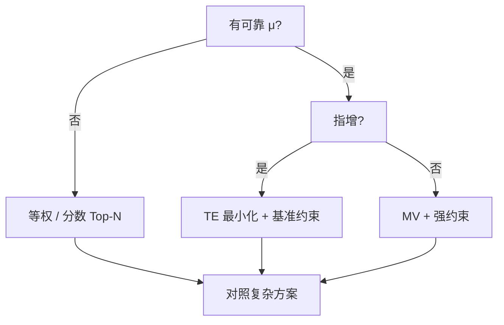

# 23 组合权重方法

> 所属模块：Part IV 从因子到投资组合

> **优化器不会创造 Alpha，只会放大你对 Alpha 的估计。** 在 μ  noisy 的情况下，等权 Top 50 常常击败「精致」的均值—方差最优解——这不是失败，而是对估计误差的诚实回应。

## 本节导读

有了综合分数 $s_{i,t}$，下一步是 **把分数变成权重 $w$**。本章系统比较等权、市值加权、因子分数加权、风险加权与优化器权重，并给出 A 股指增 / 中性场景下的选择逻辑。

## 学习目标

1. 理解五种主流权重方法的假设与失效条件
2. 能在指增场景下构造 **主动权重** $w - w^b$
3. 评估权重方案对换手、集中度与容量的影响
4. 建立「简单方法 baseline → 复杂方法增量」的对照实验习惯

## 核心概念

权重方法本质是 **在收益、风险、约束、成本之间分配有限的风险预算**。

| 方法 | 核心输入 | 主要风险 |
|------|----------|----------|
| 等权 | 排序 / 入选集合 | 小盘、高波标的 overweight |
| 市值加权 | 基准或自由流通市值 | 大盘偏好、Alpha 稀释 |
| 因子分数加权 | 综合分数 $s$ | 极端权重、估计误差放大 |
| 风险加权 | 波动率、协方差 | Σ 估计误差 |
| 优化器 | μ, Σ, 约束 | μ 与 Σ 双重误差 |

---

## 23.1 等权组合

### 优点

- **实现简单**：Top $N$ 等权是 industry standard baseline
- **对 μ 估计误差不敏感**：不依赖预期收益点估计
- **分散 idiosyncratic risk**：$N$ 足够大时（如 50—100）特异性风险下降

### 风险

- **隐式小盘 / 高波暴露**：等权使小市值获得更高权重 → A 股小盘溢价 or 小盘陷阱
- **流动性不均**：微盘股权重与成交额不匹配
- **指增偏离大**：相对沪深 300 基准的主动权重可能很激进

### 适用场景

- 因子研究的 **第一版组合**
- 中性策略多头 leg（配合行业中性约束）
- 与复杂方法的 **对照组**

### 典型参数

| 参数 | 常见取值 | 说明 |
|------|----------|------|
| $N$ | 30—100 | 过少集中，过多稀释 |
| 再平衡 | 周 / 月 | 与因子衰减匹配 |
| 权重上限 | 2%—5% | 等权后再 cap |

---

## 23.2 市值加权

### 基准一致性

- **指数产品**：$w_i \propto \text{float\_mv}_i$ 与基准权重一致，主动收益来自 **超配低配**
- 指增常用：**$w = w^b + \Delta w$**，其中 $\sum \Delta w_i = 0$

### 大盘偏好

- 市值加权 **系统性低配小盘 Alpha**
- 若因子在小盘更强，市值加权会 **抹杀** 因子效果

### 指数增强应用

- **基准权重 + 主动倾斜**：
  $$
  w_i = w^b_i + \kappa \cdot \frac{s_i - \bar{s}_{B}}{\sum_{j \in B} |s_j - \bar{s}_{B}|}
  $$
- $\kappa$ 控制跟踪误差与增强幅度 trade-off

---

## 23.3 因子分数加权

### 线性权重

$$
w_i = \frac{\max(s_i, 0)}{\sum_j \max(s_j, 0)} \quad \text{or} \quad w_i = \frac{s_i - s_{\min}}{\sum_j (s_j - s_{\min})}
$$

- 仅对 Top 分位或 $s > 0$ 的股票分配权重
- 分数 spread 小 → 权重接近等权；spread 大 → 集中

### 截断

- **Top N + 分数加权**：先在集合内按 $s$ 分配，避免全市场长尾
- **权重上下限**：$w_i \in [w_{\min}, w_{\max}]$ 防极端（A 股单票 10% 上限是常见合规线）

### 非线性放大

- $w_i \propto s_i^p$，$p > 1$ 强化头部；$p < 1$ 接近等权
- **风险**：$p$ 越大，对分数估计误差越敏感；需 OOS 验证 $p$

---

## 23.4 风险加权

### 波动率倒数

$$
w_i \propto \frac{s_i}{\sigma_i} \quad \text{or} \quad w_i \propto \frac{1}{\sigma_i}
$$

- 降低高波股票权重；与 **低波异象** 可能冲突
- $\sigma_i$ 用 60 日历史波动，需 winsorize

### 风险平价（Risk Parity）

- 每个资产 **风险贡献** 相等：$RC_i = w_i \cdot (\Sigma w)_i / \sigma_p$
- 多用于资产配置；股票多因子中可作 **二级调整**（在因子组合层）

### 边际风险贡献

- 指增中控制 **主动风险**：$MRC_i = \frac{\partial \sigma_{\mathrm{active}}}{\partial w_i}$
- 与 Barra 因子模型结合时，优先控制 **因子主动暴露** 而非逐个 $w_i$

---

## 23.5 优化器权重

### 目标函数

- **均值—方差**：$\max w'\mu - \frac{\lambda}{2} w'\Sigma w$
- **跟踪误差（效用形式）**：$\max\ \alpha'(w-w^b)-\frac{\lambda}{2}(w-w^b)'\Sigma(w-w^b)$；或约束形式 $\max\alpha'(w-w^b)\ \mathrm{s.t.}\ (w-w^b)'\Sigma(w-w^b)\le \mathrm{TE}_{\max}^{2}$
- **风险平价**：$\min\sum_{i<j}(RC_i-RC_j)^2$（使各资产风险贡献两两接近）

### 约束

- 见第 24 章：行业、风格、权重上下限、换手、流动性

### 估计误差

- **μ 误差** → 极端权重、不稳定解
- **Σ 误差** → 错误的风险分散；样本协方差条件数差
- **缓解**：收缩估计、稳健协方差、限制 turnover、**提高** $\lambda$（更厌恶风险）/ 加强 μ shrinkage / 收紧主动权重

### 稳健优化

- **Resampled Efficiency**、**Bootstrapped MV**
- 实践更简单：**Black-Litterman**、**μ shrinkage + Σ shrinkage**
- A 股日频研究：优化器 **月频调仓** 足够；日频优化多为噪声

### 方法选择决策树



---

## 数学定义

等权 Top $N$：

$$
w_i = \begin{cases} 1/N & i \in \mathrm{Top}_N(s) \\ 0 & \text{otherwise} \end{cases}
$$

主动权重（指增）：

$$
w_i^{\mathrm{active}} = w_i - w^b_i, \quad \sum_i w_i^{\mathrm{active}} = 0
$$

---

## Python 示例

```python
import pandas as pd
import numpy as np

def equal_weight_top_n(score: pd.Series, n: int = 50) -> pd.Series:
    """score: index=(trade_date, symbol)"""
    def _day(s):
        top = s.nlargest(n)
        w = pd.Series(0.0, index=s.index)
        w.loc[top.index] = 1.0 / n
        return w
    return score.groupby(level="trade_date").apply(_day).droplevel(0)

def score_weighted(score: pd.Series, n: int = 50, max_w: float = 0.05) -> pd.Series:
    def _day(s):
        top = s.nlargest(n).clip(lower=0)
        w = top / top.sum()
        w = w.clip(upper=max_w)
        return w / w.sum()
    return score.groupby(level="trade_date").apply(_day).droplevel(0)
```

---

## 常见错误

1. **跳过等权 baseline 直接上优化器** → 无法证明复杂方法价值
2. **分数加权不设 cap** → 单票超限 + 实盘不可成交
3. **用全样本波动率做风险加权** → 前视；应滚动估计
4. **优化器无解时不处理** → 静默失败或全零权重
5. **指增用全市场等权** → TE 爆炸

## 要点回顾

- 等权 Top-N 是默认 baseline；复杂方法须证明增量
- 指增用基准权重 + 主动倾斜，而非全市场绝对权重
- 因子分数加权需截断与 cap；非线性放大谨慎 OOS
- 优化器输入误差大于模型 elegance；收缩与约束是必需品

下一章：[24 风险约束与中性化](24-risk-constraints.md)
