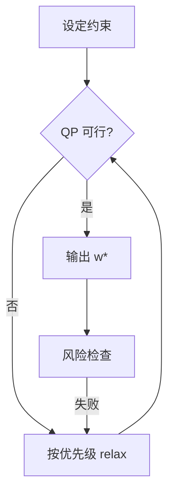

# 25 组合优化基础

> 所属模块：Part IV 从因子到投资组合

> **Markowitz 1952 至今，业界学到的最重要一课是：别全信输入的 μ 和 Σ。** 优化器是约束下的权重分配器，不是 Alpha 发生器。

## 本节导读

本章介绍均值—方差、跟踪误差最小化、约束优化与输入估计问题，并回答：**何时值得上优化器，何时等权就够了。**

## 学习目标

1. 理解均值—方差与 TE 优化的问题形式
2. 识别优化器对 μ、Σ 估计误差的敏感性
3. 掌握收缩估计与稳健优化的基本思路
4. 在研究与生产之间选择合适的优化复杂度

## 核心概念

组合优化 = **目标函数 + 估计输入 + 约束集合**。三者任一错误，输出不可信。

---

## 25.1 均值—方差框架

### 预期收益 μ

- 来自第 22 章映射；**高噪声**
- 实践：**向零收缩**、向基准收缩、或用 rank 代替 level

### 协方差矩阵 Σ

- 样本协方差：$T < N$ 时不可逆；$T \gg N$ 仍不稳定
- **因子模型协方差**：$Σ = B F B' + D$（Barra 思路，Part VI 详述）
- **收缩**：Ledoit-Wolf 向对角阵或常相关目标矩阵收缩（目标矩阵记作 $T$，勿与因子协方差 $F$ 混淆）

### 风险厌恶 λ

$$
\max_w \ w'\mu - \frac{\lambda}{2} w'\Sigma w \quad \text{s.t.} \ w \in \mathcal{W}
$$

- λ 越大 → 越保守 → 权重越接近 benchmark 或越分散
- 在基准相对效用下，调 $\lambda$ **近似**调节主动风险 / TE；不应 grid search $\lambda$ 最大化 Sharpe（过拟合）

### 均值—方差的问题

| 问题 | 后果 |
|------|------|
| μ 误差 | 极端权重、错误排序 |
| Σ 误差 | 错误对冲、虚假分散 |
| λ 任意 | 回测曲线拟合 |
| 无约束 | 杠杆式集中 |

---

## 25.2 跟踪误差最小化

### 指数增强

- **目标**：在 TE ≤ TE_max 下最大化主动收益（推荐）
- 或：在效用形式下权衡主动收益与主动风险

$$
\max_w\ \alpha'(w - w^b) - \frac{\lambda}{2}(w - w^b)'\Sigma(w - w^b)
$$

等价约束形式：$\max \alpha'(w-w^b)\ \mathrm{s.t.}\ (w-w^b)'\Sigma(w-w^b)\le \mathrm{TE}_{\max}^{2}$（及行业/换手等约束）。避免无 $\lambda$ 的「$\min\ \mathrm{TE}-\alpha$」混写，量纲不一致且解易极端追逐 $\alpha$。

### 主动权重

- $w^{\mathrm{active}} = w - w^b$；**纯主动** 优化避免 scale 混淆
- 基准权重 $w^b$ 必须用 **调仓日 Point-in-Time** 官方权重或流通市值近似

### Benchmark-relative Risk

- **Ex-ante TE**：$\sqrt{(w-w^b)'\Sigma(w-w^b)}$ 年化
- **Ex-post TE**：实现主动收益的标准差
- 二者偏离大 → 模型风险或执行偏差

### 指增典型设定

| 产品 | TE 目标 | 增强目标 |
|------|---------|----------|
| 300 指增 | 2%—5% | 年化超额 3%—8% |
| 500 指增 | 3%—6% | 年化超额 5%—10% |
| 1000 指增 | 4%—8% | 更高 Alpha、更低容量 |

（以上为行业常见量级示意，以产品合同为准；非承诺收益。）

---

## 25.3 约束优化

### 线性约束

- 权重和为 1、多头 $w \geq 0$（A 股纯多头）
- 行业：$A w \leq b$（区间）或 $A w = b$（中性）
- 因子暴露：$B(w - w^b) \in [l, u]$

### 二次规划（QP）

- MV 与 TE 目标均为二次 → **凸 QP**（$\Sigma$ 正定前提下）
- 求解器：OSQP、ECOS、MOSEK、Gurobi
- **不可行**：约束冲突 → 需 hierarchy relax

### 可行域

- 约束过多 → **空集**；优化器报错或返回 NaN
- **生产**：必须 fallback（放宽 TE → 放宽行业 → 等权 baseline）



---

## 25.4 优化器的常见问题

### 输入噪声

- μ 的 t 统计常 < 2；优化器仍会给高 μ 股票 **过大权重**
- **对策**：μ shrinkage、限制 active weight、增加 turnover penalty

### 极端权重

- 无 cap 时常见 20%+ 单票（样本协方差下）
- **对策**：$w_{\max}$、$|w_i - w^b_i|_{\max}$

### 协方差不稳定

- 市场 regime 切换 → Σ 滞后
- **对策**：短窗口 + 收缩、因子模型 Σ、定期重估

### 结果敏感

- μ 微小扰动 → 权重巨变（**ill-conditioned**）
- **对策**：regularization、resampling、降低 rebalance 频率

### 估计误差对比

| 输入 | 相对误差 | 优化器放大程度 |
|------|----------|----------------|
| μ | 高 | 极高 |
| Σ | 中 | 高 |
| 约束 | 低 | 低（若可行） |

**结论**：优先对 **μ** 做最强正则（shrinkage、rank/主动分数、限制主动权重），再用因子模型或收缩修 **Σ**，最后用硬约束兜底。切勿在 μ 未处理时迷信「先把协方差估准」。

---

## 25.5 简单方法与复杂方法的选择

### 等权为何常常稳健

- 不对 μ 排序外的 magnitudes 下注
- 隐式 **1/N 分散** 在 Σ 估计差时 near-optimal（DeMiguel et al.）
- 实现与归因简单；PM 与风控易理解

### 复杂优化何时有价值

- **指增**：TE 与行业约束 **必须** 用 QP 系统化
- **多因子叠加**：风格暴露需精确控制
- **大规模持仓**（300+）：规则法难以 manual tune
- **有可靠因子风险模型** 时，Σ 质量提升，优化价值上升

### 研究与生产的权衡

| 阶段 | 建议 |
|------|------|
| 因子验证 | 等权 Long-Short / Top-N |
| 策略 prototype | 规则权重 + 约束 |
| 指增准生产 | TE QP + 完整约束 |
| 生产 | 同一套 QP + fallback + 审计 log |

### 决策清单

1. 等权 baseline 净 IR 是否为正？
2. 优化增量是否 **样本外** 持续？
3. 增量是否 > 额外复杂度与故障风险？
4. 三条皆 yes → 上优化器；否则保持简单

---

## 数学定义

均值—方差（约束形式）：

$$
\begin{aligned}
\max_w \ & w'\mu - \frac{\lambda}{2} w'\Sigma w \\
\text{s.t.} \ & \mathbf{1}'w = 1, \ w \geq 0, \ w \in \mathcal{W}
\end{aligned}
$$

跟踪误差约束增强：

$$
\begin{aligned}
\max_w \ & (w - w^b)'\alpha \\
\text{s.t.} \ & (w - w^b)'\Sigma (w - w^b) \leq \mathrm{TE}_{\max}^2, \ w \in \mathcal{W}
\end{aligned}
$$

Ledoit-Wolf 收缩（概念）：

$$
\hat{\Sigma}_{\mathrm{LW}} = \delta F + (1-\delta) S
$$

$S$ 为样本协方差，$F$ 为结构化目标矩阵，$\delta \in [0,1]$。

---

## Python 示例

```python
import cvxpy as cp
import numpy as np

def te_constrained_enhance(
    alpha: np.ndarray,
    w_b: np.ndarray,
    sigma: np.ndarray,
    te_max: float = 0.05,
    max_active: float = 0.02,
):
    """sigma 须为与 te_max **同一频率** 的协方差。
    若 te_max=0.05 为年化 TE、收益为日频，则传入年化协方差 Σ_ann = Σ_daily * 252。
    """
    n = len(alpha)
    w = cp.Variable(n)
    active = w - w_b

    te_sq = cp.quad_form(active, sigma)
    objective = cp.Maximize(alpha @ active)
    constraints = [
        cp.sum(w) == 1,
        w >= 0,
        active >= -max_active,
        active <= max_active,
        te_sq <= te_max ** 2,
    ]
    cp.Problem(objective, constraints).solve()
    return w.value
```

---

## 常见错误

1. **Grid search λ / TE 最大化 IS Sharpe** → 严重过拟合
2. **样本协方差直接 invert** → 病态矩阵
3. **μ 与 Σ 来自不同样本窗口** → 不一致
4. **优化器输出不检查 sum(w)** → 数值误差累积
5. **研究用等权、生产用优化，无 OOS 对照** → 上线即风格漂移

## 要点回顾

- MV 与 TE 优化是约束下的权重工具；Alpha 来自因子，不是优化器
- μ 误差是最大敌人；收缩、cap、换手惩罚是标配
- Σ 应用因子模型或收缩；样本协方差 raw 慎用
- 等权是科学 baseline；复杂优化需 OOS 增量证明
- Part IV 结束 → 进入 Part V，用回测检验上述所有假设

下一章：[26 回测的基本框架](../part-v/26-backtest-framework.md)
