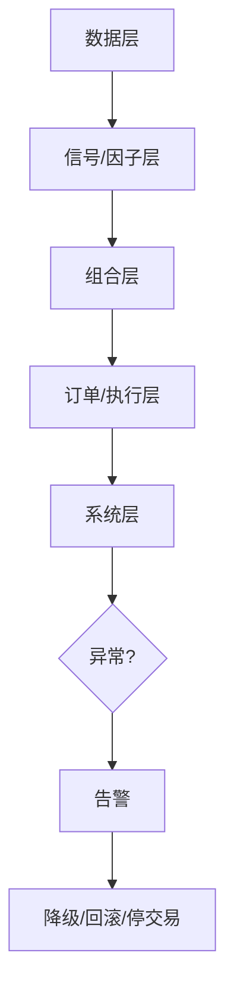

# 46 实盘监控与故障处理

> 所属模块：Part IX 从研究到实盘

> **生产系统默认会出错；成熟团队的区别在于多快发现、多快止损、多快恢复。**

## 本节导读

09:31 某成分股因子值缺失率从 2% 跳至 40%，优化器将其权重压至 0 — 若无人告警，组合相对基准暴露悄然变化。本章按数据、信号、组合、订单、系统五类异常给出监控与处置**预案**（playbook）。

## 学习目标

1. 分类识别五类生产异常
2. 掌握降级、回滚与停止交易的决策树
3. 建立 on-call 与事后复盘机制

---

## 监控分层



---

## 46.1 数据异常
| 现象 | 可能原因 | 处置 |
| --- | --- | --- |
| 行数骤降 | 供应商故障 | 阻塞下游，切备份源 |
| 价格跳变 | 复权错误 | 暂停因子，人工核对 |
| 财务字段全 NaN | ETL bug | 回滚数据版本 |
| 延迟超 SLA | 网络/任务卡住 | 告警，评估是否延迟调仓 |

**原则**：数据未验证 → **不跑优化器**。

---

## 46.2 信号异常
- 因子 IC 单日极端（怀疑 bug）
- 因子分布 vs 30 日均值 KS 距离过大
- 全市场 score 相同（计算失败）

**动作**：切换备用因子版本；或冻结调仓，保持昨日持仓。

---

## 46.3 组合异常
- 单票权重 > 硬上限
- 行业 active weight 超限
- TE 预估突增
- 换手 > 日常 3 倍

**动作**：L2 降级 — 重新优化或回滚 target。

---

## 46.4 订单异常
- 拒单、废单、重复单
- 成交率 < 阈值
- 滑点 > 预算 2 倍

**动作**：交易台介入；未完成部分次日补单或放弃（防追价）。

---

## 46.5 系统异常
- 调度任务失败
- OMS 连接中断
- 服务器磁盘满

**动作**：L3 停交易；启用灾备；手动导出 emergency target（若有）。

---

## 46.6 降级、回滚与停止交易
| 级别 | 条件 | 动作 |
| --- | --- | --- |
| L1 | 软阈值 | 通知 on-call |
| L2 | 信号/组合异常 | 停止调仓，持仓不变 |
| L3 | 数据/系统严重 | 停发新单，风控接管 |
| L4 | 极端市场 | 按预案减仓/对冲 |

**回滚**：

```text
restore target_portfolio from T-1 validated snapshot
git checkout factor_engine@last_green
```

每次 L2+ 必须写 **incident report**：时间线、根因、修复、预防。

---

## On-call 清单

- [ ] 告警渠道畅通（电话 > 即时通讯）
- [ ] Runbook 链接可访问
- [ ] 备份数据源凭证有效
- [ ] 有权 sign-off 停交易的人员值班表
- [ ] 次日开盘前复盘是否可恢复正常 pipeline

---

## 常见错误

- 告警过多导致忽视（cry wolf）
- 无 runbook，靠个人记忆排障
- 回滚后不查根因，次日复发
- 停交易无合规记录
- 只修症状（删异常行）不修 ETL

## 要点回顾

- 监控五层：数据→信号→组合→订单→系统
- 默认保守：不确定时**不调仓**
- 下一章 [47 策略容量与规模管理](47-capacity-management.md)讲容量与规模管理
