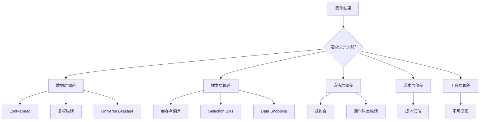

# 29 回测偏差与常见陷阱

> 所属模块：Part V 回测体系

> **大多数「实盘失效」，不是市场变了，是回测里埋了雷——只是你直到亏钱时才挖出来。** 本章是 Part V 的核心：系统梳理让回测 **系统性偏乐观** 的十条偏差，每条配定义、A 股案例、检测方法与修复清单。

## 本节导读

回测偏差不是「小误差」，而是 **方向性错误**——它们几乎总是让结果更好看。本章按 **发生环节** 组织：数据 → 样本 → 方法 → 成本 → 工程。建议作为 **策略上线前 checklist** 逐项勾选。

## 学习目标

1. 识别并定义十大类回测偏差
2. 能在自有代码与数据中定位典型偏差
3. 掌握每条偏差的 **检测 heuristic 与修复方案**
4. 建立「偏差审计」习惯，降低 Data Snooping 与过拟合

## 核心概念



---

## 29.1 Look-ahead Bias（未来函数）

### 定义

在 **决策时点 $t$ 使用了 $t$ 之后才能获得的信息**。

### A 股典型案例

| 场景 | 错误做法 | 后果 |
|------|----------|------|
| 财务因子 | 用报告期 merge 价格，忽略公告日 | 财报发布前已「知道」业绩 |
| 指数成分 | 用 2025 成分回测 2015 | 提前持有未来牛股 |
| 因子标准化 | 全样本 mean/std 做 z-score | 用到未来分布 |
| 收盘价信号 | 当日收盘算因子、当日收盘成交 | 不可能实现 |
| 分析师一致预期 | 用修订后历史 | 回填预期 |

### 检测方法

1. **Delay test**：信号 lag 0 vs 1 vs 2 日，IC/PnL 是否在 lag=1 断崖式下跌
2. **Audit timestamp**：每条数据字段是否有 `available_date`
3. **Merge 审查**：`merge` 是否 `on report_period` 而非 `on announce_date`
4. **子样本随机切分**：若 IS 极好、OOS 随机段仍极好，怀疑 leakage

### 修复清单

- [ ] 财务：as-of join by `announce_date`（Part II 第 13 章）
- [ ] 指数：Point-in-Time membership 表
- [ ] 标准化：截面按日；禁用全样本 scaler
- [ ] 成交：信号 $t$ → 成交 $t+1$
- [ ] 字段级 `available_time` 入库

### 严重程度

⭐⭐⭐⭐⭐ —— **最致命**；一条 future leak 可让策略从负变正。

---

## 29.2 Survivorship Bias（幸存者偏差）

### 定义

样本仅包含 **至今仍存在** 的证券，遗漏已退市、被并购标的。

### A 股典型案例

- 回测「当前 A 股全市场」2010—2025，不含 2018—2020 大量退市股
- 只保留「正常上市」标签，未纳入 **退市整理期** 数据
- 数据库 vendor 默认剔除 dead symbols

### 后果

- 收益 **偏高**（坏公司消失）
- 波动 **偏低**
- 质量、ST、小盘因子 **尤其严重**

### 检测方法

1. 统计历史池 **每年退市数量** 是否为 0（应非 0）
2. 对比「含退市」vs「不含退市」组合收益差
3. 检查数据 vendor 文档的 universe 定义

### 修复清单

- [ ] 使用含 **退市证券历史行情** 的数据源
- [ ] 维护 `list_date`, `delist_date`, `status` 历史
- [ ] 退市前若可交易，保留在池中直至不可交易
- [ ] 研究报告注明退市样本处理方式

### 严重程度

⭐⭐⭐⭐ —— A 股注册制后退市增加，近年偏差 **越来越大**。

---

## 29.3 Selection Bias（选择偏差）

### 定义

样本或规则 **非随机** 地筛选了 favorable 子集，且筛选条件与 **测试目标相关**。

### A 股典型案例

| 场景 | 偏差 |
|------|------|
| 只在「有财务数据」的股票上测价值因子 | 排除 young / 亏损 / 金融股 |
| 先删缺失再算 IC | 缺失非随机（停牌、ST） |
| 只在牛市长样本上调参 | 参数只适合上涨 regime |
| 剔除 2015 股灾 | 刻意去掉 stress test |
| 只报告「成功因子」不报告失败因子 | 发表偏差 |

### 与 Survivorship 区别

- Survivorship：**时间轴上** 遗漏死亡个体
- Selection：**横截面或规则上** 非随机入池

### 检测方法

1. 对比 **宽池 vs 窄池** IC 差异
2. 列出 **所有** 尝试过的因子 / 参数，非只报 winner
3. 检查过滤链：每一步损失多少样本、损失是否 correlated with return

### 修复清单

- [ ] 过滤规则 **事前写入** spec，非事后删段
- [ ] 保留 **research log**：所有实验 ID
- [ ] 压力段（2015、2018、2024）**强制纳入**
- [ ] 缺失处理：区分 MCAR vs 非随机缺失

### 严重程度

⭐⭐⭐⭐

---

## 29.4 Data Snooping（数据窥探 / p-hacking）

### 定义

在同一数据集上 **反复试验** 大量假设，只报告显著结果，未校正多重检验。

### A 股典型案例

- 测试 200 个技术因子变体，只发布 Top 5
- Grid search 50 组 `(窗口, 中性化, 权重)` 取最优 Sharpe
- 多个研究员多年共用同一 backtest set「调一调」
- 看到 OOS 差就换 OOS 区间直到好看

### 后果

- IS 显著 **不可重复**
- 机构内部 **因子库膨胀** 但实盘无一可用

### 检测方法

1. **Deflated Sharpe Ratio**（Bailey & López de Prado 思想）：校正试验次数
2. 记录 **trial count**；trial > 20 时 skepticism
3. **Hold-out test set** 只碰一次
4. Bootstrap / 置换检验：null 下能否 replicate

### 修复清单

- [ ] 预注册 **research hypothesis**（Hypothesis ID）
- [ ] Bonferroni / FDR 控制多重检验
- [ ] Train / Val / Test **严格隔离**（第 30 章）
- [ ] 「失败实验」入库，与成功同等存档
- [ ] 新因子必须通过 **独立 OOS 段** 或 walk-forward

### 严重程度

⭐⭐⭐⭐⭐ —— 机构级 **隐性杀手**；个人研究员同样难逃。

---

## 29.5 Overfitting（过拟合）

### 定义

模型 **记住样本噪声** 而非规律；参数过多、样本过少、约束过弱。

### 表现

- IS Sharpe 2+，OOS near 0 或负
- 参数 **极度敏感**：窗口 20 vs 21 天结果天差地别
- ML 模型 train $R^2$ 高，test $R^2$ 负
- 十因子合成 + TE 优化 + 50 次调参

### A 股加剧因素

- 样本期短（有效 A 股量化历史 ~15—20 年）
- 结构 break 多（2015、2017 风格、2020、2024）
- 因子 **crowding** 后 IS 规律 OOS 反转

### 检测方法

1. **参数平原**：好参数应是一片区域，非尖峰
2. **复杂度惩罚**：因子数 / 参数数 vs 样本长度
3. **Walk-forward** IR 是否稳定
4. **Simple model challenge**：复杂必须 beat 等权

### 修复清单

- [ ] 默认 **简单模型**（等权、线性合成）
- [ ] 限制自由度：因子 < 10 进入组合前先合成
- [ ] μ shrinkage、权重 cap、换手惩罚
- [ ] OOS + walk-forward **硬门槛**
- [ ] ML：Purged CV、early stopping、特征数上限

### 严重程度

⭐⭐⭐⭐⭐

---

## 29.6 Transaction Cost Underestimation（交易成本低估）

### 定义

回测 **未充分扣除** 佣金、印花税、滑点、冲击，或 **换手被低估**。

### A 股典型案例

- 零成本 + 月换手 150%
- 只算万 2 佣金，忽略 **0.05% 印花税**
- 小盘组合按 **收盘价零滑点** 成交
- 忽略 **最低 5 元** 对小单的影响
- Drift 未更新，低估实际换手

### 检测方法

1. 毛 vs 净收益差是否 **与换手成正比**
2. 成本占毛 Alpha **比例** > 50% 则高危
3. 提高成本 50% 后策略是否仍盈利
4. 对比 **理论换手 vs 模拟换手**

### 修复清单

- [ ] 默认 conservative cost（第 27 章）
- [ ] 成本 **压力测试** ±50%
- [ ] 涨跌停、ADV 约束进回测
- [ ] 报告 **成本分解** 柱状图

### 严重程度

⭐⭐⭐⭐ —— 高换手策略 **一票否决** 项。

---

## 29.7 Incorrect Price Adjustment（复权与价格错误）

### 定义

除权除息、拆股、配股 **未正确复权**，或混用 **前复权 / 后复权 / 不复权**。

### A 股典型案例

- 用不复权价格算动量 → 除息日假暴跌 → 假 reversal
- 前复权因子错误 → 历史价格断层
- 复权与 **成交量** 未同步调整
- 展示用前复权、回测用另一套

### 检测方法

1. 除息日前后 **人工 spot check** 5—10 只股票
2. 复权前后 **收益率连续性**
3. `adj_factor` 与 vendor 交叉验证
4. 动量因子在除息密集期是否异常 spike

### 修复清单

- [ ] 全项目 **统一复权口径**（通常后复权算收益）
- [ ] 收益用 **复权价格比率**，非手工减分红
- [ ] 复权因子版本与数据版本绑定
- [ ] Part II 第 12 章流程落地

### 严重程度

⭐⭐⭐⭐ —— 动量、反转类 **直接作废**。

---

## 29.8 Universe Leakage（股票池泄漏）

### 定义

使用了 **当时不属于可投资集合** 的股票信息——与 Look-ahead 重叠但 **专指 pool 定义**。

### A 股典型案例

- 用 **现行沪深 300** 回测 2010 指增
- 每周用 **未来一周** 才生效的成分
- ST 剔除用 **当前 ST 标签** 涂改历史
- 回测池 = 「现在有数据的股票」

### 与 Look-ahead / Survivorship 关系

| 偏差 | 焦点 |
|------|------|
| Look-ahead | 任意未来信息 |
| Survivorship | 遗漏退市 |
| Universe Leakage | 池 membership 时间错误 |

### 检测方法

1. 历史某日 pool count vs 官方 index 成分 count 对比
2. 调入 index **之前** 是否已持有该 stock
3. ST 标记时间序列 vs 公告日

### 修复清单

- [ ] Point-in-Time index membership（第 21 章）
- [ ] ST / 停牌 **历史状态表**
- [ ] `universe_version` 写入回测 config
- [ ] 增强收益相对 **同期官方 benchmark**

### 严重程度

⭐⭐⭐⭐⭐ —— 指增 **TE 和 Alpha 同时虚高**。

---

## 29.9 Rebalancing Timing Error（调仓时点错误）

### 定义

**信号、权重、成交、计价** 时点不一致或逻辑错误。

### A 股典型案例

| 错误 | 后果 |
|------|------|
| 月末因子用月末收盘，成交也用月末收盘 | Look-ahead |
| 周初信号、周末成交 | 多算 4 日免费收益 |
| 忽略 drift，直接设 target w | 换手低估 |
| 分红日未调整 cash | 权重和 ≠ 1 |
| T+1 制度下 T 日买入可卖 | 空头 / 回转错误 |

### 检测方法

1. 打印 **timeline diagram**：数据可用 → 信号 → 订单 → 成交 → 计价
2. 手工演算 **3 天** 小样本组合
3. 权重和每日 **sum(w) ≈ 1**
4. 与「延迟 1 日成交」版本 diff

### 修复清单

- [ ] 文档化 **Event Calendar**
- [ ] 成交日 = 信号日 + lag（≥1）
- [ ] Drift → trade delta 流程
- [ ] 单元测试：单 stock 除息路径

### 严重程度

⭐⭐⭐⭐

---

## 29.10 结果复现失败

### 定义

**相同配置** 无法得到相同回测结果——工程或数据问题，或 **隐性随机 / 隐性自由度**。

### 典型原因

| 原因 | 表现 |
|------|------|
| 未固定随机种子 | ML 权重每次不同 |
| 数据 silent update | vendor 修订历史 |
| 并行 race condition | 订单分配不确定 |
| 未版本化 config | 「昨天还能跑」 |
| 浮点非确定性 | GPU / 多线程 |
| 隐性 `dropna` 顺序变化 | 样本量漂移 |

### 检测方法

1. **同一 git commit + data snapshot** 跑两次，diff NAV
2. CI 中 **回归测试** golden NAV
3. 检查 `requirements.txt` / 环境 lock
4. Code review：`sort_values` 是否 stable sort

### 修复清单

- [ ] Git tag + data hash + config hash = **run_id**
- [ ] 随机种子全局固定（Part VII 第 39 章）
- [ ] 数据 **immutable snapshot**
- [ ] Golden file test：允许 ±1e-8 误差
- [ ] Research log 绑定 run_id

### 严重程度

⭐⭐⭐ —— 不直接虚高 Sharpe，但 **摧毁信任与协作**；隐性 bug 可叠加其他偏差。

---

## 偏差综合对照表

| # | 偏差 | 主要环节 | 乐观方向 | 首要检测 |
|---|------|----------|----------|----------|
| 29.1 | Look-ahead | 数据/时点 | ↑收益 | Delay test |
| 29.2 | Survivorship | 样本 | ↑收益 ↓风险 | 退市计数 |
| 29.3 | Selection | 规则 | ↑收益 | 池对比 |
| 29.4 | Data Snooping | 研究流程 | ↑显著性 | Trial log |
| 29.5 | Overfitting | 模型 | ↑IS | OOS / 参数平原 |
| 29.6 | 成本低估 | 成本 | ↑净收益 | 毛净差 |
| 29.7 | 复权错误 | 数据 | 不定 | 除息 spot |
| 29.8 | Universe Leak | 池 | ↑指增 | PIT 成分 |
| 29.9 | 调仓时点 | 流程 | ↑收益 | Timeline |
| 29.10 | 不可复现 | 工程 | 不定 | Double run |

---

## 上线前偏差审计 Checklist

```markdown
## Data
- [ ] 所有字段有 available_date，财务 as-of join
- [ ] 复权统一，除息 spot check 通过
- [ ] 含退市股，ST/停牌历史状态

## Universe
- [ ] PIT index membership
- [ ] 池与 benchmark 口径文档化

## Method
- [ ] 信号 t → 成交 t+1
- [ ] 截面标准化按日
- [ ] 简单 baseline 对照

## Cost & Tradability
- [ ] 佣金 + 印花税 + 滑点
- [ ] 涨跌停 / ADV 约束
- [ ] 成本 +50% 仍盈利？

## Research Integrity
- [ ] Trial log / Hypothesis ID
- [ ] OOS 未触碰多次
- [ ] Walk-forward IR > 0

## Engineering
- [ ] 同 config 复现 NAV
- [ ] run_id = git + data + config hash
```

---

## Python：Delay 敏感性测试

```python
import pandas as pd

def delay_sensitivity(factor: pd.Series, ret: pd.Series, delays=(0, 1, 2, 3)):
    """factor index=(date, symbol); ret 为 forward return"""
    results = {}
    for d in delays:
        shifted = factor.groupby(level="symbol").shift(d)
        ic = shifted.groupby(level="date").apply(
            lambda x: x.rank().corr(ret.loc[x.index].rank())
        ).mean()
        results[d] = ic
    return pd.Series(results)
```

**解读**：lag=0 显著高于 lag=1 → **高度怀疑** Look-ahead 或时点错误。

---

## 常见错误（元层面）

1. **知道偏差存在但「这次应该没有」** → 必须 checklist，不能靠感觉
2. **只 fix 最亮的偏差** → 多条偏差 **叠加** 非线性虚高
3. **把 OOS 当 IS 继续调** → OOS 变 IS，失去意义
4. **复现失败仍写报告** → 结果不可信
5. **偏差审计只做一次** → 数据/vendor 变更后重审

## 要点回顾

- 回测偏差 **几乎总让结果更好**；怀疑乐观是专业本能
- Look-ahead、Universe Leak、Snooping、Overfitting 是四大杀手
- 每条偏差有 **检测 + 修复**；上线前 checklist 非可选
- 不可复现 = 不可上线；工程与统计同等重要
- 下一章用 **样本外与稳健性** 做最后一道防火墙

下一章：[30 样本外验证与稳健性测试](30-oos-robustness.md)
