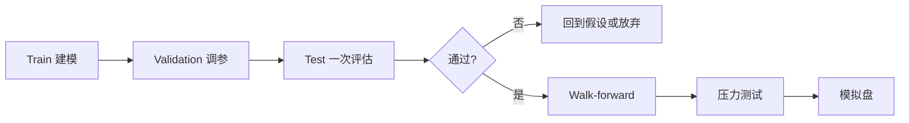

# 30 样本外验证与稳健性测试

> 所属模块：Part V 回测体系

> **样本内是讲故事，样本外是交卷。** 没有在 hold-out 上仍成立的策略，默认是过拟合——直到被证明 otherwise。

## 本节导读

第 29 章讲「别被骗」；本章讲 **如何主动证伪**。覆盖 Train/Val/Test 切分、时间序列 CV、Walk-forward、参数敏感性、regime 测试、成本与容量压力测试——A 股多因子 **上线前的最后一道门**。

## 学习目标

1. 设计严格的数据切分，避免 Test set 污染
2. 实施 Walk-forward 与 Purged 时间序列交叉验证
3. 做参数敏感性与市场状态分层测试
4. 完成成本、极端情景与容量压力测试

## 核心概念

稳健性 ≠ 「某段还能赚」；稳健性 = **结论对切分、参数、成本、regime 不敏感**。



---

## 30.1 Train / Validation / Test

### 划分原则

| 集合 | 用途 | 触碰次数 |
|------|------|----------|
| Train | 因子构造、初步检验 | 多次 |
| Validation | 选参数、选合成权重 | 有限 |
| Test | **最终判决** | **一次** |

### A 股时间切分示例

| 集合 | 区间（示例） | 说明 |
|------|--------------|------|
| Train | 2010—2017 | 含 2015 股灾 |
| Validation | 2018—2020 | 熊 + 结构变化 |
| Test | 2021—2025 | **封存**，直到最终评估 |

**切忌**：Test 上 Sharpe 差 → 改参数再看 Test → Test 变 Validation。

### 污染路径

- 用全样本做因子 **行业中性化** → Test 信息泄漏
- 用 Test 段 IC 选因子权重 → Snooping
- 「Test 不好就延长 Train」→ 间接偷看

---

## 30.2 时间序列交叉验证

### 为何不用 K-Fold

- 收益序列 **自相关**；随机 K-Fold 造成 **时间泄漏**
- 应用 **Purged / Embargo** CV（López de Prado）

### Purged CV 要点

1. Train 与 Test 块 **时间隔离**
2. **Purge**：Train 标签窗口与 Test 重叠部分删除
3. **Embargo**：Test 后若干日不进入 Train（防 serial correlation）

### 适用

- ML 因子、超参选择
- 评估 **预测 $R^2$ / rank IC** 的 OOS 分布

### 简化方案（无 ML）

- **滚动 Origin CV**：扩展窗口 Train，下一段 Test，滚动多次
- 报告 IR 的 **均值与标准差**，非单次

---

## 30.3 Walk-forward Analysis

### 定义

模拟 **真实研究流程**：只用过去数据估计，向前一步，再估计，再向前。

### 流程

```
Period 1: Train [2010-2014] → Trade 2015
Period 2: Train [2010-2015] → Trade 2016
...
Aggregate all OOS periods → Walk-forward IR
```

### 指标

- **Walk-forward IR**（OOS 段拼接）
- **OOS / IS IR ratio** > 0.5 为经验及格线（非定理；可被样本切分操纵，须配合 trial / 实验日志）
- OOS 段 **胜率** 与 **最大回撤**

### A 股注意

- 扩展窗口 Train 早期 **小盘、制度** 与近期不同 → 可考虑 **rolling 10y window**
- 2015、2018 是否每个 OOS fold 都经历

---

## 30.4 参数敏感性分析

### 待测参数

| 参数 | 典型范围 |
|------|----------|
| 因子窗口 | 20 / 40 / 60 / 120 日 |
| 调仓频率 | 周 / 双周 / 月 |
| Top N | 30 / 50 / 100 |
| 中性化 | 行业 / 行业+市值 |
| 成本假设 | base / +50% |

### 通过标准

- 好策略：**参数平原** —— 邻域 IR 变化 < 30%
- 坏策略：**尖峰** —— 仅 window=31 有效

### 可视化

- 热力图：window × N → IR
- 折线：cost multiplier → net IR

### 禁止

- 在 Test 上选最优 window → 改为 Validation 选，Test 验证一次

---

## 30.5 市场状态测试

### 分层维度

| 维度 | 划分 |
|------|------|
| 牛熊 | 基准 200 日 MA 上/下 |
| 波动 | VIX 代理 / 实现 vol 高/低 |
| 大小盘 | 中证 1000 vs 300 相对强弱 |
| 宏观 | 信用扩张 / 收缩（可选） |

### 通过标准

- 因子 **符号一致**（正 IC）或 **经济解释** 为何某 regime 失效
- 仅牛市有效 → **Beta 伪装**，非纯 Alpha

### A 股历史 stress 段（强制报告）

- 2015.06—2016.01（杠杆牛崩）
- 2018 全年（去杠杆）
- 2024 Q1（微盘流动性）
- 2020 Q1（疫情冲击）

---

## 30.6 成本压力测试

### 方法

- 成本 multiplier：$1.0\times$, $1.5\times$, $2.0\times$ baseline
- 滑点 +5 bp / +10 bp 单边
- 换手 **cap**：强制 max 50% 月换手

### 通过标准

- $1.5\times$ 成本下 **净 IR > 0**
- $2.0\times$ 下不爆仓（MDD 可接受）

### 解读

- 1.0× 盈利、1.5× 亏损 → **边际策略**，实盘易死

---

## 30.7 极端情景测试

### 情景

| 情景 | 操作 |
|------|------|
| 连续跌停 | 持仓股 N 日跌停无法卖出 |
| 指数熔断 | 暂停调仓 1 周 |
| 数据缺失 | 随机 5% 行情缺失 |
| 因子失效 | IC 符号反转 6 个月 |

### 目的

- 测 **风控与 fallback**，非追求盈利
- 通过 = 不爆仓、TE 可控、有降级路径

---

## 30.8 策略容量测试

### 方法

1. 设定 AUM 序列：1 亿 / 5 亿 / 20 亿 / 50 亿
2. 应用 ADV 参与率约束重跑回测
3. 绘制 **AUM vs net IR / vs MDD**

### 通过标准

- 目标 AUM（产品规模）下 net IR **> 合同门槛**
- 识别 **capacity knee**：IR 骤降的 AUM 点

### A 股经验

- 1000 指增 **5 亿** 以上常需显著收紧池子
- 全市场小盘 **2—3 亿** 可能是硬顶

---

## 稳健性报告模板

| 测试 | 指标 | 阈值 | 结果 |
|------|------|------|------|
| Test set IR | 0.4 | ✓/✗ |
| Walk-forward IR | 0.3 | |
| Param plateau | ±30% | |
| 2018 子样本 | IR > 0 | |
| Cost 1.5× | IR > 0 | |
| Capacity @5亿 | IR > 0.2 | |

---

## Python 示例：Walk-forward 骨架

```python
import pandas as pd
import numpy as np

def walk_forward_oos_ir(
    daily_active_ret: pd.Series,
    train_days: int = 252 * 5,
    test_days: int = 252,
) -> pd.Series:
    """真正的 walk-forward：用过去 train_days 拟合口径（此处仅切分），
    在随后 test_days 的 OOS 主动收益上计算年化 IR；向前滚动不重叠窥探。
    """
    irs = []
    dates = daily_active_ret.index
    i = train_days
    while i + test_days <= len(dates):
        # train = dates[i - train_days : i]  # 真实流程在此拟合参数
        oos = daily_active_ret.iloc[i : i + test_days]
        if oos.std() > 0:
            irs.append(oos.mean() / oos.std() * np.sqrt(252))
        i += test_days
    return pd.Series(irs)
```

---

## 常见错误

1. **Test set 反复使用** → 实为 Validation
2. **Walk-forward 用未来因子标准化** → leakage
3. **只报平均 OOS，不报 worst fold** → 隐藏 2018
4. **参数敏感性只测 IR 不测 TE** → 指增失控
5. **容量测试用零成本** → 虚高规模上限

## 要点回顾

- Train / Val / Test 分工清晰；Test **只判一次**
- Walk-forward 与 Purged CV 是时间序列 OOS 标配
- 参数平原、regime 分层、成本与容量压力 **缺一不可**
- OOS 通过是 **必要条件**，非充分——还需 29 章偏差审计
- 通过后进入 [Part VI 风险管理](../part-vi/index.md) 做暴露与归因闭环
