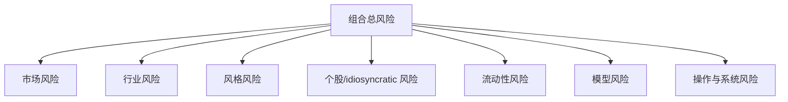

# 32 风险的基本框架

> 所属模块：Part VI 风险管理与收益归因

> **回测回答"能不能赚钱"，风险框架回答"赚的是什么钱、可能在哪儿亏回去"。**

## 本节导读

指数增强产品 2024 年某月超额为正，但组合相对基准的行业暴露偏离超过 3 个标准差——这不是"选股好"，而是**承担了未被定价的行业赌注**。本章建立多维度风险分类框架，帮助研究员在汇报 Alpha 之前，先说清楚承担了哪些风险。

## 学习目标

1. 区分市场、行业、风格、个股、流动性、模型与操作七类风险
2. 理解"收益—风险"二维评价，而非只看绝对收益
3. 知道每类风险在 A 股多因子研究中的典型表现与监控入口

---

## 核心概念

### 风险全景图

| 风险类型 | 典型来源 | A 股语境示例 |
| --- | --- | --- |
| 市场风险 | Beta、宏观冲击 | 沪深 300 单日 -3%，多头产品同步回撤 |
| 行业风险 | 行业集中或偏离 | 超配 AI 概念板块后政策调整 |
| 风格风险 | Size/Value/Mom 等 | 小盘因子拥挤后风格反转 |
| 个股风险 | 单票事件 | 财务造假、突发停牌 |
| 流动性风险 | 成交不足、冲击 | 1000 指增在小票上集中建仓 |
| 模型风险 | 估计误差、假设失效 | 协方差矩阵不稳定导致优化器极端权重 |
| 操作风险 | 系统、流程、人为 | 因子脚本漏跑、订单重复发送 |

---

## 32.1 市场风险

**定义**：组合对整体市场方向（或基准指数）的敏感度。

- **Beta 暴露**：量化多头通常 Beta ≈ 0.8–1.0；市场中性目标 Beta ≈ 0
- **宏观事件**：利率、汇率、政策预期——无法被单因子完全解释
- **对冲残差**：用 IF/IC/IM 对冲时，基差变化带来额外 P&L

$$
R_p = \alpha + \beta \cdot R_m + \epsilon
$$

**实务**：指数增强产品**必然**承担一定市场风险；评价时应使用**超额收益**与**跟踪误差**，而非只看绝对收益。

---

## 32.2 行业风险

**定义**：组合在行业维度相对基准的配置偏离所带来的波动。

- 主动行业权重：$w_{p,i} - w_{b,i}$
- 行业中性约束可压低此类风险，但会限制 Alpha 表达空间
- A 股行业轮动快，申万一级行业集中度需设硬约束

| 监控指标 | 说明 |
| --- | --- |
| 最大行业主动权重 | 如 \|active weight\| ≤ 3% |
| 行业暴露标准差 | 相对历史分布的 z-score |
| 行业贡献波动 | 归因中行业项的滚动方差 |

---

## 32.3 风格风险

**定义**：对 Barra 类风格因子（市值、价值、动量、波动率、流动性等）的暴露。

- **假 Alpha 温床**：小盘 + 反转 + 高 Beta 组合在牛市回测中表现亮眼
- **风格择时 vs 风格暴露**：前者是主动 bet，后者常是无意暴露
- 中性化可在因子层或组合层实施，各有代价（见 Part III 17.6、Part IV 24.3）

---

## 32.4 个股风险

**定义**：无法被因子模型解释的单票特异性波动。

- 个股权重上限（如 2%–3%）是基本风控
- ST、退市、重大诉讼 — 需股票池与事件过滤
- 特异性风险在优化中进入协方差矩阵对角项

---

## 32.5 流动性风险

**定义**：无法以合理成本、在合理时间内完成交易的风险。

- **Amihud、换手率、成交额占比** 是常用代理变量
- 小市值 + 高换手策略容量低，规模放大后流动性风险非线性上升
- 涨跌停、停牌导致**无法调仓** — 回测中必须建模（Part V 27.4）

---

## 32.6 模型风险

**定义**：因模型假设、参数估计、结构选择错误而导致的风险误判。

| 子类 | 示例 |
| --- | --- |
| 估计误差 | 样本协方差矩阵病态，优化器给出 corner solution |
| 结构误差 | 三因子模型无法解释 A 股政策驱动段 |
| 实现误差 | 风险模型版本与组合优化器版本不一致 |
| 漂移 | 因子有效性随时间衰减（见 [35.6](35-risk-monitoring.md)） |

---

## 32.7 操作与系统风险

**定义**：流程、系统、人为失误导致的非预期损失。

- 数据未更新 → 因子基于 stale 数据调仓
- 重复下单、漏单、错账户
- 权限、备份、灾备失效

**团队接口**：研究负责模型假设，开发负责系统稳定性，风控负责限额与监控规则，交易负责执行反馈。

---

## 经济直觉

多因子 Alpha 的本质是**承担有限、可理解、可监控的风险**，换取风险调整后的超额。若无法命名当前承担的主要风险，则该"Alpha"尚未通过研究评审。

---

## 常见错误

- 把牛市绝对收益等同于选股能力
- 只做因子 IC，不做组合层暴露检查
- 将"行业中性"口头承诺但未在优化约束中落实
- 忽视流动性 — 回测用收盘价全额成交
- 风险报告只有 VaR 一个数，缺少归因维度

## 要点回顾

- 风险是多维的；回测收益必须拆解来源
- A 股多因子产品核心风险：风格暴露、行业偏离、流动性、模型估计
- 下一章 [33 风险模型基础](33-risk-models.md)介绍如何用因子风险模型量化上述暴露
