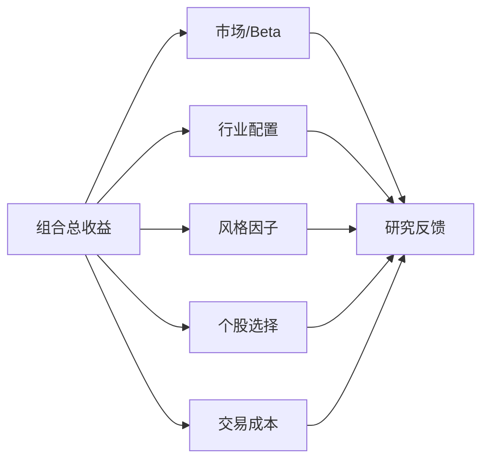
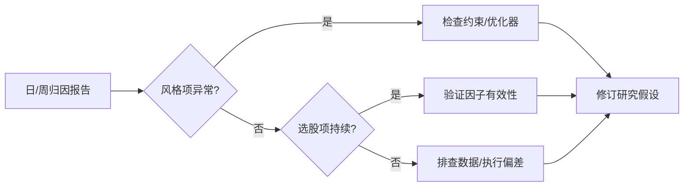

# 33 收益归因

> 所属模块：Part VI 风险管理与收益归因

> **不能归因的超额，不算被理解的 Alpha。**

## 本节导读

本月超额 +1.2%，是选股真本事，还是押中了小盘风格？收益归因把组合 P&L 拆成可解释、可对比的分项，是研究员与 PM、风控之间的**共同语言**。

## 学习目标

1. 掌握 Brinson 类归因与因子归因的基本思路
2. 区分市场、行业配置、风格、选股、成本五项
3. 会将归因结果反馈到研究与风控流程

---

## 核心概念

### 归因框架



---

## 33.1 市场收益
**定义**：持有市场暴露所获得的收益。以下两种**不是**同一对象，勿用 or 混写：

| 口径 | 公式 | 用途 |
| --- | --- | --- |
| 回归 Beta 贡献 | $\beta\cdot R_b$ | 相对某基准的市场项（回归估计） |
| 基准组合收益 | $w_b^\top R$ | 持有基准权重的实现收益 |

- 量化多头：市场项常占收益大头
- 指数增强：常用「基准收益 + 主动超额」叙述
- 市场中性：目标剥离市场项，残差为净 Alpha

---

## 33.2 行业配置收益
Brinson 模型将主动收益分解为**配置效应**与**选择效应**（简化二维）：

| 效应 | 含义 |
| --- | --- |
| 配置 Allocation | 行业权重与基准不同 × 基准行业收益 |
| 选择 Selection | 基准权重 × 组合内相对基准的超额 |
| 交互 Interaction | 交叉项 |

$$
\text{Active Return} \approx \sum_i (w_{p,i} - w_{b,i}) R_{b,i} + \sum_i w_{b,i}(R_{p,i} - R_{b,i}) + \cdots
$$

**A 股注意**：行业分类口径统一（申万 vs 中信）；使用**调仓日**权重而非期末权重做期间归因。上式为 Brinson–Hood–Beebower（BHB）简化写法；Brinson–Fachler（BF）对配置项用行业相对基准收益，团队须固定一种并写进报告。

---

## 33.3 风格因子收益
用多因子回归或因子模拟组合（factor mimicking portfolio）估计。对**主动收益**应使用**主动暴露**：

$$
R_{p,t} - R_{b,t} = \sum_k (b_{p,k,t} - b_{b,k,t})\,\lambda_{k,t} + \epsilon_t
$$

（若回归在绝对收益上做，须先明确 LHS 是 $R_p$ 还是 $R_p-R_b$，并与 Brinson 行业项避免双重计数。）

| 风格 | 归因问题示例 |
| --- | --- |
| Size | 超额是否来自小盘暴露？ |
| Value | 价值因子反弹是否贡献？ |
| Momentum | 动量崩溃是否拖累？ |

**团队惯例**：因子暴露用**调仓日**暴露，因子收益用同期因子组合收益 — 口径必须文档化。

---

## 33.4 个股选择收益
**定义**：剥离行业与风格后，单票（或残差）层面的选择贡献。

- 常表现为特异性收益加权求和
- 真 Alpha 应主要落在此项 — 若行业/风格项占比过高，需审视约束
- 可与因子研究 IC 检验交叉验证

---

## 33.5 交易成本
**必须单独列示**，否则高估策略能力：

| 成本项 | 归因处理 |
| --- | --- |
| 佣金 + 印花税 | 实际成交记录 |
| 滑点 | 相对 TWAP/VWAP 或决策价 |
| 冲击 | 大单相对小单增量 |
| 对冲成本 | 基差、融券费率 |

$$
R_{net} = R_{gross} - C_{trade} - C_{hedge}
$$

---

## 33.6 归因与研究反馈


| 归因信号 | 可能动作 |
| --- | --- |
| 行业项持续同向 | 收紧行业中性或承认行业 bet |
| 小盘项突增 | 检查市值中性、股票池 |
| 成本项侵蚀 | 降换手、优化执行 |
| 选股项衰减 | 启动因子失效审查（34 章） |

---

## Python 示例

```python
def brinson_allocation(w_p, w_b, r_sector):
    """行业配置效应（简化）."""
    return ((w_p - w_b) * r_sector).sum()

def style_attribution(active_exposures, factor_returns):
    """风格贡献 = 主动暴露 (b_p - b_b) × 因子收益."""
    return (active_exposures * factor_returns).sum(axis=1)
```

---

## 常见错误

- 用期末权重做全月归因
- 基准定义与产品合同不一致
- 忽略成本，把 gross 超额当 Alpha 汇报
- 因子归因与 Brinson 行业归因**重复计算**同一效应
- 归因只做展示，不闭环到研究迭代

## 要点回顾

- 归因回答"超额从哪来"，不是装饰性报表
- 市场 / 行业 / 风格 / 选股 / 成本 五项缺一不可
- 下一章 [34 风险监控与策略失效](34-risk-monitoring.md)讲如何用监控体系识别策略失效
