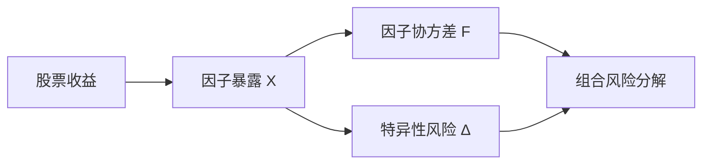

# 33 风险模型基础

> 所属模块：Part VI 风险管理与收益归因

> **优化器不会魔法，它只会把你喂给它的协方差矩阵当真。**

## 本节导读

组合优化器输出某票权重 8%，而样本协方差估计下该票波动率被严重低估 — 这是**输入问题**，不是优化器 bug。本章介绍多因子风险模型的基本结构，以及跟踪误差、主动风险与边际风险贡献如何服务指数增强与中性策略。

## 学习目标

1. 理解因子风险模型的三要素：暴露、因子协方差、特异性风险
2. 知道样本协方差为何不稳定性及常用修正思路
3. 会解读 Tracking Error、Active Risk 与 MRC

---

## 核心概念

### 33.1 因子风险模型

多因子模型将股票收益分解为系统性（因子）与特异性部分：

$$
r_i = \sum_{k=1}^{K} X_{ik} f_k + u_i
$$

组合方差：

$$
\sigma_p^2 = w^\top X F X^\top w + w^\top \Delta w
$$

| 符号 | 含义 |
| --- | --- |
| $X$ | $N \times K$ 因子暴露矩阵 |
| $F$ | $K \times K$ 因子协方差 |
| $\Delta$ | 特异性风险对角阵 |
| $w$ | 组合权重 |

**商业模型 vs 自建模型**：Barra、AX 等提供现成因子定义与估计流程；中小团队常用简化版（行业哑变量 + 市值 + 若干风格）做内部一致性监控。



---

### 33.2 协方差矩阵

**样本协方差的问题**（$N$ 只股票，$T$ 期观测）：

- $N \gg T$ 时矩阵奇异
- 特征值分布极端，优化结果对估计误差敏感
- A 股结构变化快，长窗口平稳性假设弱

**常用修正**：

| 方法 | 思路 |
| --- | --- |
| 收缩估计 Shrinkage | $\hat{\Sigma} = \delta F + (1-\delta) S$ |
| 因子模型结构化 | 先估因子协方差，再拼组合方差 |
| 指数加权 | 近期观测权重更高 |
| 稳健协方差 | 降低极端观测影响 |

---

### 33.3 Tracking Error

**定义**：组合相对基准的超额收益标准差。

$$
TE_{\mathrm{ex\text{-}post}} = \sigma(R_p - R_b)\cdot\sqrt{252}
\quad\text{（日频主动收益；年化）}
$$

指数增强典型目标：年化 TE 约 **2%–5%**（视产品合同；与 Part IV 示意区间一致，以合同为准）。

**与波动率区别**：高波动组合 TE 可以很低（若紧贴基准）；低波动组合 TE 也可能高（若主动偏离大）。

---

### 33.4 Active Risk

Active Risk 常与 Tracking Error 混用，严格语境下：

- **Active Risk** = 主动权重 $w - w_b$ 所承担的风险
- 分解为因子主动暴露 + 特异性主动风险

$$
\sigma_{active}^2 = (w - w_b)^\top \Sigma (w - w_b)
$$

（$\Sigma$ 须与收益频率一致；由该式开方并年化即 **ex-ante TE**。）

**信息比率**（与 Part V 对齐）：

$$
IR = \frac{\mathbb{E}[R_p - R_b]}{\sigma(R_p - R_b)}\cdot\sqrt{252}
$$

---

### 33.5 边际风险贡献

**边际风险贡献 MRC** 回答："若略微增加第 $i$ 只股票权重，组合风险如何变化？"

$$
MRC_i = \frac{(\Sigma w)_i}{\sigma_p}
$$

**风险贡献 RC**：

$$
RC_i = w_i \cdot MRC_i
$$

用于检查风险是否集中在少数行业或个股；指数增强常见约束 $\sum RC_i \leq \text{threshold}$  per sector。

对跟踪误差 / 主动风险，边际贡献应相对主动权重：

$$
MRC^{\mathrm{a}}_i = \frac{\partial \sigma_a}{\partial w_i},\quad \sigma_a=\sqrt{(w-w_b)^\top\Sigma(w-w_b)}
$$

---

## Python 示例

```python
import numpy as np

def portfolio_vol(w, X, F, delta):
    """简化因子模型组合波动率."""
    factor_exp = X.T @ w
    sys_var = factor_exp @ F @ factor_exp
    idio_var = w @ (delta * w)
    return np.sqrt(sys_var + idio_var)

def tracking_error(w, w_b, cov, ann_factor: float = 252.0):
    """ex-ante TE。cov 为日协方差时 ann_factor=252；若 cov 已年化则 ann_factor=1。"""
    active = w - w_b
    return float(np.sqrt(active @ cov @ active) * np.sqrt(ann_factor))
```

---

## 研究流程

1. 选定因子集（与研究/生产一致）
2. 估计 $F$、$\Delta$ — 记录估计窗口与版本
3. 计算组合 $TE$、因子主动暴露
4. 优化前检查协方差矩阵条件数
5. 优化后验证 MRC 无异常集中

---

## 常见错误

- 用全样本协方差直接喂给优化器，得到极端权重
- 风险模型因子定义与 Alpha 因子中性化口径不一致
- TE 计算用日收益但未年化（或重复年化）
- 忽略特异性风险，以为行业中性就等于风险中性
- 回测与实盘使用不同版本风险模型

## 要点回顾

- 因子风险模型 = 暴露 + 因子协方差 + 特异性风险
- TE / IR 是指数增强的核心评价维度
- 下一章 [34 收益归因](34-performance-attribution.md)讲收益如何归因到市场、行业、风格与选股
