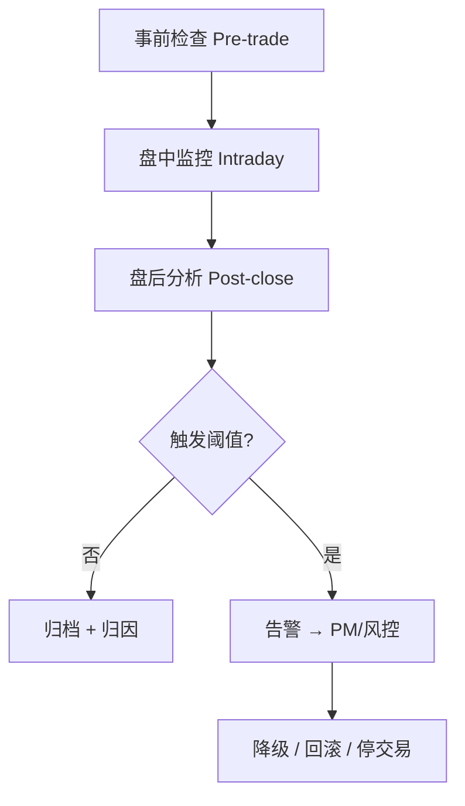

# 35 风险监控与策略失效

> 所属模块：Part VI 风险管理与收益归因

> **策略很少突然死亡，更多是在监控盲区里慢慢失血。**

## 本节导读

某价值因子 IC 连续 8 周为负，组合小盘暴露 z-score 升至 2.5，同期同类指增产品集体回撤 — 这是**因子拥挤 + 风格暴露**叠加的可预警场景。本章建立事前检查、盘中盘后监控与失效处置机制。

## 学习目标

1. 设计事前 / 盘中 / 盘后三级监控清单
2. 识别异常收益、异常暴露与回撤的处置阈值
3. 理解因子拥挤、模型漂移与停止交易/回滚流程

---

## 核心概念

### 监控体系

---

## 35.1 事前风险检查

调仓**前**必须通过的检查项：

| 检查项 | 典型阈值（示例） |
| --- | --- |
| 个股权重上限 | ≤ 3% |
| 行业主动权重 | \|active\| ≤ 3% |
| 风格暴露 z-score | \|z\| ≤ 2 |
| 预估 TE | ≤ 合同上限 |
| 预估换手 | ≤ 预算 |
| 流动性 | 单票成交额占比 ≤ 10% |
| 可交易性 | 剔除停牌、涨跌停无法成交 |

**不通过**：优化器重新求解、人工裁减权重或延迟调仓。

---

## 35.2 盘中与盘后监控

**盘中**（指增/中性产品）：

- 实时超额 vs 基准
- 股指期货基差（对冲产品）
- 大额成交与滑点异常
- 系统心跳、数据延迟

**盘后**：

- 当日 P&L 归因初版
- 持仓 vs 目标持仓差异（执行质量）
- 风险暴露快照入库
- 因子 IC 滚动更新

---

## 35.3 异常收益与异常暴露

| 信号 | 可能原因 | 动作 |
| --- | --- | --- |
| 单日超额 ±3σ | 个股事件、数据错误 | 核查持仓与数据 |
| 风格暴露突变 | 优化器/数据 bug | 暂停调仓、回滚 |
| IC 连续 N 周 < 0 | 因子失效 | 降权或下线因子 |
| 同类策略集体回撤 | 拥挤、宏观冲击 | 评估降杠杆/降暴露 |

---

## 35.4 回撤管理

- **最大回撤限额**：产品层级硬约束
- **回撤归因**：区分市场、风格、选股、成本
- **恢复条件**：不得"赌回来" — 需风控与 PM 联合审批加仓

$$
\text{Drawdown}_t = \frac{PV_t - \max_{s \leq t} PV_s}{\max_{s \leq t} PV_s}
$$

---

## 35.5 因子拥挤

**表现**：因子 IC 下降、多空 spread 收窄、同类产品高度相关、换手上升而收益下降。

**监控代理**：

- 因子估值 spread（多空组合估值差）
- 因子相关策略 AUM 估计（若有渠道）
- 因子 turnover 与 capacity 利用率

**应对**：降因子权重、增加正交化、延长持有期、寻找替代因子。

---

## 35.6 模型漂移

**定义**：数据分布或因子—收益关系随时间变化，导致模型预测力下降。

| 类型 | 检测 |
| --- | --- |
| 概念漂移 | 滚动 IC、滚动 IR 趋势 |
| 协方差漂移 | 条件数、特征值变化 |
| 数据漂移 | 因子分布 KS 检验、缺失率 |

**再训练原则**：固定再训练日历；避免每次回撤都重训（过拟合）。

---

## 35.7 停止交易与回滚机制

**分级响应**：

| 级别 | 触发 | 动作 |
| --- | --- | --- |
| L1 告警 | 单项指标超软阈值 | 通知、人工确认 |
| L2 降级 | 数据/信号异常 | 停止新开仓、只平不建 |
| L3 停交易 | 系统故障、重大违规 | 全停 + 回滚至上一有效目标持仓 |
| L4 应急 | 极端市场、流动性枯竭 | 风控接管、强制减仓 |

**回滚**：保留每日 `target_portfolio` 版本；异常时恢复 T-1 已验证组合。

---

## 常见错误

- 只有盘后净值，没有暴露与 IC 监控
- 阈值过宽 — 从未触发；过窄 — 狼来了
- 失效后反复调参追历史，而非先查经济逻辑与数据
- 停交易无书面流程，依赖个人 heroics
- 拥挤识别靠主观感觉，无量化代理

## 要点回顾

- 风险监控是生产系统的器官，不是可选附件
- 因子拥挤与模型漂移是 A 股多因子长期运行的主要敌人
- Part VI 完结；Part VII 进入研究工程化
