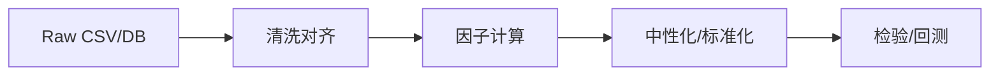

# 36 Python 在量化研究中的应用

> 所属模块：Part VII 研究工程化

> **Python 是研究者的草稿纸，不是生产系统的全部；但草稿纸上的字迹必须别人能读懂。**

## 本节导读

全 A 截面 5000 只股票 × 120 个月因子矩阵，循环逐行计算需要数小时，向量化后降至秒级 — 这是 Python 量化研究的日常分水岭。本章覆盖 NumPy/Pandas 核心模式、性能意识与代码质量底线。

## 学习目标

1. 掌握向量化思维，避免 Python 层循环处理面板数据
2. 熟悉多因子研究常见 Pandas 模式（groupby、merge、rolling、rank）
3. 建立内存、性能与可读性的基本权衡意识

---

## 36.1 NumPy

**定位**：底层数值数组运算，Pandas 的引擎。

```python
import numpy as np

# 截面 z-score（每行）
x = np.random.randn(5000, 252)
mu = x.mean(axis=1, keepdims=True)
sigma = x.std(axis=1, keepdims=True)
z = (x - mu) / sigma
```

| 场景 | 推荐 |
| --- | --- |
| 矩阵运算、线性代数 | NumPy |
| 带标签的面板数据 | Pandas |
| 自定义滚动/复杂逻辑 | NumPy 或 Numba |

---

## 36.2 Pandas

**核心数据结构**：`Series`（一维）、`DataFrame`（二维表）。

多因子研究典型索引：

```python
# MultiIndex: (trade_date, symbol)
df.set_index(["trade_date", "symbol"], inplace=True)
df.sort_index(inplace=True)
```

**必备操作**：

| 操作 | 用途 |
| --- | --- |
| `groupby("trade_date")` | 截面统计 |
| `merge(..., on=["trade_date","symbol"], how="left")` | 因子与收益对齐 |
| `shift(n)` | 滞后、避免未来函数 |
| `rank(pct=True)` | 因子分位数 |

---

## 36.3 向量化

**反模式**：

```python
# 慢：双重循环
for date in dates:
    for sym in symbols:
        ...
```

**正模式**：

```python
# 快：按日 groupby 向量化
factor.groupby("trade_date").transform(
    lambda s: (s - s.mean()) / s.std()
)
```

截面 Rank IC 示例：

```python
def daily_rank_ic(factor_df, ret_df):
    merged = factor_df.join(ret_df, how="inner")
    # include_groups=False 需 pandas≥2.2；旧版可去掉该参数
    return merged.groupby("trade_date").apply(
        lambda x: x["factor"].rank().corr(x["ret"].rank()),
        include_groups=False,
    )
```

---

## 36.4 内存与性能

| 技巧 | 说明 |
| --- | --- |
| `dtype` 优化 | float64 → **float32** 可约减半（注意精度） |
| 分类类型 `category` | symbol、行业字段 |
| Parquet 列存 | 只读需要的列 |
| `eval` / `query` | 大表过滤加速 |
| 分块 `chunksize` | 超内存时分批处理 |

**Profiling**：`%timeit`、`line_profiler` — 先测量再优化。

---

## 36.5 常见数据处理模式



1. **As-of merge**：财务数据按公告日对齐（见 Part II 13）
2. **Point-in-time 股票池**：动态成分，非当前成分
3. **Winsorize**：`groupby("trade_date").transform(lambda s: s.clip(lower, upper))`
4. **中性化**：`statsmodels` OLS 残差

```python
import pandas as pd
import statsmodels.api as sm

def neutralize(f: pd.Series, industry: pd.Series, log_mcap: pd.Series) -> pd.Series:
    """行业（drop_first）+ 市值中性化；对齐有效样本后再回归，避免长度错位。"""
    X = pd.concat(
        [pd.get_dummies(industry, drop_first=True), log_mcap.rename("ln_cap")],
        axis=1,
    )
    df = pd.concat({"f": f, **{c: X[c] for c in X.columns}}, axis=1).dropna()
    y = df["f"]
    X_ = sm.add_constant(df.drop(columns=["f"]), has_constant="add")
    resid = y - sm.OLS(y, X_).fit().predict(X_)
    return resid.reindex(f.index)
```

---

## 36.6 代码质量与错误处理

- **函数化**：因子计算 = 纯函数 `(data, params) -> factor`
- **类型提示**：`def calc_pe(df: pd.DataFrame) -> pd.Series`
- **断言**：`assert df.index.is_unique`
- **日志**：`logging` 替代 print
- **异常**：区分数据缺失 vs 逻辑错误

---

## 常见错误

- 在 Python for 循环里做全截面计算
- `merge` 未指定 `how` 导致静默丢行
- 忘记 `sort_index` 后 `shift` 方向错误
- Notebook 全局变量隐式依赖，无法复现
- 过早优化 — 先正确再快

## 要点回顾

- Pandas 向量化是多因子研究的默认姿势
- 性能问题先查 merge/重复计算，再考虑 Numba/C++
- 下一章 [37 SQL 与研究数据库](37-sql-databases.md)介绍 SQL 与数据库在研究数据层的作用
