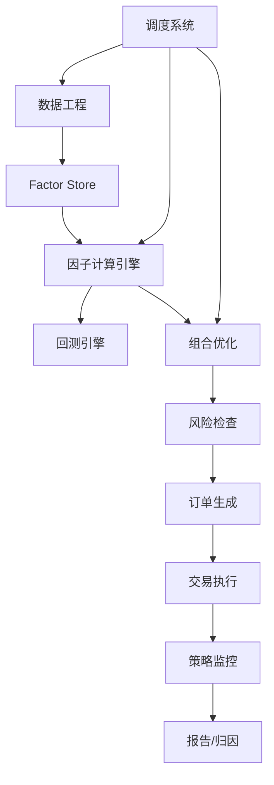

# 39 研究平台能力分层

> 所属模块：Part VII 研究工程化

> **研究追求灵活，生产追求稳定；同一套因子定义，两套环境，一条对齐链路。**

## 本节导读

研究 Notebook 里 ROE 因子 **ICIR 1.9**，生产日报 ROE 因子 **ICIR 1.2** — 90% 是**口径不一致**而非市场变化。本章给出研究平台的**能力分层与隔离原则**；每日数据→因子→组合→交易→监控的操作节奏见 **[Part IX · 45 策略生产流程](../part-ix/45-production-workflow.md)**，勿在本章维护第二份日清单。

## 学习目标

1. 理解因子引擎、回测引擎、调度与监控的**平台能力分层**
2. 掌握研究环境与生产环境隔离及对齐验证方法
3. 知道平台最小能力集；每日生产步骤细节见 Part IX（45）

---

## 核心架构



---

## 39.1 因子计算引擎
**职责**：按注册因子定义，从 Clean Layer 读取数据，输出标准化因子矩阵。

| 要求 | 说明 |
| --- | --- |
| 幂等 | 同一日期重跑结果一致 |
| 版本化 | factor_def v1.2 |
| 增量 | 每日只算 T 日 |
| 校验 | 覆盖率、分布、缺失率 |

```python
@register_factor("roe_ttm", version="1.2")
def calc_roe(data: FactorContext) -> pd.Series:
    return data.fin["net_profit"] / data.fin["equity"]
```

---

## 39.2 回测引擎
- 研究：快速迭代，允许简化成本
- 生产验证：与实盘规则一致的 event-driven 回测
- **共享**：信号定义、股票池、调仓日历

---

## 39.3 调度系统（能力要求）
平台须支持：**依赖 DAG**、失败重试、超时告警、任务幂等与人工介入入口。A 股日终任务的时间窗、阻塞/降级规则与岗位接口属于**生产日节奏**，统一以 **[45 策略生产流程](../part-ix/45-production-workflow.md)** 为准，本章不另维护第二份步骤清单。

工具示例：Airflow、Cron、自研调度。

---

## 39.4 数据监控
- 行数、缺失率、极值 vs 昨日
- 更新延迟 > 阈值 → 阻塞下游
- 双源交叉校验（收盘价 diff）

---

## 39.5 策略监控
- 目标 vs 实际持仓
- 当日超额、TE、暴露
- 因子 IC 滚动（见 34 章）

---

## 39.6 报告自动生成
日报模板：

1. 净值与超额
2. 归因摘要
3. 风险暴露
4. 执行质量（滑点、未完成订单）
5. 数据/任务异常清单

Jinja2 + PDF/HTML 或内部 BI — 与团队约定的报告字段对齐即可。

---

## 39.7 研究环境与生产环境隔离
| 维度 | 研究 | 生产 |
| --- | --- | --- |
| 数据 | 可含 experimental 字段 | 仅 validated 表 |
| 代码分支 | research/* | main / release |
| 权限 | 读写实验库 | 只读生产 + 受限写 |
| 因子 | 可未注册 | 必须 register + review |

**对齐验证 Shadow Run**：

1. 生产因子脚本在 research 数据快照上跑
2. 对比 research 同名因子 diff < ε
3. 通过后方可 promote 因子版本

---

## 常见错误

- 研究与生产各维护一份 ROE 公式
- 调度无依赖，因子未算完就优化
- 监控只 ping 进程，不校验数据质量
- 实验因子直连生产组合
- 无 promote 流程，Notebook 公式直接上线

## 要点回顾

- 平台能力分层：数据工程 → 因子引擎 → 回测/优化接口 → 调度与监控 → 报告；研究侧负责定义与对齐，生产日节奏见 Part IX（45）
- 研究/生产隔离 + Shadow 对齐是口径一致的唯一可靠方式
