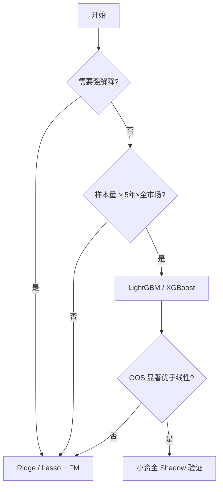

# 41 常用模型概览

> 所属模块：Part VIII 机器学习在多因子研究中的应用

> **模型选择不是选最贵的，而是选在你数据量、信噪比和解释需求下最不容易骗人的。**

## 本节导读

同样的 50 个因子、2015–2020 训练，线性模型 IC 0.04、XGBoost IC 0.06、深度网络 IC 0.08（样本内）— 2021–2023 样本外谁存活？本章按**可解释性 ↔ 表达能力**光谱介绍常见模型。

## 学习目标

1. 知道各模型适用场景与 A 股多因子研究中的典型用法
2. 理解正则化、树模型、集成方法的基本权衡
3. 对神经网络保持"概念了解、谨慎上线"的态度

---

## 模型光谱

| 模型 | 表达能力 | 可解释性 | 小样本稳健 | 典型用途 |
| --- | --- | --- | --- | --- |
| 线性回归 | 低 | 高 | 高 | 因子合成 baseline |
| Lasso/Ridge | 低–中 | 高 | 高 | 因子筛选 |
| 逻辑回归 | 低 | 高 | 高 | 分类标签（涨/跌组） |
| 随机森林 | 中 | 中 | 中 | 非线性、交互探索 |
| XGBoost/LGBM | 中–高 | 中–低 | 中 | 横截面排序主力 ML |
| 神经网络 | 高 | 低 | 低 | 大规模特征、另类数据 |

---

## 41.1 Linear Regression
$$
y = X\beta + \epsilon
$$

- **Fama-MacBeth** 本质是截面回归的时间平均
- 多重共线性时用 **Ridge**（L2）或 **Lasso**（L1 稀疏）

```python
from sklearn.linear_model import Ridge
model = Ridge(alpha=1.0).fit(X_train, y_train)
score = model.predict(X_test)
```

---

## 41.2 Logistic Regression
标签：$y \in \{0,1\}$（如次月收益是否高于中位数）。

- 输出概率，可用于分层
- 类别不平衡时需 `class_weight` 或重采样

---

## 41.3 Random Forest
- Bagging + 决策树；对异常值相对稳健
- **缺点**：高维稀疏因子、外推能力弱；特征重要性不稳定

---

## 41.4 XGBoost
- 梯度提升树；Kaggle 式表格数据强基线
- 超参：`max_depth`, `learning_rate`, `subsample`, `colsample_bytree`
- **注意**：默认按行采样破坏截面结构 — 应按**日期分组** CV（42 章）

```python
import xgboost as xgb
model = xgb.XGBRegressor(
    max_depth=4,
    learning_rate=0.05,
    n_estimators=200,
    subsample=0.8,
)
```

---

## 41.5 LightGBM
- 叶子优先生长；大数据更快
- 类别特征原生支持（行业代码）
- 与 XGBoost 类似，需严格时间切分

---

## 41.6 神经网络概念性介绍
**结构**：MLP、TabNet、Temporal Fusion 等。

| 优势 | 劣势 |
| --- | --- |
| 自动特征交互 | 需大量数据 |
| 可融合另类数据 | 训练不稳定 |
| | 归因困难，A 股非平稳 |

**团队建议**：除非有明确数据规模与工程能力，否则**生产默认不上深度模型**；研究探索须严格 OOS + 成本测试。

---

## 选型决策树



---

## 常见错误

- 样本内调参 100 轮，测试集只看最后一眼
- 树模型深度过大，记住噪声
- 线性模型未标准化系数就比较重要性
- 神经网络无 early stopping，严重过拟合
- 更换模型却不更换成本与约束测试

## 要点回顾

- 线性模型是**必做的 baseline**（mandatory baseline）
- XGBoost/LGBM 是 A 股表格因子 ML 的主流工作马
- 下一章 [42 机器学习工作流](42-ml-workflow.md)讲完整 ML 研究流程
