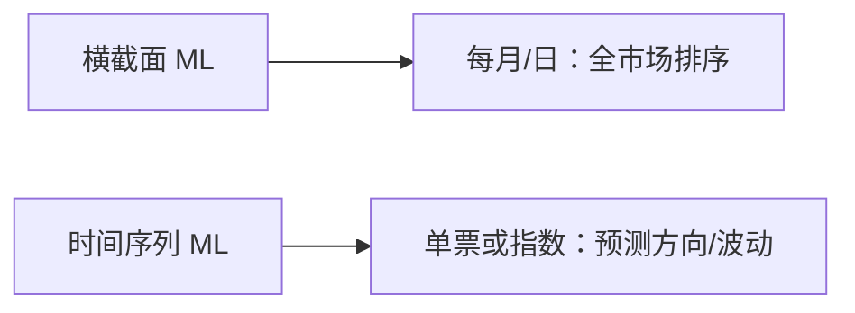

# 41 机器学习在量化中的正确定位

> 所属模块：Part VIII 机器学习在多因子研究中的应用

> **机器学习是工具箱里更锋利的刻刀，不是自动印钞机；刀口偏一毫米，回测里就是一条假 Alpha 曲线。**

## 本节导读

某实习生用 XGBoost 把 200 个因子拟合次月收益，样本内 Rank IC 0.12 — 评审的第一问不是"模型结构"，而是：**标签怎么定义？有没有泄漏？换 2018 年样本还显著吗？** 本章摆正 ML 在多因子研究中的位置。

## 学习目标

1. 理解 ML 解决的是"映射与组合"问题，不是替代经济假设
2. 区分特征、标签与预测目标
3. 认识预测能力与投资组合收益之间的差距

---

## 41.1 机器学习不是自动赚钱机器

| 误解 | 事实 |
| --- | --- |
| 模型越复杂 Alpha 越大 | 复杂度 ↑ → 过拟合风险 ↑ |
| 高 R² = 好策略 | 横截面 R² 本身很低（1%–5% 已不错） |
| 深度学习适合一切 | 小样本、非平稳下线性+正则常更稳健 |
| AutoML 可跳过因子研究 | 特征工程与口径仍是核心 |

**团队立场**：ML 用于因子**非线性组合、交互项挖掘、缺失模式处理** — 前提是单因子已通过基础检验。

---

## 41.2 特征、标签与预测目标

| 概念 | 多因子语境 |
| --- | --- |
| 特征 X | 标准化后的因子暴露、衍生项 |
| 标签 y | 未来 H 期收益、超额、分位数组标签 |
| 预测目标 | 排序（Rank）常优于点估计 |

**标签设计示例**：

$$
y_{i,t} = r_{i,t+1} - \bar{r}_{t+1} \quad \text{（相对市场超额）}
$$

或行业中性残差收益 — 与产品形态一致。

---

## 41.3 横截面预测与时间序列预测

| 类型 | 典型应用 | A 股多因子主流 |
| --- | --- | --- |
| 横截面 | 因子合成、选股打分 | **主战场** |
| 时间序列 | 择时、波动预测 | 辅助，易过拟合 |

本手册产品形态（指增/中性）以**横截面**为主。

---

## 41.4 因子组合与非线性关系

线性加权：

$$
score_i = \sum_k w_k f_{k,i}
$$

ML 扩展：

$$
score_i = g(f_{1,i}, \ldots, f_{K,i}; \theta)
$$

**价值**：捕捉交互（如"高 ROE **且** 低估值"）；**风险**：$g$ 不可解释时难以归因与监控。

**务实路径**：先线性 baseline → 再树模型看 SHAP 是否稳定 → 最后才考虑深度模型。

---

## 41.5 预测能力与投资收益的差异

即使 IC 稳定，组合收益还取决于：

- 换手与成本
- 约束（行业中性、权重上限）
- 容量
- 信号衰减速度

$$
\text{Portfolio Alpha} \neq \text{Model IC} \times \text{leverage}
$$

**转化链路**：预测分数 → 组合权重 → 成交 → 净收益 — 每步都有损耗。

---

## 常见错误

- 未做 Part III 单因子检验直接上 ML
- 用全样本标准化特征（泄漏未来分布）
- 标签含未滞后分红/修订财务
- 把 validation IC 当最终结论
- 无法向 PM 解释模型为何推荐某行业超配

## 要点回顾

- ML 是因子研究的延伸，不是替代
- 横截面排序 > 点预测；可解释性 > 黑箱炫技
- 下一章 [42 常用模型概览](42-ml-models.md)概览常用模型及适用边界
