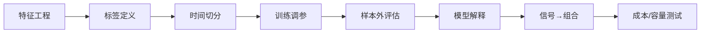

# 42 机器学习研究流程

> 所属模块：Part VIII 机器学习在多因子研究中的应用

> **ML 研究流程与因子研究同源：假设 → 数据 → 验证 → 组合 → 成本 → 监控；只是中间多了一步"估计 g(·)"。**

## 本节导读

从特征矩阵到实盘信号，中间至少经过七道门。跳过任何一道，回测里的 ML Alpha 都会在模拟盘里缩水。

## 学习目标

1. 掌握特征工程、标签定义、时间切分的研究顺序
2. 理解 purged/embargo 交叉验证思想
3. 会将模型输出接入组合优化与监控

---

## 流程总览



---

## 42.1 特征工程
- 输入：Part III 已检验因子 + 合理衍生（交互、比率）
- **截面标准化**：每个 trade_date 独立 z-score / rank
- 缺失：行业 median 填充 + missing indicator
- **禁止**：用全样本 mean/std 标准化

```python
X = df.groupby("trade_date").transform(lambda s: (s - s.mean()) / s.std())
```

---

## 42.2 标签定义
| 标签 | 公式/说明 | 注意 |
| --- | --- | --- |
| 次月收益 | $r_{t+1}$ | 需 lag 对齐 |
| 超额收益 | $r - r_b$ | 与产品一致 |
| 分位组 | top 30% = 1 | 分类模型 |
| 行业中性残差 | 回归残差 | 剥离行业 |

持有期 H 与调仓频率一致；避免 H 重叠标签未去相关。

---

## 42.3 数据切分
**错误**：随机 shuffle 行 → 未来泄漏。

**正确**：按时间 forward chaining：

```text
Train: 2010–2018  |  Valid: 2019–2020  |  Test: 2021–2024
```

**Purged K-Fold**（Lopez de Prado，进阶）：当标签依赖未来窗口时，普通 K 折会泄漏。做法是：从训练集中**删除**与测试集标签时间窗重叠的样本（purge）；并在测试集前加一段**禁运期 Embargo**，避免相邻期信息渗漏。时间序列验证优先 Walk-forward / Purged，而非随机 K 折。

---

## 42.4 训练与调参
- 调参仅在 Train+Valid；Test **一次性**
- 超参搜索用 Optuna / grid — 记录 trial 数，警惕隐式多重检验
- Early stopping 基于 Valid IC，非 Train loss

---

## 42.5 样本外评估
| 指标 | 说明 |
| --- | --- |
| OOS Rank IC | 与因子研究同口径 |
| IC 衰减曲线 | 不同 H |
| 分组单调性 | top/bottom spread |
| 相对线性 baseline | ΔIC 是否显著 |

通过后进入**组合回测**（含成本），非仅模型层 IC。

---

## 42.6 模型解释
- **线性**：系数符号与经济逻辑
- **树模型**：SHAP 全局/局部；检查是否由 1–2 特征主导
- **稳定性**：滚动 SHAP 排名是否剧变

解释无法对齐经济逻辑 → 降级为观察性模型，不上生产。

---

## 42.7 信号到组合
```python
# 模型分数 → 组合权重（示意）
df["score"] = model.predict(X)
df["rank"] = df.groupby("trade_date")["score"].rank(pct=True)
# 传入优化器或 top quantile 等权
```

与 Part IV 相同约束：行业、市值、换手、权重上限。

---

## 常见错误

- 特征含 future return、future fundamental
- Valid 集反复调参后当 OOS 汇报
- 只用 MSE 评价，不看 Rank IC 与 spread
- ML 分数未中性化，风格 bet 混入
- 跳过执行层直接上大资金

## 要点回顾

- 时间切分 + Purge 是 ML 量化与 Kaggle 的最大区别
- 模型层通过 ≠ 策略层通过
- 下一章 [43 机器学习常见陷阱](43-ml-pitfalls.md)集中讲 ML 特有陷阱
