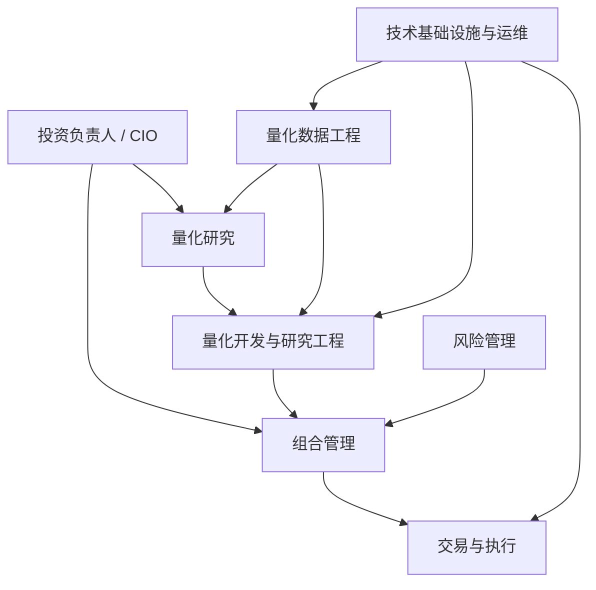
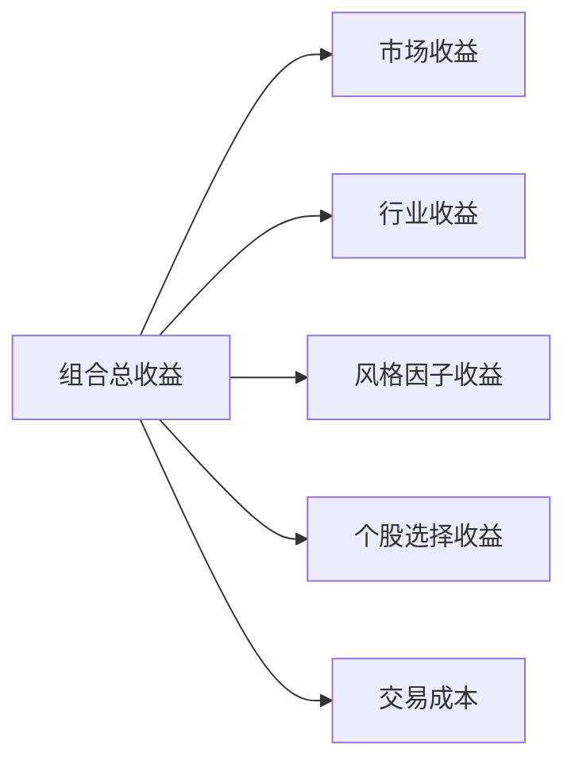

# Quant Research Handbook
## 量化策略研究新人手册——完整目录框架


# Part I 认识量化研究

## 01 什么是量化投资

### 01.1 量化投资的基本定义

- Quantitative Investing
- Quantitative Research
- Quantitative Strategy
- Quantitative Trading
- 数据、模型、规则与交易之间的关系

### 01.2 量化投资不是什么

- 量化研究不等于写交易代码
- 量化策略不等于预测明天涨跌
- 使用机器学习不等于具备 Alpha
- 回测盈利不等于实盘可交易
- 复杂模型不一定优于简单模型

### 01.3 主观投资与量化投资

- 信息处理方式
- 决策机制
- 可重复性
- 可解释性
- 可扩展性
- 主要风险来源
- 两类投资方法如何结合

### 01.4 从主观观点到可验证假设

- 市场观察
- 经济逻辑
- 数据表达
- 可证伪性
- 统计验证
- 投资实现

### 01.5 量化研究的核心价值

- 批量处理信息
- 系统化验证规律
- 约束情绪和认知偏差
- 提高研究复现性
- 支持规模化投资决策

---

## 02 团队结构与岗位分工

### 02.1 量化机构的典型组织结构



### 02.2 投资负责人 / CIO

- 制定投资理念与策略方向
- 决定风险预算
- 配置研究资源
- 评估策略组合
- 对整体投资结果负责

### 02.3 量化研究员 Quant Researcher

- 提出投资假设
- 构造因子与信号
- 进行统计检验
- 设计回测
- 分析收益来源
- 完成样本内与样本外验证
- 输出研究报告

### 02.4 量化开发与研究工程 Quant Developer / Research Engineer

- 搭建研究平台
- 开发因子计算引擎
- 维护回测框架
- 优化计算性能
- 保证实验可复现
- 将研究原型转化为稳定系统

### 02.5 量化数据工程师 Quant Data Engineer

- 获取行情、财务、资金流与另类数据
- 数据清洗、修复与对齐
- 维护历史数据库
- 设计增量更新
- 建立数据质量检查
- 设计备份与恢复机制

### 02.6 组合经理 Portfolio Manager

- 将研究信号转化为组合
- 分配权重与风险预算
- 控制行业、市值与风格暴露
- 约束换手率、容量和流动性
- 对组合最终表现负责

### 02.7 交易员与执行团队 Trader / Execution

- 将目标持仓转化为订单
- 控制滑点与市场冲击
- 选择执行算法
- 处理停牌、涨跌停与流动性问题
- 将真实成交反馈给研究与组合团队

### 02.8 风险管理 Risk Management

- 设置风险限额
- 监控杠杆、回撤和集中度
- 检查行业与风格暴露
- 识别异常仓位和策略失效
- 区分事前风险与事后风险

### 02.9 技术基础设施与运维

- 服务器与计算资源
- 数据库与权限管理
- 任务调度
- 日志与监控
- 灾备与故障恢复
- 生产环境稳定性

### 02.10 各岗位如何协作


### 02.11 不同规模机构的岗位差异

- 小型私募：一人多岗、强调综合能力
- 中型机构：研究、开发、交易逐步分工
- 大型机构：专业分工细、流程和风控更严格
- 岗位名称不同但核心职能相似

---

## 03 量化策略的基本地图

### 03.1 按资产类别划分

- 股票
- 期货
- 期权
- 债券
- 外汇
- 商品
- 数字资产（仅概念性介绍）

### 03.2 按研究逻辑划分

- 股票多因子
- 指数增强
- 股票市场中性
- CTA 趋势跟踪
- 统计套利
- 事件驱动
- 做市与高频
- 波动率与期权策略

### 03.3 按持有周期划分

- 高频
- 日内
- 短周期
- 中低频
- 长周期

### 03.4 按收益来源划分

- 市场 Beta
- 风格因子收益
- 选股 Alpha
- 套利收益
- 流动性补偿
- 波动率风险溢价

### 03.5 本手册的研究边界

- 核心：股票中低频多因子策略
- 重点：指数增强与股票市场中性
- 简介：CTA、统计套利
- 弱化：高频、做市、数字资产
- 仅扩展阅读：LLM Agent 自动交易、多智能体交易

---

## 04 多头、增强与市场中性

### 04.1 量化多头

- 市场收益
- 选股超额收益
- 风格暴露
- 回撤与仓位管理

### 04.2 指数增强

- 基准指数
- 主动收益
- 跟踪误差
- 风险约束
- 增强收益来源

### 04.3 股票市场中性

- 多头组合
- 空头或股指对冲
- Beta 中性
- 风格与行业中性
- 对冲成本

### 04.4 三类策略对比

| 维度 | 量化多头 | 指数增强 | 股票市场中性 |
| 主要收益来源 | 市场 + 选股 | 指数 + 超额 | 选股 Alpha |
| 市场暴露 | 较高 | 接近基准 | 较低 |
| 约束强度 | 中等 | 较高 | 高 |
| 典型风险 | 市场回撤 | 跟踪误差 | 对冲和拥挤风险 |

### 04.5 从因子信号到不同产品形态

- 同一个因子如何服务不同产品
- 风险约束如何改变组合
- 产品目标如何影响研究方式

---

## 05 收益、风险与基准

### 05.1 收益率的基本口径

- 简单收益率
- 对数收益率
- 累计收益
- 年化收益
- 绝对收益
- 相对收益
- 超额收益

### 05.2 风险的多维含义

- 波动率
- 最大回撤
- 下行风险
- 尾部风险
- 流动性风险
- 模型风险
- 拥挤交易风险
- 操作风险

### 05.3 Benchmark 的作用

- 沪深 300
- 中证 500
- 中证 1000
- 自定义基准
- 为什么评价策略必须选择合理基准

### 05.4 Active Return 与 Tracking Error

- 主动收益
- 跟踪误差
- 信息比率
- 指数增强中的收益—风险权衡

---

## 06 Alpha、Beta 与风险暴露

### 06.1 Beta 是什么

- 市场 Beta
- 行业 Beta
- 风格 Beta
- 系统性风险暴露

### 06.2 Alpha 是什么

- 绝对收益不等于 Alpha
- 风险调整后的超额收益
- 因子 Alpha 与个股 Alpha

### 06.3 风格因子暴露

- 市值
- 价值
- 成长
- 动量
- 波动率
- 流动性

### 06.4 收益归因的基本思想



### 06.5 假 Alpha 的常见来源

- 小盘暴露
- 行业集中
- 市场上涨
- 流动性溢价
- 数据泄漏
- 幸存者偏差

---

## 07 策略研究生命周期

### 07.1 观察市场现象

- 从现象到问题
- 避免结果导向
- 明确研究对象和时间尺度

### 07.2 提出经济假设

- 风险补偿
- 行为偏差
- 市场摩擦
- 信息扩散

### 07.3 定义数据与研究口径

- 股票池
- 时间区间
- 调仓频率
- 收益窗口
- 交易规则

### 07.4 构造信号

- 原始变量
- 因子表达
- 标准化
- 中性化
- 合成

### 07.5 验证策略

- 统计检验
- 分组回测
- 横截面回归
- 样本外测试
- 稳健性检验

### 07.6 从研究到生产

- 研究原型
- 模拟盘
- 小资金实盘
- 扩容
- 持续监控

### 07.7 研究是循环而非直线

- 结果反馈
- 假设修订
- 数据修复
- 模型重构
- 风险约束更新

---

## 08 回测与实盘的距离

### 08.1 为什么回测看起来更好

- 成交价格理想化
- 成本低估
- 信号立即可用
- 数据完整
- 容量约束缺失

### 08.2 实盘中的真实摩擦

- 手续费
- 滑点
- 冲击成本
- 涨跌停
- 停牌
- 延迟
- 流动性
- 订单拒绝

### 08.3 策略为什么会失效

- 市场结构改变
- 因子拥挤
- 数据口径变化
- 成本上升
- 过拟合
- 模型漂移
- 执行偏差

### 08.4 从回测到实盘的验证链条


---

# Part II 数据是量化研究的起点

## 09 量化数据的基本类型

### 09.1 行情数据

- OHLCV
- 前收盘价
- 成交额
- 换手率
- 复权因子
- 停牌与涨跌停状态

### 09.2 高频与逐笔数据

- Tick
- 委托
- 成交
- Level 2
- 本手册中的定位：概念了解，不作为核心

### 09.3 基本面数据

- 三大财务报表
- 盈利能力
- 成长能力
- 偿债能力
- 估值指标

### 09.4 资金面与持仓数据

- 北向资金
- 融资融券
- 主力资金
- 股东持仓
- 基金持仓

### 09.5 指数与成分股数据

- 成分股调整
- 指数权重
- 样本空间
- 历史成分股的重要性

### 09.6 另类数据

- 新闻
- 舆情
- 搜索指数
- 供应链
- 招聘信息
- 卫星与地理数据
- 使用边界与合规问题

---

## 10 数据获取与数据 Pipeline

### 10.1 数据来源

- 交易所
- 数据供应商
- 券商接口
- 公司公告
- 开源数据
- API 与文件数据

### 10.2 原始数据层、清洗层与研究层


### 10.3 全量更新与增量更新

- 首次建库
- 每日增量
- 断点续传
- 幂等更新
- 重跑机制

### 10.4 数据版本管理

- 数据修订
- 历史快照
- 可复现研究
- 数据版本与策略版本绑定

### 10.5 数据备份与恢复

- 全量备份
- 增量备份
- 校验
- 恢复演练
- 灾备思维

---

## 11 数据清洗与质量控制

### 11.1 缺失值

- 真缺失与业务缺失
- 停牌不等于价格为零
- 填充、剔除与保留缺失
- 不同字段的处理差异

### 11.2 重复记录

- 主键设计
- 日期—证券代码唯一性
- 重复来源
- 去重规则

### 11.3 异常值

- 数据错误
- 极端市场事件
- Winsorization
- MAD
- 分位数处理

### 11.4 多数据源冲突

- 来源优先级
- 一致性校验
- 交叉验证
- 审计记录

### 11.5 数据质量检查框架

- 完整性
- 唯一性
- 合法性
- 一致性
- 及时性
- 可追溯性

### 11.6 自动化质量报告

- 行数变化
- 缺失率
- 重复率
- 异常分布
- 更新延迟
- 报警机制

---

## 12 复权、停牌与交易状态

### 12.1 除权除息与价格跳变

- 分红
- 送股
- 拆股
- 配股

### 12.2 前复权与后复权

- 定义
- 研究用途
- 收益计算
- 展示与回测的区别

### 12.3 停牌处理

- 缺失收益
- 持仓冻结
- 可交易性
- 调仓延迟

### 12.4 涨跌停处理

- 理论信号与实际成交
- 买不到与卖不出
- 次日延迟执行
- 回测规则设计

### 12.5 ST、退市与上市状态

- 股票池过滤
- 历史状态
- 退市样本
- 幸存者偏差

---

## 13 时间对齐与避免未来函数

### 13.1 交易日对齐

- 自然日
- 交易日
- 月末与季度末
- 跨市场日历

### 13.2 行情与财务数据对齐

- 报告期
- 公告日
- 实际可得日
- 修订日

### 13.3 Point-in-Time Data

- 当时可获得信息
- 历史数据库修订
- 财报重述
- 指数成分历史快照

### 13.4 Look-ahead Bias

- 典型案例
- 错误 Merge
- 使用未来成分股
- 使用修订后财务数据

### 13.5 正确的数据对齐方法

- As-of Join
- 公告日生效
- 滞后一期
- 可用时间戳

---

## 14 数据存储与研究数据集

### 14.1 CSV、Parquet 与数据库

- 优缺点
- 适用场景
- 存储效率
- 查询性能

### 14.2 行式存储与列式存储

- 行式数据库
- Parquet
- OLAP 数据库
- 因子研究中的选择

### 14.3 长表与宽表

- Tidy Data
- 面板数据
- 因子矩阵
- 内存与查询权衡

### 14.4 研究数据集的主键设计

- 股票代码
- 交易日期
- 公告日期
- 版本号

### 14.5 数据字典与元数据

- 字段定义
- 单位
- 更新频率
- 数据来源
- 可用时间

---

# Part III 股票多因子研究

## 15 因子的基本认知

### 15.1 什么是因子

- 股票特征
- 横截面差异
- 预期收益
- 风险暴露

### 15.2 因子、指标、特征与信号

- Indicator
- Feature
- Factor
- Signal
- Score

### 15.3 为什么因子可能有效

- 风险补偿
- 行为偏差
- 市场摩擦
- 信息扩散缓慢
- 制度与交易限制

### 15.4 一个好因子的基本要求

- 经济逻辑
- 数据可得
- 统计显著
- 稳健
- 可交易
- 容量合理
- 与现有因子低冗余

### 15.5 因子研究的证据链


---

## 16 常见股票因子体系

### 16.1 价值因子 Value

- PE
- PB
- PS
- EV/EBITDA
- Earnings Yield
- 价值陷阱

### 16.2 动量因子 Momentum

- 过去收益
- 反转与动量
- 跳过最近一个月
- 行业动量
- 动量崩溃

### 16.3 质量因子 Quality

- ROE
- ROA
- 毛利率
- 现金流质量
- 盈利稳定性
- 财务杠杆

### 16.4 成长因子 Growth

- 收入增长
- 利润增长
- 盈利预测变化
- 成长的可持续性

### 16.5 低波动因子 Low Volatility

- 历史波动率
- Beta
- 下行波动
- 低波异象
- 行业与防御属性

### 16.6 规模因子 Size

- 市值
- 流通市值
- 小盘效应
- 流动性与容量问题

### 16.7 流动性因子 Liquidity

- 换手率
- Amihud
- 成交额
- 买卖价差
- 流动性风险补偿

### 16.8 情绪与资金流因子

- 换手异常
- 资金流
- 分析师预期
- 新闻情绪
- 拥挤度

---

## 17 因子构造

### 17.1 明确因子定义

- 数学表达
- 数据字段
- 计算窗口
- 更新频率
- 生效时间

### 17.2 横截面与时间序列因子

- Cross-sectional Factor
- Time-series Signal
- 研究目标差异

### 17.3 去极值

- 分位数缩尾
- MAD
- 3σ
- 业务规则

### 17.4 标准化

- Z-score
- Rank
- 分位数
- 行业内标准化

### 17.5 缺失值处理

- 剔除
- 中位数填充
- 行业填充
- 缺失指示变量

### 17.6 中性化

- 行业中性
- 市值中性
- 回归残差
- 中性化的代价与意义

### 17.7 因子方向与滞后

- 正向与反向
- 因子生效时间
- Holding Period
- Delay

---

## 18 单因子检验

### 18.1 覆盖率与分布检查

- 覆盖率
- 横截面分布
- 时间稳定性
- 极端值
- 行业分布

### 18.2 IC 与 Rank IC

- Pearson IC
- Spearman Rank IC
- 截面计算
- 时间序列统计

### 18.3 ICIR

- 平均 IC
- IC 波动
- 因子稳定性
- 年化问题

### 18.4 分组回测

- 分位数组
- 等权与市值加权
- 单调性
- 多空收益

### 18.5 Long-Short Portfolio

- Top Minus Bottom
- 多头可实现性
- 空头约束
- 中性组合

### 18.6 换手率与衰减

- 因子自相关
- Signal Decay
- 不同持有期
- 调仓频率

### 18.7 统计显著性

- t-test
- Newey-West
- Mann-Whitney
- Bootstrap
- 多重检验问题

### 18.8 横截面回归

- Fama-MacBeth 基本思想
- 因子暴露
- 风险溢价
- 控制变量

---

## 19 因子稳健性与有效性判断

### 19.1 样本内与样本外

- In-Sample
- Out-of-Sample
- 验证集
- 测试集隔离

### 19.2 时间切分

- 扩展窗口
- 滚动窗口
- Walk-forward

### 19.3 子样本检验

- 牛熊市
- 高低波动阶段
- 大小市值
- 不同行业
- 不同年份

### 19.4 参数敏感性

- 计算窗口
- 调仓频率
- 去极值方法
- 中性化方法

### 19.5 多重假设检验

- Data Snooping
- p-hacking
- False Discovery Rate
- 研究自由度

### 19.6 因子失效判断

- IC 下降
- 收益反转
- 拥挤度上升
- 成本侵蚀
- 经济逻辑改变

---

## 20 因子相关性、冗余与组合

### 20.1 因子相关性

- 截面相关
- 因子收益相关
- 时间稳定性

### 20.2 冗余因子

- 同一经济逻辑
- 高相关但名称不同
- 条件相关性

### 20.3 因子正交化

- 回归残差
- PCA
- 顺序依赖
- 可解释性损失

### 20.4 因子合成

- 等权
- IC 加权
- ICIR 加权
- 回归权重
- 优化权重

### 20.5 因子择时

- 是否必要
- 宏观状态
- 因子动量
- 过拟合风险

---

# Part IV 从因子到投资组合

## 21 股票池构建

### 21.1 基础股票池

- 全市场
- 沪深 300
- 中证 500
- 中证 1000

### 21.2 可交易性过滤

- 停牌
- ST
- 上市时间
- 成交额
- 涨跌停
- 退市风险

### 21.3 历史股票池

- 动态成分股
- 避免幸存者偏差
- 基准调整

### 21.4 股票池与策略目标

- 指数增强
- 量化多头
- 市场中性
- 小盘策略

---

## 22 从因子分数到预期收益

### 22.1 因子排序

- Rank
- Percentile
- 分组

### 22.2 综合因子分数

- 加权求和
- 标准化后合成
- 非线性组合

### 22.3 预期收益模型

- 线性映射
- 历史因子收益
- 横截面回归
- 机器学习扩展

### 22.4 信号稳定性

- 平滑
- 滞后
- 置信度
- 信号衰减

---

## 23 组合权重方法

### 23.1 等权组合

- 优点
- 风险
- 适用场景

### 23.2 市值加权

- 基准一致性
- 大盘偏好
- 指数增强应用

### 23.3 因子分数加权

- 线性权重
- 截断
- 非线性放大

### 23.4 风险加权

- 波动率倒数
- 风险平价
- 边际风险贡献

### 23.5 优化器权重

- 目标函数
- 约束
- 估计误差
- 稳健优化

---

## 24 风险约束与中性化

### 24.1 个股权重约束

- 最大权重
- 最小持仓
- 持仓数量

### 24.2 行业约束

- 行业中性
- 相对基准偏离
- 行业集中度

### 24.3 市值与风格约束

- Size
- Value
- Momentum
- Beta
- Volatility

### 24.4 换手率约束

- 调仓成本
- 信号变化
- 最优权衡

### 24.5 流动性与容量约束

- 成交额比例
- 市场冲击
- 组合容量
- 小盘策略限制

---

## 25 组合优化基础

### 25.1 均值—方差框架

- 预期收益
- 协方差矩阵
- 风险厌恶

### 25.2 跟踪误差最小化

- 指数增强
- 主动权重
- Benchmark-relative Risk

### 25.3 约束优化

- 线性约束
- 二次规划
- 可行域

### 25.4 优化器的常见问题

- 输入噪声
- 极端权重
- 协方差不稳定
- 结果敏感

### 25.5 简单方法与复杂方法的选择

- 等权为何常常稳健
- 复杂优化何时有价值
- 研究与生产的权衡

---

# Part V 回测体系

## 26 回测的基本框架

### 26.1 回测要回答什么

- 策略是否有效
- 收益来自哪里
- 风险多大
- 是否可交易
- 是否稳健

### 26.2 向量化回测与事件驱动回测

- Vectorized Backtest
- Event-driven Backtest
- 适用场景

### 26.3 回测流程


### 26.4 调仓与持有期

- 日频
- 周频
- 月频
- 信号日与成交日
- 持仓重叠

### 26.5 现金、分红与公司行动

- 分红
- 拆股
- 配股
- 现金管理

---

## 27 交易成本与成交建模

### 27.1 手续费与税费

- 佣金
- 印花税
- 交易所费用

### 27.2 滑点

- 固定滑点
- 比例滑点
- 基于成交量的滑点

### 27.3 市场冲击

- 订单规模
- 流动性
- 冲击函数
- 容量分析

### 27.4 成交约束

- 停牌
- 涨跌停
- 成交量限制
- 延迟成交

### 27.5 Turnover

- 定义
- 计算口径
- 成本关系
- 研究中的解释

---

## 28 绩效评价指标

### 28.1 收益指标

- 累计收益
- 年化收益
- 超额收益
- 月度胜率

### 28.2 风险指标

- 波动率
- 最大回撤
- 下行波动
- VaR / CVaR 简介

### 28.3 风险调整后收益

- Sharpe Ratio
- Sortino Ratio
- Calmar Ratio
- Information Ratio

### 28.4 相对基准指标

- Tracking Error
- Active Return
- Information Ratio
- Up/Down Capture

### 28.5 指标之间的冲突

- 高收益与高回撤
- 高 Sharpe 与低容量
- 低换手与信号衰减
- 稳定性与进攻性

---

## 29 回测偏差与常见陷阱

### 29.1 Look-ahead Bias

### 29.2 Survivorship Bias

### 29.3 Selection Bias

### 29.4 Data Snooping

### 29.5 Overfitting

### 29.6 Transaction Cost Underestimation

### 29.7 Incorrect Price Adjustment

### 29.8 Universe Leakage

### 29.9 Rebalancing Timing Error

### 29.10 结果复现失败

---

## 30 样本外验证与稳健性测试

### 30.1 Train / Validation / Test

### 30.2 时间序列交叉验证

### 30.3 Walk-forward Analysis

### 30.4 参数敏感性分析

### 30.5 市场状态测试

### 30.6 成本压力测试

### 30.7 极端情景测试

### 30.8 策略容量测试

---

## 31 回测报告的标准结构

### 31.1 Executive Summary

### 31.2 Strategy Logic

### 31.3 Data and Universe

### 31.4 Factor Definition

### 31.5 Methodology

### 31.6 Performance

### 31.7 Risk Attribution

### 31.8 Robustness

### 31.9 Limitations

### 31.10 Conclusion and Next Steps

---

# Part VI 风险管理与收益归因

## 31 风险的基本框架

### 31.1 市场风险

### 31.2 行业风险

### 31.3 风格风险

### 31.4 个股风险

### 31.5 流动性风险

### 31.6 模型风险

### 31.7 操作与系统风险

---

## 31 风险模型基础

### 31.1 因子风险模型

- 因子暴露
- 因子协方差
- 特异性风险

### 31.2 协方差矩阵

- 样本协方差
- 收缩估计
- 不稳定性

### 31.3 Tracking Error

### 31.4 Active Risk

### 31.5 边际风险贡献

---

## 31 收益归因

### 31.1 市场收益

### 31.2 行业配置收益

### 31.3 风格因子收益

### 31.4 个股选择收益

### 31.5 交易成本

### 31.6 归因与研究反馈

---

## 31 风险监控与策略失效

### 31.1 事前风险检查

### 31.2 盘中与盘后监控

### 31.3 异常收益与异常暴露

### 31.4 回撤管理

### 31.5 因子拥挤

### 31.6 模型漂移

### 31.7 停止交易与回滚机制

---

# Part VII 研究工程化

## 31 Python 在量化研究中的应用

### 31.1 NumPy

### 31.2 Pandas

### 31.3 向量化

### 31.4 内存与性能

### 31.5 常见数据处理模式

### 31.6 代码质量与错误处理

---

## 31 SQL 与数据库

### 31.1 基础查询

### 31.2 JOIN

### 31.3 GROUP BY

### 31.4 窗口函数

### 31.5 增量更新

### 31.6 数据库索引

### 31.7 研究数据查询案例

---

## 31 研究代码的工程化

### 31.1 Notebook 与脚本

### 31.2 项目目录结构

### 31.3 配置管理

### 31.4 日志

### 31.5 单元测试

### 31.6 异常处理

### 31.7 命令行接口

---

## 31 可复现研究

### 31.1 Git

### 31.2 环境管理

### 31.3 随机种子

### 31.4 数据版本

### 31.5 实验配置

### 31.6 结果归档

### 31.7 Research Log

---

## 31 研究平台与生产 Pipeline

### 31.1 因子计算引擎

### 31.2 回测引擎

### 31.3 调度系统

### 31.4 数据监控

### 31.5 策略监控

### 31.6 报告自动生成

### 31.7 研究环境与生产环境隔离

---

# Part VIII 机器学习在多因子研究中的应用

## 31 机器学习在量化中的正确定位

### 31.1 机器学习不是自动赚钱机器

### 31.2 特征、标签与预测目标

### 31.3 横截面预测与时间序列预测

### 31.4 因子组合与非线性关系

### 31.5 预测能力与投资收益的差异

---

## 31 常见模型

### 31.1 Linear Regression

### 31.2 Logistic Regression

### 31.3 Random Forest

### 31.4 XGBoost

### 31.5 LightGBM

### 31.6 神经网络概念性介绍

---

## 31 机器学习研究流程

### 31.1 特征工程

### 31.2 标签定义

### 31.3 数据切分

### 31.4 训练与调参

### 31.5 样本外评估

### 31.6 模型解释

### 31.7 信号到组合

---

## 31 机器学习常见陷阱

### 31.1 Data Leakage

### 31.2 Overfitting

### 31.3 非独立同分布

### 31.4 类别不平衡

### 31.5 模型漂移

### 31.6 高预测准确率不等于高收益

### 31.7 特征重要性误读

---

# Part IX 从研究到实盘

## 31 模拟盘与实盘验证

### 31.1 Paper Trading

### 31.2 Shadow Portfolio

### 31.3 小资金验证

### 31.4 实盘偏差记录

### 31.5 执行质量分析

---

## 31 策略生产流程

### 31.1 每日数据更新

### 31.2 因子计算

### 31.3 目标组合生成

### 31.4 风险检查

### 31.5 订单生成

### 31.6 交易执行

### 31.7 盘后归因

---

## 31 实盘监控与故障处理

### 31.1 数据异常

### 31.2 信号异常

### 31.3 组合异常

### 31.4 订单异常

### 31.5 系统异常

### 31.6 降级、回滚与停止交易

---

## 31 策略容量与规模管理

### 31.1 容量是什么

### 31.2 流动性约束

### 31.3 冲击成本

### 31.4 规模扩大后的收益衰减

### 31.5 封盘与规模控制
---
# Appendix 附录

## A 量化术语表

- Alpha
- Beta
- Benchmark
- Factor
- IC
- ICIR
- Sharpe Ratio
- Maximum Drawdown
- Tracking Error
- Turnover
- Slippage
- Neutralization
- Survivorship Bias
- Look-ahead Bias
- Out-of-Sample
- Capacity

## B 常用数学与统计基础

- 均值
- 方差
- 协方差
- 相关系数
- 回归
- 假设检验
- p-value
- t-stat
- Bootstrap
- 横截面与时间序列

## C Python 与 SQL 快速参考

- Pandas 常用操作
- Merge / Join
- GroupBy
- Rolling
- Rank
- SQL 聚合
- 窗口函数
- 日期处理

## D 常见问题 FAQ

- 量化策略一定需要机器学习吗
- IC 多高才算好
- 因子显著为什么回测不赚钱
- 回测很好为什么实盘失效
- 缺失值是否应该填充
- 财务数据如何避免未来函数
- 为什么要做行业中性
- 为什么高 Sharpe 也可能不可靠
- 如何判断策略过拟合
- 如何选择样本外区间


# 网页层级建议

建议网站采用三级结构：

```text
Part
└── Chapter
    └── Page / Section
```

示例：

```text
Part III 股票多因子研究
└── 18 单因子检验
    ├── 18.1 覆盖率与分布
    ├── 18.2 IC 与 Rank IC
    ├── 18.3 ICIR
    ├── 18.4 分组回测
    └── 18.5 统计显著性
```

不建议把所有三级标题全部拆成独立页面。建议：

- Part：左侧导航一级目录
- Chapter：左侧导航二级页面
- Page 内小节：右侧 Table of Contents
- 特别重要或内容较长的小节再单独分页

---

# 每个核心页面的统一内容模板

```markdown
# 页面标题

## 本节导读

## 学习目标

## 核心概念

## 经济直觉或业务背景

## 数学定义

## 研究流程

## Python / SQL 示例

## 图表或 Mermaid 流程图

## 常见错误

## 要点回顾


